# Anisotropy descriptors in pydemi: `zeta`, `zeta_ELF`, `T_eigenvalues`, `charge_FA`

Definitions, implementation, physical meaning, numerical behaviour and a survey over
6,059 VASP charge densities.

**Author:** Shubham Maurya, CMS Lab, IIT Kanpur · **Date:** 2026-09-25 ·
**pydemi:** `main` (prompt.md build) · **Data:** 6,059-structure VASP dataset
(`/data/sai/new_charge/6000_data_aug13`), descriptor table
`results/prompt_spec/descriptors_6000_data_aug13.csv`

Every number and figure in this document is produced by the scripts in `scripts/`
(section 11); the intermediate tables are in `data/`.

---

## Summary

| Descriptor | What it measures | Range | Typical value (median over 6,059) | Numerically robust? |
|---|---|---|---|---|
| `zeta` | share of the density gradient that is **not radial** about the nearest nucleus | [0, 1) | 0.022 | yes (FFT vs FD4: 1e-4; 80% grid: 5e-3) |
| `zeta_ELF` | the same for the gradient of the **electron localization function** | [0, 1) | 0.094 | **no** (18–26% between schemes; a spurious baseline of up to 0.24 for a spherical atom) |
| `T_eigenvalues_t1..t3` | eigenvalues of the cell-averaged **gradient second-moment tensor**, trace 1 | [0, 1] each | all ≈ 1/3 | yes (FD4: 1e-5) |
| `charge_FA` | **fractional anisotropy** of that tensor: how far the gradients deviate from isotropy | [0, 1] | 0.0011 | yes (FD4: 0.6%, FD8: 6e-5) |

Main findings:

1. **`charge_FA` is a symmetry detector.** A cubic crystal forces T = I/3, so FA = 0. On the
   2,137 structures that are cubic after relaxation, FA is at the numerical floor, with a
   median of 4×10⁻⁸ and a maximum of 9×10⁻⁵ for the non-magnetic ones. It rises above 10⁻³
   for 69–86% of the structures of every lower-symmetry system. Its tensor shape
   (η, section 7.3) puts uniaxial crystals exactly at η = 0 or η = 1. It picks out the
   layered and linear-unit structures: graphite 0.50, LiC₁₂ 0.48, LiB 0.45, the azides LiN₃
   and NaN₃ 0.42, h-BN 0.25.
2. **`charge_FA` also sees electronic symmetry breaking.** Magnetic cubic Yb, Dy and Pr
   compounds reach FA = 4×10⁻³, forty times the non-magnetic cubic maximum: the charge
   density loses the cubic symmetry although the lattice keeps it, most likely through an
   uneven occupation of the partly filled 4f shell.
3. **`zeta` separates covalent from ionic bonding**, but on PAW densities it is dominated by
   the region near the nuclei. It is highest for covalent semiconductors (Si 0.21, SiC 0.16,
   GaAs 0.13) and lowest for ionic solids (CaF₂ 0.004, KCl 0.009) and d-metals (Cu 0.003).
   The PAW augmentation spheres, 46% of the volume, carry 86% of its denominator Σ|∇ρ|, so on
   CHGCAR data it partly measures the pseudized core density. That is why sp-metals score
   high: Al 0.14, Mg 0.19, Be 0.32.
4. **`zeta_ELF` flags electrides and localized interstitial electrons**, but it is not
   numerically converged. Its highest values are for Ca₂N (0.54), Ho₂C and Dy₂C (0.53–0.55)
   and Lu. Yet it changes by 18–26% between derivative schemes without converging. It carries
   a baseline of 0.0003–0.24 for a perfectly spherical atom, where the exact value is 0. It is
   the least ML-predictable of the 86 non-constant descriptors tested (Spearman 0.22). **Recommendation:**
   tag it `fragile`, like the ellipticity statistics and saddle counts.
5. **The four descriptors are largely independent** of one another and of the other
   descriptors. The largest rank correlation of `zeta` with any other descriptor is 0.67
   (with `f_bond`); for `charge_FA` it is 0.62 (with `perc_anisotropy`).

---

## Contents

1. [Notation](#1-notation)
2. [Definitions and formulas](#2-definitions-and-formulas)
3. [How pydemi computes them](#3-how-pydemi-computes-them)
4. [Analytic behaviour](#4-analytic-behaviour)
5. [What they look like in real materials](#5-what-they-look-like-in-real-materials)
6. [Physical significance](#6-physical-significance)
7. [Survey over 6,059 materials](#7-survey-over-6059-materials)
8. [Numerical robustness and ML predictability](#8-numerical-robustness-and-ml-predictability)
9. [Utility: what to use them for](#9-utility-what-to-use-them-for)
10. [Caveats and recommendations](#10-caveats-and-recommendations)
11. [Reproducing this document](#11-reproducing-this-document)
12. [References](#12-references)

---

## 1. Notation

| Symbol | Meaning |
|---|---|
| $k = 1 \dots N$ | voxels of the periodic grid (all voxels of the cell, equal volume $\Delta V$) |
| $\rho_k$ | charge density at voxel $k$ (e/ų; for a VASP CHGCAR the PAW pseudo-density) |
| $\nabla\rho_k$ | density gradient at voxel $k$ (e/Å⁴), Cartesian |
| $\mathbf{R}_{i(k)}$ | position of the periodic image of the atom nearest to voxel $k$ |
| $\hat{\mathbf{u}}_k$ | unit vector from that nucleus to voxel $k$: $(\mathbf{r}_k - \mathbf{R}_{i(k)}) / \lvert\mathbf{r}_k - \mathbf{R}_{i(k)}\rvert$ ($\mathbf{0}$ at a nucleus) |
| $\mathrm{ELF}_k$ | electron localization function reconstructed from $\rho$ (section 2.2) |
| $T$ | 3×3 anisotropy tensor (section 2.3), eigenvalues $t_1 \le t_2 \le t_3$ |

All four descriptors are sums over voxels, so they are **intensive**: a 2×2×2 supercell
gives the same value, which the invariance tests check to 10⁻⁶. They are also
**invariant under translation and rotation** of the cell. `zeta` and `zeta_ELF` use only
distances and dot products; `T` rotates as a tensor, so its eigenvalues and FA do not change.

---

## 2. Definitions and formulas

### 2.1 Gradient anisotropy `zeta`

$$
\zeta \;=\; 1 \;-\; \frac{\sum_k \big|\nabla\rho_k\cdot\hat{\mathbf{u}}_k\big|}{\sum_k \big|\nabla\rho_k\big|}
$$

The numerator is the radial component of the gradient about the nearest nucleus, the
denominator its full magnitude, each summed over all voxels. Equivalently,

$$
\zeta \;=\; \sum_k w_k \big(1 - \lvert\cos\theta_k\rvert\big), \qquad
w_k = \frac{\lvert\nabla\rho_k\rvert}{\sum_j \lvert\nabla\rho_j\rvert},
$$

where $\theta_k$ is the angle between $\nabla\rho_k$ and $\hat{\mathbf{u}}_k$. So `zeta` is the
**gradient-weighted mean of the local non-radial fraction** $1-\lvert\cos\theta\rvert$, the
quantity mapped in Fig. 2.

* $\zeta = 0$ exactly when every gradient is radial: an isolated spherical atom, or
  well-separated spherical atoms.
* $\zeta$ grows when density piles up off the radial directions, in bonds, lone pairs and
  interstitial features.
* $\zeta < 1$ always, and it can reach 1 only if every gradient were tangential.
* Uniform density (0/0): the documented value is 0.0, with `zeta__flag` set.

### 2.2 ELF gradient anisotropy `zeta_ELF`

The same operator applied to the ELF field:

$$
\zeta_{\mathrm{ELF}} \;=\; 1 \;-\; \frac{\sum_k \big|\nabla\mathrm{ELF}_k\cdot\hat{\mathbf{u}}_k\big|}{\sum_k \big|\nabla\mathrm{ELF}_k\big|}
$$

The ELF is the file ELFCAR when one is read and `elf_source` allows it. Otherwise, and for
every structure in the dataset survey, it is reconstructed from the density alone with the
Kirzhnits gradient expansion of the kinetic energy (Tsirelson & Stash 2002). This is
**ELF_D**, computed in atomic units:

$$
\begin{aligned}
t_P &= C_F\,\rho^{5/3} + \frac{1}{72}\frac{|\nabla\rho|^2}{\rho} + \frac{1}{6}\nabla^2\rho,
\qquad C_F = \tfrac{3}{10}(3\pi^2)^{2/3} \\
D_P &= t_P - \frac{|\nabla\rho|^2}{8\rho}, \qquad D_h = C_F\,\rho^{5/3} \\
\mathrm{ELF}_D &= \frac{1}{1 + (D_P/D_h)^2}
\end{aligned}
$$

Where $\rho$ is below the floor $10^{-8}$ e/bohr³, ELF_D is set to 0; negative PAW
pseudo-density values are clipped to 0 first. ELF_D is in [0, 1] by construction.
$\nabla\mathrm{ELF}$ is then obtained with the same derivative operator as $\nabla\rho$, so
`zeta_ELF` involves **third derivatives of ρ** in effect (the Laplacian inside ELF_D,
differentiated once more). That is the source of its numerical fragility (section 8).

### 2.3 Anisotropy tensor `T` and its eigenvalues

$$
T_{ab} \;=\; \frac{\sum_k \partial_a\rho_k\,\partial_b\rho_k}{\sum_k \lvert\nabla\rho_k\rvert^2},
\qquad a, b \in \{x, y, z\}, \qquad \operatorname{tr} T = 1
$$

$T$ is the normalized **second-moment (structure) tensor of the gradient field**, symmetric
and positive semi-definite. Its eigenvalues, sorted $t_1 \le t_2 \le t_3$, are reported as
`T_eigenvalues_t1`, `_t2` and `_t3`. They satisfy $t_1 + t_2 + t_3 = 1$, so only two are
independent.

* $t_1 = t_2 = t_3 = 1/3$: the gradients are distributed isotropically in direction. This
  is exact for any cubic crystal, because $T$ must commute with every symmetry operation.
* One large eigenvalue ($t_3 > t_2 = t_1$): the density varies mostly along one direction,
  as in layered structures, where it changes most normal to the layers.
* One small eigenvalue ($t_1 < t_2 = t_3$): the density varies least along one direction,
  as in chain structures, where it is nearly uniform along the chains.
* $T$ weights voxels by $\lvert\nabla\rho\rvert^2$, **more strongly** than `zeta` weights
  them by $\lvert\nabla\rho\rvert$. It is therefore dominated by the steepest gradients,
  near the nuclei (section 6.4).
* Uniform density: $t_1 = t_2 = t_3 = 1/3$, flagged.

A useful shape parameter, used in Fig. 7 but not reported by pydemi, is

$$
\eta = \frac{t_2 - t_1}{t_3 - t_1} \in [0, 1],
$$

with $\eta = 0$ for $t_1 = t_2$ (one dominant direction, "layer-like") and $\eta = 1$ for
$t_2 = t_3$ (one quiet direction, "chain-like").

### 2.4 Fractional anisotropy `charge_FA`

$$
\mathrm{FA} \;=\; \sqrt{\tfrac{3}{2}}\;\frac{\big\lVert T - \tfrac{1}{3} I \big\rVert_F}{\lVert T \rVert_F}
\;=\; \sqrt{\tfrac{3}{2}}\,\sqrt{\frac{\sum_i (t_i - 1/3)^2}{\sum_i t_i^2}}
$$

This is the fractional anisotropy of diffusion-tensor imaging (Basser & Pierpaoli 1996),
applied to the gradient tensor. It equals 0 for an isotropic tensor, and 1 when every
gradient is parallel ($t = (0, 0, 1)$). A uniaxial tensor with $t = (1/2, 1/2, 0)$ gives 1/2,
which is where ideal layered graphite lies (FA = 0.496). Uniform density: 0.0, flagged.

### 2.5 How the four relate

|  | `zeta` | `zeta_ELF` | `T`, `charge_FA` |
|---|---|---|---|
| field | ρ | ELF (from ρ) | ρ |
| reference frame | **local**: the nearest nucleus | local | **global**: the Cartesian axes of the cell |
| weight | \|∇ρ\| | \|∇ELF\| | \|∇ρ\|² |
| zero for | spherical atoms | spherical atoms (exactly; not on a grid, section 4.3) | any cubic density, and a single spherical atom |
| sees | bond-directed density | shape of localization domains | crystal-scale directionality |

`zeta` and `charge_FA` answer different questions. Diamond Si has `zeta` = 0.21 (strongly
directional bonds) but FA = 0 (cubic). Conversely, trigonal Te has a low `zeta` of 0.037 but
FA = 0.041, because its helical chains make the density vary much less along the chain
axis than across it.

---

## 3. How pydemi computes them

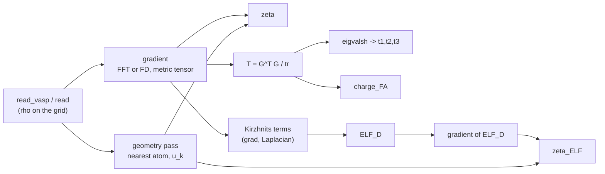

| Step | Code | Notes |
|---|---|---|
| Gradient | `core/derivatives.py` (`gradient`); cached by `fields/density.Derivatives` via `descriptors/registry.field_derivatives` | $\nabla f = \sum_a \mathbf{b}_a\,\partial f/\partial u_a$ with the reciprocal vectors $\mathbf{b}_a$, exact for any cell shape. Default FFT (spectral), option FD of order 2/4/6/8. |
| Nearest-atom direction $\hat{\mathbf{u}}_k$ | `core/geometry.py` (`assign_atoms`, cached `geometry_of`) | Adaptive periodic image search; equidistant images are ordered by a geometric rule, so the result is exactly invariant under supercell and translation. |
| `zeta`, `zeta_ELF` | `operators/anisotropy.gradient_anisotropy`; registered in `descriptors/bonding.py` | $1 - \sum\lvert g\cdot u\rvert / \sum\lvert g\rvert$ in float64. |
| `T`, eigenvalues, FA | `operators/anisotropy.anisotropy_tensor`, `fractional_anisotropy`; registered in `descriptors/structural.py` (`_tensor`) | $T = G^\top G / \operatorname{tr}$ over the (N×3) gradient array; `numpy.linalg.eigvalsh`. |
| ELF_D | `fields/elf.py` (`kinetic_terms`, `elf_d`); `descriptors/bonding._elf_reconstructed` | Atomic units, density floor 10⁻⁸ e/bohr³. |

**Cost.** One gradient (three FFTs) serves `zeta`, `T` and FA, and the geometry pass is
shared with every distance-based descriptor. `zeta_ELF` additionally needs the Laplacian,
shared with the energy densities, and one more gradient, of the ELF field. None of the
four adds a pass over the grid beyond these cached fields.

**Options that change them.** `derivative_backend` / `fd_order` affect all four;
`laplacian_method` affects only `zeta_ELF`, through ELF_D; `elf_source` affects `zeta_ELF`.
The `partition` and `shells` options change none of them.

```python
import pydemi
vd = pydemi.read_vasp("CHGCAR")
f = pydemi.featurize(vd, domains=["bonding", "structural"])
f["zeta"], f["zeta_ELF"], f["T_eigenvalues_t1"], f["charge_FA"]
```

---

## 4. Analytic behaviour

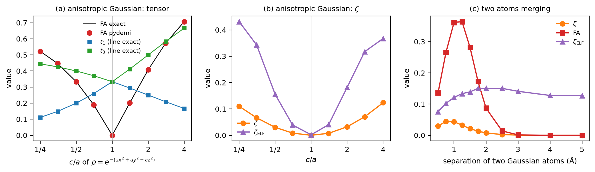

**Fig. 1.** (a, b) One anisotropic Gaussian, $\rho = e^{-(a x^2 + a y^2 + c z^2)}$, as a
function of $c/a$ (16 Å box, 112³ grid). (c) Two spherical Gaussian atoms (α = 2 Å⁻²)
at separation *d* (12 Å box, 96³ grid).

### 4.1 An exact test of the tensor

For a Gaussian $\rho \propto \exp(-\sum_i a_i x_i^2)$ the gradient second moment is

$$
\partial_i\rho = -2a_i x_i\,\rho,\qquad
\int (\partial_i\rho)^2\,dV = 4a_i^2 \int x_i^2\rho^2\,dV = a_i \int \rho^2\,dV
\quad\Longrightarrow\quad
T = \frac{\operatorname{diag}(a_1, a_2, a_3)}{a_1 + a_2 + a_3},
$$

using $\int x_i^2 e^{-2a_i x_i^2}dx_i \big/ \int e^{-2a_i x_i^2}dx_i = 1/(4a_i)$.

pydemi reproduces this to five decimals at every $c/a$ (Fig. 1a, points against lines). For
example, $c/a = 4$ gives $t = (1/6, 1/6, 2/3)$ and FA = 0.7071. FA is 0 only at $c/a = 1$
and grows with the anisotropy on both sides: prolate ($c < a$) and oblate ($c > a$)
Gaussians give different $(t_1, t_3)$ and are told apart by η.

### 4.2 `zeta` for anisotropic and bonded densities

For the anisotropic Gaussian, `zeta` grows smoothly from 0 at $c/a = 1$ to 0.11–0.12 at
$c/a = 1/4$ or 4 (Fig. 1b): the gradient of an ellipsoid is not radial. For two atoms
(Fig. 1c), `zeta` rises from 0 at large separation to a maximum of 0.044 near 0.75–1 Å,
where the overlap region between the atoms, the "bond", is largest relative to the atoms.
It drops again as the two atoms merge into a single, nearly spherical object. FA follows
the same curve with a larger amplitude (maximum 0.36 at 1.0–1.25 Å), because the pair is a
prolate object along the bond axis.

### 4.3 The `zeta_ELF` baseline

A single spherical atom gives `zeta` = 6×10⁻¹⁵ and FA = 2×10⁻¹⁶, both 0 to machine
precision. **`zeta_ELF` does not vanish** (Fig. 13): on typical grids a perfectly spherical
Gaussian gives 0.0003–0.24, depending on the density scale and the grid spacing.

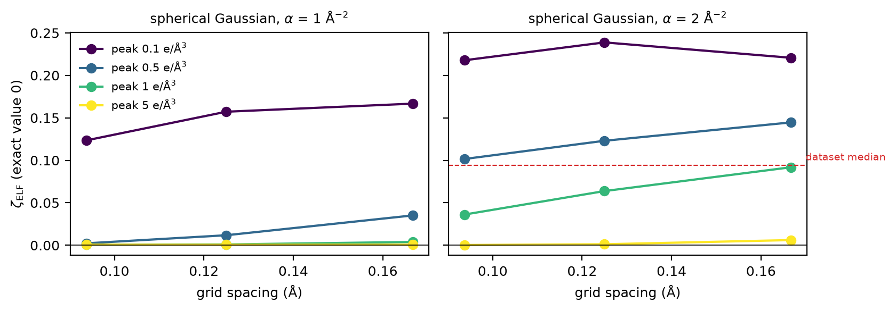

**Fig. 13.** `zeta_ELF` of a spherical Gaussian, whose exact value is 0, against grid
spacing, for peak densities 0.1–5 e/ų. The dashed line is the dataset median.

The cause is that ELF_D is a bounded ratio of kinetic-energy densities. Its gradient does
not decay with the density, so the low-density tail regions carry full weight in
$\sum\lvert\nabla\mathrm{ELF}\rvert$. There ELF_D depends on ratios of small, differentiated
quantities, whose discretization errors on a cubic grid are not radial. With FD4
derivatives the non-radial contribution comes from $10^{-3} < \rho < 0.1$ e/ų and
disappears above 0.1 e/ų. The baseline shrinks with finer grids and higher densities
(Fig. 13), but for diffuse, valence-like atoms (peak ≤ 0.5 e/ų) it is comparable to the
dataset median of 0.094.

---

## 5. What they look like in real materials

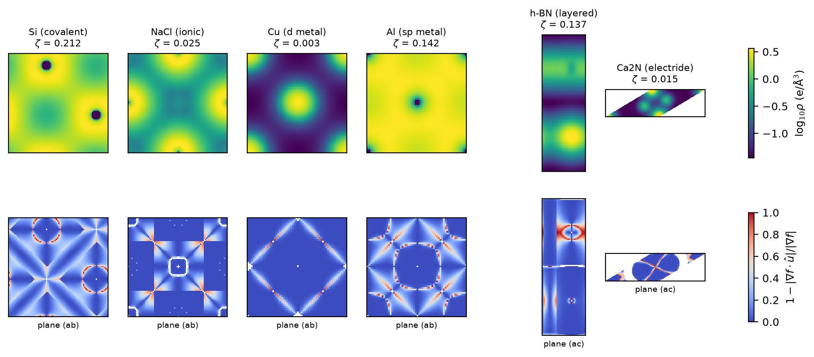

**Fig. 2.** Top: log₁₀ρ on one grid plane through an atom, from VASP CHGCARs. Bottom: the
local non-radial fraction $1 - \lvert\nabla\rho\cdot\hat{\mathbf{u}}\rvert/\lvert\nabla\rho\rvert$,
drawn where $\lvert\nabla\rho\rvert$ exceeds 10⁻³ of its maximum. `zeta` is its
$\lvert\nabla\rho\rvert$-weighted average over the whole cell.

What the maps show:

* **Si (covalent, ζ = 0.212).** Broad non-radial regions (light blue to red) fill the
  bonding directions between the atoms. The red rings around the nuclei are the PAW
  pseudized cores: the pseudo-density has a *minimum* at the Si nucleus (dark dots in the
  top panel), so its gradient turns over there.
* **NaCl (ionic, ζ = 0.025).** Nearly everything is radial (dark blue). Non-radial voxels
  appear only on the thin boundaries between the Na and Cl cells, where the nearest nucleus
  switches.
* **Cu (d-metal, ζ = 0.003).** Radial everywhere except on the Voronoi boundaries. The
  steep 3d density near the nuclei dominates Σ|∇ρ| and is spherical.
* **Al (sp-metal, ζ = 0.142).** The pseudized Al core is flat, so the small gradients of
  the nearly-free-electron sea make up a large share of the total. Their non-radial
  pattern, the square network, raises `zeta` (section 6.1).
* **h-BN (layered).** The *ac* plane cuts across the layers: the gradient is mostly
  normal to them, and FA = 0.249.
* **Ca₂N (electride).** `zeta` is low (0.015): the density around the ions is close to
  spherical. Its large `zeta_ELF` (0.54) comes from the ELF (Fig. 3).

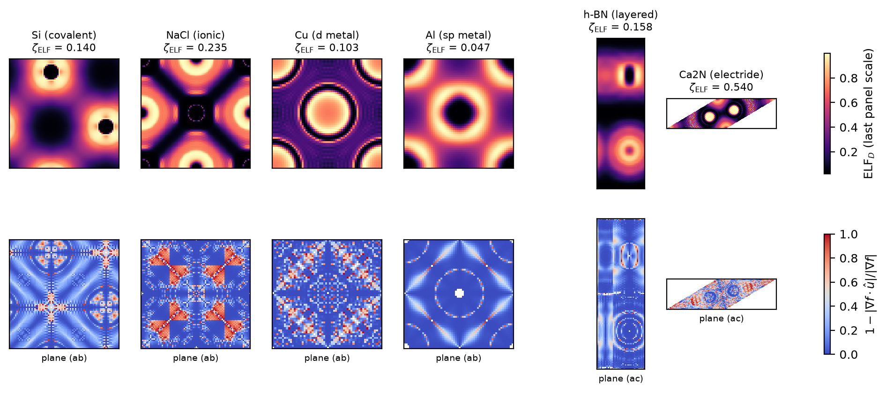

**Fig. 3.** The same planes for ELF_D (top) and the local non-radial fraction of its
gradient (bottom). Unlike Fig. 2, the bottom row is speckled at the scale of single voxels
in every material, most strongly for Cu, NaCl and Ca₂N. This is the visible form of the
numerical noise in ∇ELF that makes `zeta_ELF` fragile (sections 4.3 and 8). The atomic
shell structure appears as the rings in the top row.

---

## 6. Physical significance

### 6.1 `zeta`: how bond-directed is the density?

In a superposition of spherical atoms every gradient is radial about its own nucleus, so
`zeta` measures the **departure from a spherical-atom picture**, weighted by where the
density changes fastest. Covalent bonding moves density into directed bonds and gives the
highest values (Si 0.21, SiC 0.16, Ge 0.14, GaAs 0.13, InSb 0.11). Ionic bonding keeps the
ions nearly spherical (CaF₂ 0.004, KCl 0.009, LiF 0.015, NaCl 0.025, MgO 0.024).

On CHGCAR densities `zeta` has a second contribution: **how smooth the PAW pseudo-core
is**. Near a nucleus the gradient is large, and in the pseudized region its direction
follows the pseudo-orbitals. Elements with steep, spherical valence cores (the d-metals: Cu
0.003, Fe 0.006) have low `zeta`. The sp-metals, whose pseudized valence density is almost flat near the nuclei (Be 0.32,
Mg 0.19, Al 0.14), have high `zeta`: the small non-radial ripple of the electron sea is
then a large share of a small total. Section 6.4 quantifies this. hcp Hf (0.42, the
dataset maximum) and Hf₃Tl (0.33) are also high; we have not analysed them further.

### 6.2 `zeta_ELF`: shape of the localization domains

ELF marks where electrons are paired and localized: bonds, lone pairs, atomic shells and,
in electrides, the interstitial anionic electrons. Its gradient points toward those
basins. When the basins are atom-centred shells, the gradient is radial; when they are
bonds, lone pairs or interstitial blobs, it is not. The highest values in the dataset are
the electrides and electride-like compounds: Ca₂N 0.54, Ho₂C 0.55, Dy₂C 0.53, Lu 0.50,
MnS₂ 0.50. The ionic oxides and halides come next (MgO 0.27, NaCl 0.23), where the ELF has
a pronounced non-spherical structure between the ions. The physical signal is real, but
it rides on the numerical baseline of section 4.3, which is of the same size.

### 6.3 `T` and `charge_FA`: crystal-scale directionality

$T$ averages the outer product of the gradient over the whole cell, so it measures **in
which directions the density varies**, irrespective of which atom the variation belongs
to. Symmetry fixes its form:

| Crystal system | Form of $T$ | Consequence |
|---|---|---|
| cubic | $T = I/3$ | FA = 0 |
| hexagonal, trigonal, tetragonal | uniaxial: two equal eigenvalues | η = 0 or η = 1 exactly |
| orthorhombic, monoclinic, triclinic | three independent eigenvalues | any η |

Beyond symmetry, FA measures **how strongly** the density is layered or chain-like:
graphite 0.50, LiC₁₂ 0.48, LiB 0.45, LiN₃ / NaN₃ 0.42 (linear azide anions), h-BN 0.25, Mg
0.05, Te 0.04 (helical chains), Bi₂Te₃ 0.004 (layered, yet with nearly isotropic gradients). η says which kind: graphite and h-BN have $t_1 = t_2 < t_3$ (η = 0, layers), Te and
hexagonal Mg have $t_1 < t_2 = t_3$ (η = 1).

### 6.4 Where the sums come from on PAW densities

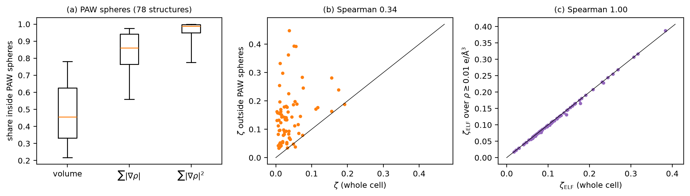

**Fig. 11.** (a) Shares of the volume, of Σ|∇ρ| (the denominator of `zeta`) and of
Σ|∇ρ|² (the trace of T) that lie inside the PAW augmentation spheres, for 78 random
structures with their own OUTCAR. (b) `zeta` over the whole cell against `zeta` over the
voxels outside the spheres. (c) `zeta_ELF` against `zeta_ELF` over ρ ≥ 0.01 e/ų.

| Quantity (median over 78 structures) | Value |
|---|---|
| volume inside the PAW spheres | 46% |
| Σ\|∇ρ\| inside the spheres | 86% |
| Σ\|∇ρ\|² inside the spheres | 99% |
| `zeta` whole cell / outside the spheres | 0.027 / 0.133 (rank correlation 0.34) |
| `charge_FA` whole cell / outside the spheres | 0.001 / 0.011 (rank correlation 0.80) |
| `zeta_ELF` whole cell / over ρ ≥ 0.01 e/ų | 0.094 / 0.093 (rank correlation 0.999) |

So on VASP pseudo-densities, **`zeta` and T are dominated by the pseudized region.** Outside
the spheres, where the pseudo-density equals the all-electron valence density, `zeta` is
five times larger and ranks the structures differently. FA is less affected: its ranking
survives (0.80), because its main signal, the crystal symmetry, holds in every region.
`zeta_ELF` in solids is not driven by vacuum-like regions: they are rare, 0.1% of the
volume below 0.01 e/ų. The problem of section 4.3 matters for slabs, molecules and porous
frameworks.

---

## 7. Survey over 6,059 materials

**Classes.** The chemical class is set by the anions present, first match wins: elemental →
halide (F, Cl, Br, I) → oxide (O) → chalcogenide (S, Se, Te) → pnictide (N, P, As) →
hydride (H) → boride/carbide (B, C) → intermetallic. The crystal system is taken from
spglib on the **relaxed** structure (tolerance 10⁻³ Å). For 373 structures it differs from
the space group in the run name, which is that of the starting structure, and it is always
lower: 2,137 cubic, 813 hexagonal, 481 trigonal, 1,116 tetragonal, 950 orthorhombic, 449
monoclinic, 113 triclinic.

### 7.1 Distributions

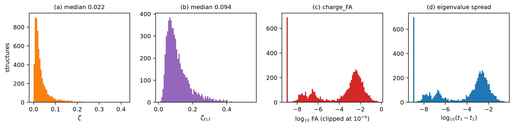

**Fig. 4.** Distributions over the 6,059 structures. (c, d) are on log scales, with values
below 10⁻⁹ drawn at 10⁻⁹.

`zeta` is right-skewed (median 0.022, interquartile range 0.012–0.041, maximum 0.42 for hcp
Hf). `zeta_ELF` is broader (median 0.094, IQR 0.065–0.142). `charge_FA` spans nine
decades: the cubic structures sit at 10⁻⁹–10⁻⁴, and the lower-symmetry ones form a second
peak around 10⁻³–10⁻².

### 7.2 By chemical class

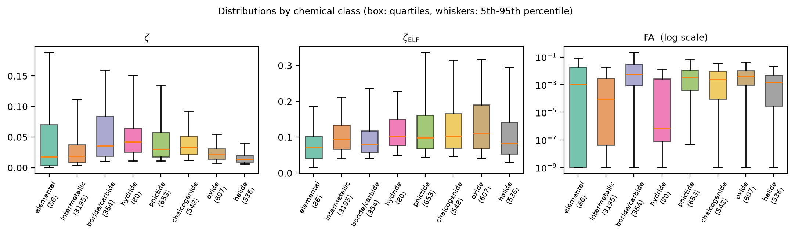

**Fig. 5.** By chemical class (box: quartiles; whiskers: 5th–95th percentile; FA on a log
scale).

| Class | n | `zeta` median [IQR] | `zeta_ELF` median [IQR] | `charge_FA` median [IQR] |
|---|---|---|---|---|
| elemental | 86 | 0.018 [0.003, 0.071] | 0.073 [0.040, 0.102] | 0.0011 [0.0000, 0.0182] |
| intermetallic | 3,195 | 0.019 [0.009, 0.037] | 0.094 [0.067, 0.134] | 0.0001 [0.0000, 0.0028] |
| boride/carbide | 354 | 0.036 [0.019, 0.084] | 0.079 [0.058, 0.117] | 0.0055 [0.0008, 0.0307] |
| hydride | 80 | 0.042 [0.025, 0.065] | 0.103 [0.077, 0.150] | 0.0000 [0.0000, 0.0026] |
| pnictide | 653 | 0.030 [0.018, 0.058] | 0.098 [0.068, 0.162] | 0.0037 [0.0004, 0.0118] |
| chalcogenide | 548 | 0.033 [0.021, 0.052] | 0.103 [0.070, 0.166] | 0.0023 [0.0001, 0.0093] |
| oxide | 607 | 0.022 [0.014, 0.031] | 0.110 [0.067, 0.190] | 0.0040 [0.0009, 0.0103] |
| halide | 536 | 0.013 [0.009, 0.020] | 0.082 [0.053, 0.141] | 0.0015 [0.0000, 0.0048] |

* **`zeta` follows the covalency of the anion.** Halides are lowest (0.013); oxides next
  (0.022); chalcogenides, pnictides and borides/carbides, with more covalent bonding to
  the anion, highest (0.030–0.036). Elemental solids span the widest range, because the
  class holds both solids of nearly spherical atoms (noble gases, alkali and
  alkaline-earth metals) and covalent Si, Ge and C.
* **`charge_FA` follows the symmetry mix of the class.** Intermetallics and hydrides have
  the largest shares of cubic structures (48% and 55%, against 16–24% for the anion-rich
  classes) and the lowest FA medians (10⁻⁴ and 0). Borides and carbides have the highest
  median (0.0055), and their upper tail holds the layered LiC₁₂ (0.48) and LiB (0.45).
* **`zeta_ELF`** differs little between classes (medians 0.07–0.11). Oxides and
  chalcogenides have the widest upper tail.

### 7.3 By crystal system: symmetry, and symmetry breaking

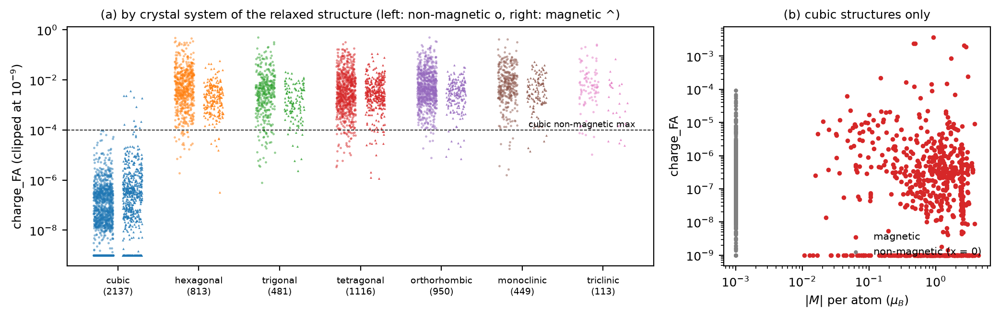

**Fig. 6.** (a) `charge_FA` by the crystal system of the relaxed structure (non-magnetic
left, magnetic right). The dashed line is the maximum over non-magnetic cubic structures.
(b) Cubic structures only: FA against the magnetic moment per atom.

| System (relaxed) | n | FA median | FA > 10⁻³ | FA > 10⁻² | `zeta` median |
|---|---|---|---|---|---|
| cubic | 2,137 | 3.9×10⁻⁸ | 0% | 0% | 0.016 |
| hexagonal | 813 | 3.6×10⁻³ | 76% | 28% | 0.021 |
| trigonal | 481 | 2.8×10⁻³ | 69% | 19% | 0.024 |
| tetragonal | 1,116 | 2.9×10⁻³ | 77% | 23% | 0.023 |
| orthorhombic | 950 | 4.3×10⁻³ | 85% | 28% | 0.026 |
| monoclinic | 449 | 5.7×10⁻³ | 86% | 36% | 0.027 |
| triclinic | 113 | 5.2×10⁻³ | 79% | 27% | 0.027 |

* **The cubic floor is numerical.** For the 1,467 non-magnetic cubic structures, FA has a
  median of 2.6×10⁻⁸, a 99th percentile of 1.2×10⁻⁵ and a maximum of 9.4×10⁻⁵. This is
  the round-off and grid floor, and it confirms that the implementation preserves
  symmetry.
* **Magnetic f-electron compounds break it.** Among the 670 magnetic cubic structures, FA
  reaches 3.6×10⁻³ (Yb₂GaHg), with Dy₂MgAl, YbSnAu₂, YbPrZn₂ and YbNbRu₂ above 1.9×10⁻³.
  These are Yb, Dy and Pr compounds, most likely because their self-consistent DFT
  densities occupy the partly filled 4f shell unevenly, which lowers the symmetry of the
  charge density below that of the lattice. FA detects it at 40 times the numerical
  floor.
* **Relaxation lowers the symmetry of the named structure.** Using the space group in the
  run name instead of the relaxed one, 108 "cubic" structures are misassigned. The largest
  FA among them belong to structures that relaxed to lower symmetry: In "Fm-3m" is
  I4/mmm, FA 0.007; LiAl "Fd-3m" is I4₁/amd, FA 0.006; PmDyIn₂ "Fm-3m" is R-3m, FA 0.02.
  FA is therefore a cheap check that a structure has the symmetry its label claims.

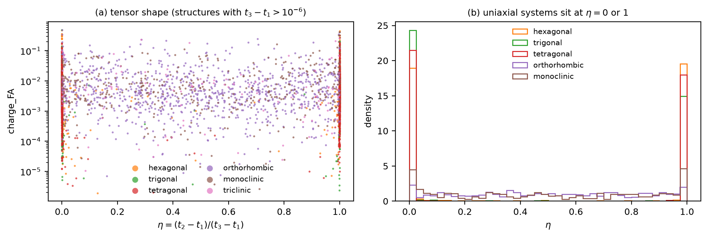

**Fig. 7.** (a) FA against the shape parameter η = (t₂ − t₁)/(t₃ − t₁) for the structures
with t₃ − t₁ > 10⁻⁶. (b) Distribution of η per crystal system: the uniaxial systems sit at
η = 0 or η = 1, as symmetry requires; orthorhombic and monoclinic cells spread over the
whole interval.

### 7.4 `zeta` and `zeta_ELF` together

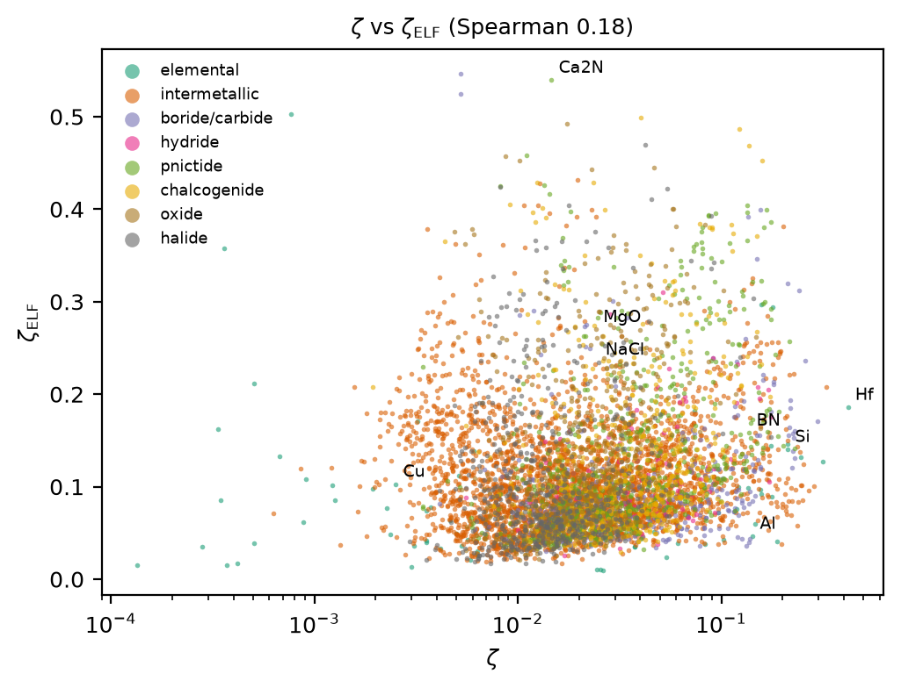

**Fig. 8.** `zeta_ELF` against `zeta` (log scale), coloured by class; Spearman 0.18.

The two gradient anisotropies are nearly independent. Covalent solids combine high `zeta`
with moderate `zeta_ELF`. Ionic oxides and halides have low `zeta` but high `zeta_ELF`:
the density around each ion is spherical, but the ELF between the ions is not. Electrides
(Ca₂N) sit at low `zeta` and the highest `zeta_ELF`. sp-metals (Al, Mg) sit at high `zeta`
and the lowest `zeta_ELF`.

### 7.5 Relation to the other descriptors

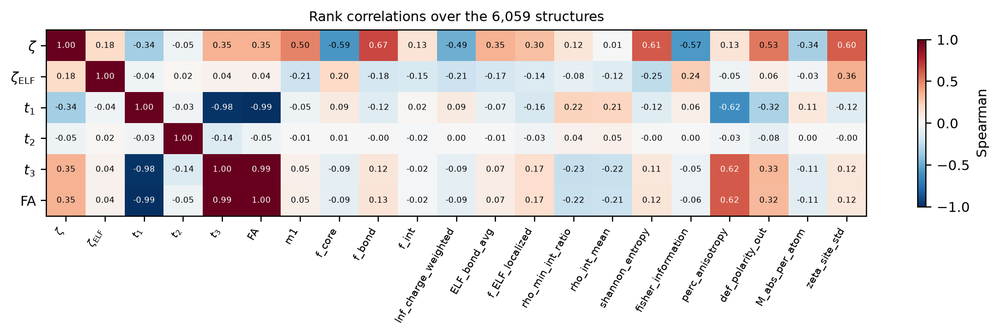

**Fig. 9.** Spearman rank correlations with fifteen other descriptors over the 6,059
structures.

| Descriptor | Strongest rank correlations with other descriptors |
|---|---|
| `zeta` | `f_bond` 0.67, `shannon_entropy` 0.61, `zeta_site_std` 0.60 |
| `zeta_ELF` | `zeta_site_std` 0.36, `shannon_entropy` −0.25, `fisher_information` 0.24 |
| `t1` / `t3` | `perc_anisotropy` −0.62 / +0.62, `def_polarity_out` −0.32 / +0.33 |
| `charge_FA` | `perc_anisotropy` 0.62, `def_polarity_out` 0.32, `rho_min_int_ratio` −0.22 |

Among themselves: `zeta`–`charge_FA` 0.35, `zeta`–`zeta_ELF` 0.18,
`zeta_ELF`–`charge_FA` 0.04. `zeta` shares information with the bond-shell charge fraction,
as expected from its meaning, but none of the four is redundant. `charge_FA` and the
percolation anisotropy both measure directionality and agree at 0.62. They are
complementary: FA is a gradient property, percolation a connectivity property.

### 7.6 Example materials

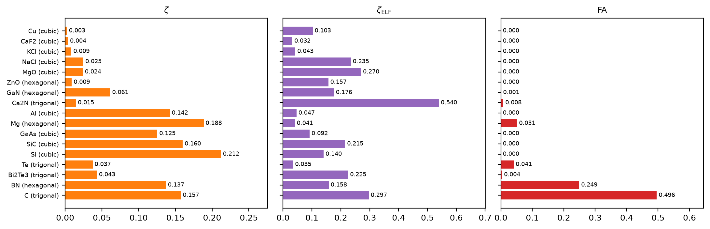

**Fig. 12.** The three scalar descriptors for seventeen familiar materials, ordered from
ionic and metallic, through covalent, to layered.

| Material | Class | System | `zeta` | `zeta_ELF` | t₁ | t₂ | t₃ | `charge_FA` |
|---|---|---|---|---|---|---|---|---|
| Cu (fcc) | elemental | cubic | 0.0025 | 0.103 | 1/3 | 1/3 | 1/3 | 0 |
| CaF₂ | halide | cubic | 0.0039 | 0.032 | 1/3 | 1/3 | 1/3 | 0 |
| KCl | halide | cubic | 0.0085 | 0.043 | 1/3 | 1/3 | 1/3 | 0 |
| NaCl | halide | cubic | 0.0248 | 0.235 | 1/3 | 1/3 | 1/3 | 0 |
| MgO | oxide | cubic | 0.0242 | 0.270 | 1/3 | 1/3 | 1/3 | 0 |
| ZnO (wurtzite) | oxide | hexagonal | 0.0089 | 0.157 | 0.3333 | 0.3333 | 0.3333 | 0.0000 |
| GaN (wurtzite) | pnictide | hexagonal | 0.0613 | 0.176 | 0.3332 | 0.3332 | 0.3336 | 0.0007 |
| Ca₂N (electride) | pnictide | trigonal | 0.0146 | 0.540 | 0.3318 | 0.3318 | 0.3363 | 0.0078 |
| Al (fcc) | elemental | cubic | 0.1424 | 0.047 | 1/3 | 1/3 | 1/3 | 0 |
| Mg (hcp) | elemental | hexagonal | 0.1885 | 0.041 | 0.3135 | 0.3432 | 0.3432 | 0.0514 |
| GaAs | pnictide | cubic | 0.1255 | 0.092 | 1/3 | 1/3 | 1/3 | 0 |
| SiC (3C) | boride/carbide | cubic | 0.1600 | 0.215 | 1/3 | 1/3 | 1/3 | 0 |
| Si (diamond) | elemental | cubic | 0.2121 | 0.141 | 1/3 | 1/3 | 1/3 | 0 |
| Te (trigonal) | elemental | trigonal | 0.0374 | 0.035 | 0.3176 | 0.3412 | 0.3412 | 0.0408 |
| Bi₂Te₃ | chalcogenide | trigonal | 0.0433 | 0.225 | 0.3319 | 0.3340 | 0.3340 | 0.0036 |
| h-BN | pnictide | hexagonal | 0.1372 | 0.158 | 0.2844 | 0.2844 | 0.4313 | 0.2491 |
| graphite (C, R-3m) | elemental | trigonal | 0.1574 | 0.297 | 0.2290 | 0.2290 | 0.5420 | 0.4958 |

ZnO shows how weak the tensor anisotropy of a wurtzite can be (FA < 10⁻⁴): its near-ideal
c/a makes the gradient distribution almost isotropic. Graphite and h-BN are the layered
extreme (η = 0, $t_3 \gg t_1 = t_2$); Te and Mg sit at η = 1.

**Extremes of the dataset.**

| Largest `zeta` | Largest `charge_FA` | Largest `zeta_ELF` | Smallest `zeta` |
|---|---|---|---|
| Hf (hcp) 0.419 | C (R-3m) 0.496 | Ho₂C 0.546 | Sr (bcc) 0.0001 |
| Hf₃Tl 0.327 | C (Cmce) 0.496 | Ca₂N 0.540 | Ba (hcp) 0.0003 |
| Be (hcp) 0.316 | LiC₁₂ 0.481 | Dy₂C 0.525 | Tm (hcp) 0.0003 |
| Be₄B 0.298 | LiB 0.453 | Lu (R-3m) 0.503 | Ca (fcc) 0.0003 |
| Be₂₂Re 0.284 | LiN₃ 0.417 | MnS₂ 0.499 | Ne (fcc) 0.0004 |
| TaBe₁₂ 0.270 | NaN₃ 0.415 | YCu₂Bi₂(SeO₂)₂ 0.493 | Sr (fcc) 0.0004 |

The smallest `zeta` belongs to alkaline-earth and rare-earth metals and solid Ne, whose
densities are superpositions of nearly spherical atoms. The largest belong to Be compounds, whose pseudo-valence densities are flat near the
nuclei (section 6.1), and to Hf and its compounds.

---

## 8. Numerical robustness and ML predictability

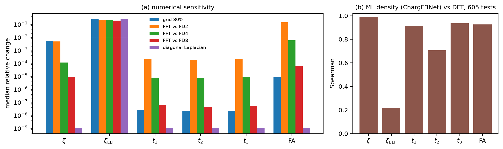

**Fig. 10.** (a) Median relative change against the default (FFT derivatives, full grid):
FD of order 2, 4, 8 (100 random structures), the diagonal-Laplacian shortcut, and a
Fourier-coarsened grid with 80% of the points per axis (30 structures). The dashed line
marks 1%. (b) Spearman rank correlation between values from ML-predicted densities
(ChargE3Net trained from scratch) and from DFT densities, on 605 test structures.

| Descriptor | FFT–FD2 | FFT–FD4 | FFT–FD8 | diagonal Laplacian | grid 100→80% | ML vs DFT, Spearman | ML vs DFT, median rel. error |
|---|---|---|---|---|---|---|---|
| `zeta` | 4.6×10⁻³ | 1.1×10⁻⁴ | 8.9×10⁻⁶ | 0 | 5.2×10⁻³ | 0.988 | 2.4% |
| `zeta_ELF` | 0.22 | 0.21 | 0.18 | 0.26 | 0.25 | **0.22** | 78% |
| `T_eigenvalues_t1` | 2.0×10⁻⁴ | 7.6×10⁻⁶ | 5.8×10⁻⁸ | 0 | 2.5×10⁻⁸ | 0.914 | 0.05% |
| `T_eigenvalues_t2` | 1.9×10⁻⁴ | 7.4×10⁻⁶ | 4.1×10⁻⁸ | 0 | 2.1×10⁻⁸ | 0.707 | 0.03% |
| `T_eigenvalues_t3` | 2.0×10⁻⁴ | 8.4×10⁻⁶ | 4.9×10⁻⁸ | 0 | 2.1×10⁻⁸ | 0.936 | 0.04% |
| `charge_FA` | 0.14 | 5.8×10⁻³ | 6.1×10⁻⁵ | 0 | 8.0×10⁻⁶ | 0.926 | 60% |

(Median relative differences; the Spearman rank correlations between schemes are ≥ 0.998
for `zeta`, T and FA at FD4 and above, and 0.80–0.94 for `zeta_ELF`.)

* **`zeta`, T and FA converge.** The difference to FFT falls by one to two orders of
  magnitude with each increase of the finite-difference order, so the FFT default is the
  converged value. The only large FD2 difference, 14% for FA, is relative to a quantity
  whose median is 10⁻³. The diagonal-Laplacian option does not touch them, since they use
  first derivatives only.
* **`zeta_ELF` does not converge.** It changes by about 20% whatever the order and does not
  approach the FFT value, and the diagonal Laplacian changes it by 26%. It depends on third
  derivatives of ρ and on the ill-conditioned low-density ELF (section 4.3).
* **ML densities.** `zeta` survives the ML prediction well (rank 0.99, 2.4% error). T and FA
  keep their ranking (0.91–0.94; 0.71 for t₂, which varies least across structures), but
  FA has a 60% relative error. A predicted density is not exactly
  symmetric, so a cubic structure acquires a small nonzero FA. `zeta_ELF` is the least
  reproducible of the 86 non-constant descriptors tested.

---

## 9. Utility: what to use them for

| Use | Descriptor | Why it works | Evidence |
|---|---|---|---|
| **Covalent vs ionic vs metallic bonding**, as an ML feature | `zeta` | directed bonds make gradients non-radial | halides 0.013 → borides/carbides 0.036; Si 0.21 vs NaCl 0.025 (§7.2, §7.6) |
| **Layered and chain-like structures** | `charge_FA`, t₁–t₃, η | the gradient tensor measures the direction of density variation | graphite 0.50, h-BN 0.25; η = 0 for layers, 1 for chains (§6.3) |
| **Symmetry check** of relaxed structures | `charge_FA` | T = I/3 in cubic symmetry; uniaxial forms in the uniaxial systems | cubic floor < 10⁻⁴; flags structures whose label overstates their symmetry (§7.3) |
| **Electronic symmetry breaking** (orbital order, f-electron states) | `charge_FA` | the density loses the lattice symmetry | magnetic cubic Yb, Dy, Pr compounds up to 4×10⁻³ (§7.3) |
| **Electride screening** | `zeta_ELF` (with care) | interstitial ELF maxima away from nuclei | Ca₂N, Ho₂C, Dy₂C at the top; a numerical baseline of the same size (§4.3) |
| **Features that survive an ML density** | `zeta`, t₁, t₃, FA ranking | smooth, first-derivative quantities | Spearman 0.91–0.99 (§8) |

For models, the three robust ones (`zeta`, the T eigenvalues, `charge_FA`) add
information that the composition and the other density descriptors do not carry (rank
correlations ≤ 0.67, §7.5). Because FA spans nine decades, use `log10(FA + 10⁻⁸)` rather
than FA. Remember that only two of the three T eigenvalues are independent.

---

## 10. Caveats and recommendations

1. **Tag `zeta_ELF` as fragile.** Every test points the same way:
   - 18–26% change between derivative schemes, not converging;
   - 25% change on an 80% grid;
   - a spherical-atom baseline of up to 0.24;
   - ML rank correlation 0.22.

   These are the same criteria that led to tagging `ellip_bond_avg`, `ellip_bond_std`,
   `n_saddle1` and `n_saddle2` (decision of 2026-09-25). `zeta_ELF` meets them as clearly,
   so it should join them in `descriptor_names(include_fragile=False)`. That is a one-line
   change, not made here pending your approval. A converged variant would need ELF only
   where the density is high enough, e.g. over ρ ≥ 0.1 e/ų, where the spherical-atom
   baseline vanishes. That would be a new descriptor beyond prompt.md.
2. **Read `zeta` on CHGCAR data with the PAW spheres in mind.** 86% of its weight is inside
   them. For bonding comparisons between elements with very different pseudo-cores (Cu vs
   Al), an outside-the-spheres variant would compare like with like, in the manner of the
   `paw` extension's `*_def_out` descriptors. The dataset shows it ranks structures
   differently (rank correlation 0.34) and is five times larger. With AECCAR all-electron
   densities use `derivative_backend="fd"`, because FFT rings at the nuclear cusps.
3. **`charge_FA` needs a log scale and a floor.** Values below about 10⁻⁴ are numerical
   (the cubic floor) or electronic symmetry breaking; above 10⁻³ they reflect structure.
   Use the relaxed structure's symmetry, not the run label, when interpreting them.
4. **Vacuum and slabs.** `zeta_ELF` in cells with vacuum is dominated by the tail artefact
   of section 4.3. `zeta` and FA are safe, because the density gradient itself vanishes in
   vacuum.
5. **Grid.** All four are defined on the density grid. At the dataset's spacings
   (0.055–0.068 Å), coarsening to 80% changes `zeta` by 0.5% and T and FA by 10⁻⁵ or less
   (medians). Coarser grids should be checked with
   `validate.convergence.grid_convergence`.

---

## 11. Reproducing this document

All scripts run from `scripts/` in the `pydemi` conda environment (Python 3.11,
pymatgen, spglib, matplotlib). One thread per worker:
`OMP_NUM_THREADS=1 nice -n 10 python <script>`.

| Script | Produces (`data/`) | Figures / sections |
|---|---|---|
| `classes.py` | `anisotropy_dataset.csv`: class, crystal systems (named and relaxed), the four descriptors and fifteen others for all 6,059 | §7 |
| `analytic_examples.py` | `analytic_A.csv`, `analytic_B.csv`, `analytic_C.csv` | Fig. 1, §4 |
| `analytic_examples.py` (part D) | `analytic_zetaELF_baseline.csv` | Fig. 13 |
| `slices.py` | `slices.npz` | Figs. 2, 3 |
| `region_shares.py 100` | `region_shares.csv` (78 structures with an OUTCAR) | Fig. 11, §6.4 |
| `derivative_sensitivity.py 100` | `derivative_sensitivity.csv`, `derivative_sensitivity_summary.csv` | Fig. 10, §8 |
| `make_figures.py` | all figures (PNG and PDF), `robustness.csv`, `spearman_correlations.csv`, `examples.csv` | Figs. 1–13 |

Other inputs: `results/prompt_spec/descriptors_6000_data_aug13.csv` (the dataset rerun),
`paper/analysis/out/convergence.csv` (the 80% grid test, `paper/analysis/e_convergence.py`)
and `data/ml_scores_scratch.csv` (the descriptor-level DFT-vs-ML comparison of the
ChargE3Net test set; provisional until the fine-tuned model has been evaluated).
`summary_by_class.csv` and `summary_by_system.csv` hold the tables of §7.

Figures are in `figures/` as PNG (200 dpi) and PDF (vector, for LaTeX). To reuse this
text in LaTeX, the equations are standard LaTeX between `$…$` / `$$…$$`, and the tables
are plain Markdown, which pandoc converts: `pandoc anisotropy_descriptors.md -o
anisotropy_descriptors.tex` (pandoc is not installed on this machine).

---

## 12. References

* A. D. Becke and K. E. Edgecombe, "A simple measure of electron localization in atomic
  and molecular systems", *J. Chem. Phys.* **92**, 5397 (1990). (ELF.)
* V. G. Tsirelson and A. Stash, "Determination of the electron localization function from
  electron density", *Chem. Phys. Lett.* **351**, 142 (2002). (ELF_D from ρ alone.)
* D. A. Kirzhnits, "Quantum corrections to the Thomas-Fermi equation", *Sov. Phys. JETP*
  **5**, 64 (1957). (Gradient expansion of the kinetic energy.)
* P. J. Basser and C. Pierpaoli, "Microstructural and physiological features of tissues
  elucidated by quantitative-diffusion-tensor MRI", *J. Magn. Reson. B* **111**, 209
  (1996). (Fractional anisotropy.)
* P. E. Blöchl, "Projector augmented-wave method", *Phys. Rev. B* **50**, 17953 (1994);
  G. Kresse and D. Joubert, *Phys. Rev. B* **59**, 1758 (1999). (PAW pseudo-densities.)
* A. Togo and I. Tanaka, spglib, https://spglib.readthedocs.io. (Space groups of the
  relaxed structures.)
* pydemi `prompt.md`, §7–8.2 (operator and descriptor definitions); `README.md` §6.6
  (stability tags).
