# Deformation-density descriptors in pydemi: `m1_def`, `m2_def`, `sigma_r2_def`, `f_bond_def`, `f_int_def`, `f_bond_dep`, `def_polarity`

Definitions, implementation, physical meaning, numerical behaviour and a survey over
6,059 VASP charge densities.

**Author:** Shubham Maurya, CMS Lab, IIT Kanpur · **Date:** 2026-09-25 ·
**pydemi:** `main` (prompt.md build) · **Data:** 6,059-structure VASP dataset
(`/data/sai/new_charge/6000_data_aug13`), descriptor table
`results/prompt_spec/descriptors_6000_data_aug13.csv`

Every number and figure in this document comes from the scripts in `scripts/`
(section 12). The intermediate tables are in `data/`.

---

## Summary

The seven descriptors summarize the **deformation density**
Δρ(**r**) = ρ(**r**) − ρ_pro(**r**). This is the crystal density minus a superposition of
spherical free atoms (the *promolecule*) placed at the nuclei. Where Δρ > 0, bonding has
gathered charge; where Δρ < 0, it has removed charge. The descriptors ask three
questions:

* **How far from the nuclei does the rearrangement happen?** `m1_def`, `m2_def` and
  `sigma_r2_def` are the mean, second moment and variance of the nearest-nucleus
  distance, weighted by |Δρ|.
* **Where does the gained charge go, and where does the lost charge come from?**
  `f_bond_def` and `f_int_def` are the shares of the accumulated charge (Δρ > 0) in the
  bond shell (0.8–1.5 Å) and in the interstitial (> 1.5 Å). `f_bond_dep` is the share of
  the depleted charge (Δρ < 0) in the bond shell.
* **How much charge moves?** `def_polarity` = ∫|Δρ| dV / Q is the rearranged charge per
  electron. It is the only one of the seven that grows with the amount moved; the other
  six do not change when Δρ is multiplied by a constant.

Main findings:

1. **The code is exact on model densities.** For a "breathing" Gaussian atom against its
   own reference, all seven match 1-D radial quadrature to 0.003 or better (Fig. 1).
   Moving q electrons into a bond or onto a neighbour makes `def_polarity` exactly linear
   in q (0.762 q and 0.909 q in the two models). The six shape descriptors stay constant
   to within 10⁻³ for every q ≥ 0.05 (Fig. 2).
2. **The shells are absolute, so bond length decides the partition.** In a two-atom model
   with bond charge at the midpoint, `f_bond_def` peaks at 0.91 for bonds of 2.4–2.6 Å.
   It then hands over to `f_int_def` once the midpoint passes 1.5 Å, and the two are equal
   at d ≈ 3.3 Å (Fig. 2b). Long bonds count as "interstitial".
3. **On a CHGCAR, the whole-cell values are dominated by PAW pseudization.** None of the
   dataset's 6,059 runs has AECCAR files, so every structure uses the tabulated free-atom
   valence reference against the PAW pseudo-density. Over 100 random structures, a median
   **87%** of ∫|Δρ| lies inside the augmentation spheres, which fill 48% of the volume.
   That interior also holds 68% of the `m1_def` numerator (Fig. 5). For comparison, 58% of
   the 0.8–1.5 Å bond shell's volume lies inside the spheres. Most of the accumulated
   charge that the shells count sits in the core shell (median 65%), not the bond shell.
4. **The `paw` extension (`*_out`) measures something else entirely.** Across the dataset,
   `m1_def` and `m1_def_out` have rank correlation 0.00, `f_bond_def` and
   `f_bond_def_out` 0.01, and `def_polarity` and `def_polarity_out` −0.30. Only
   `f_int_def` (0.89) and `sigma_r2_def` (0.49) carry over.
   `def_polarity_out` rises with the electronegativity difference Δχ (Spearman +0.39).
   The whole-cell `def_polarity` falls with it (−0.18) and rises instead with the d/f
   content (Fig. 9). **For chemistry, use the `_out` variants on CHGCARs.** Reserve the
   whole-cell values for all-electron densities (AECCAR0 + AECCAR2).
5. **By class, outside the spheres:**
   * Oxides, halides, pnictides and borides/carbides put nearly all their outside
     accumulation in the bond shell (median `f_bond_def_out` 0.94–1.00).
   * Elemental solids and intermetallics put about half of it in the interstitial (median
     `f_int_def_out` 0.52 and 0.43).
   * Hydrides have the largest `def_polarity_out` (0.063, against 0.017–0.035 elsewhere).
6. **Robustness has three sides:**
   * **Grid:** robust. The median change is ≤ 1% when the grid is coarsened to 80%
     per axis.
   * **Inner shell radius:** fragile. With c1 = 0.6 instead of 0.8 Å, `f_bond_def` keeps
     only a 0.25 rank correlation with its default.
   * **Valence count:** very fragile. On 40 OUTCAR-less structures with semicore elements,
     pydemi's rule-based ZVAL instead of the dataset's PAW table changes `def_polarity` by
     a median 55%. The rank correlation between the two drops to −0.04.
7. **ML predictability:** high. From ChargE3Net's predicted densities (from-scratch model,
   605 test structures), all 14 variants have Spearman ≥ 0.993, except `f_bond_dep_out`
   at 0.934.

---

## Contents

1. Notation
2. Definitions and formulas
3. How pydemi computes them
4. Analytic behaviour
5. What they look like in real materials
6. The PAW problem, and the `paw` extension
7. Physical significance
8. Survey over 6,059 materials
9. Numerical robustness and ML predictability
10. Utility: what to use them for
11. Caveats and recommendations
12. Reproducing this document
13. References

---

## 1. Notation

| Symbol | Meaning |
|---|---|
| k | voxel index over the real-space grid of the cell, N voxels, volume dV = V/N each |
| ρ_k | crystal (valence) density at voxel k, e/ų (CHGCAR divided by the cell volume) |
| ρ_pro,k | promolecule at voxel k (section 2.1) |
| Δρ_k | ρ_k − ρ_pro,k |
| Δρ⁺_k, Δρ⁻_k | max(Δρ_k, 0) and max(−Δρ_k, 0), so Δρ = Δρ⁺ − Δρ⁻ and \|Δρ\| = Δρ⁺ + Δρ⁻ |
| r_k | distance from voxel k to its nearest nucleus, periodic images included (Å) |
| core, bond, int | the shells r ≤ c1, c1 < r ≤ c2 and r > c2 about the nearest nucleus; default c1 = 0.8 Å, c2 = 1.5 Å |
| R_PAW,i | PAW augmentation radius (RCORE) of atom i, Å |
| Q | Σ_k ρ_k dV, the electrons in the cell (the ZVAL sum for a CHGCAR) |
| ZVAL | valence electrons per atom in the PAW dataset |

Sums over k without a range run over the whole cell.

---

## 2. Definitions and formulas

### 2.1 The deformation density and the promolecule

$$
\rho_{\mathrm{pro}}(\mathbf r) = \sum_{i}\sum_{\mathbf T}\rho^{\mathrm{free}}_{Z_i}\!\left(|\mathbf r-\mathbf R_i-\mathbf T|\right),
\qquad
\Delta\rho(\mathbf r) = \rho(\mathbf r) - \rho_{\mathrm{pro}}(\mathbf r).
$$

The outer sum runs over the atoms i of the cell and the inner one over lattice
translations **T**. Each image contributes out to the radius where its free-atom density
falls below 10⁻⁶ e/ų (`PROMOLECULE_TOL`). ρ^free_Z is a spherical free-atom density.
Which free atom is used depends on the input:

| Input | `deformation_reference` | ρ^free |
|---|---|---|
| CHGCAR (PAW pseudo-density) | `tabulated` (what `auto` picks) | shipped spherical LDA atom, **only the ZVAL highest-energy electrons** |
| AECCAR0 + AECCAR2 (all-electron) | `aeccar0` (what `auto` picks) | AECCAR0 (the frozen cores) + tabulated valence atoms |
| anything | `custom` | the user's radial files `<El>.dat` (r in Å, ρ in e/ų) |

With exact electron counts and exact sampling, ∫Δρ dV = 0. The integrated charge is
therefore conserved, and Δρ only moves it around. It follows that

$$
\sum_k \Delta\rho^{+}_k \approx \sum_k \Delta\rho^{-}_k \approx \tfrac12 \sum_k |\Delta\rho_k| .
$$

The residual ∫Δρ dV is reported per structure as `def_charge_mismatch` (section 3.4).

### 2.2 Radial moments: `m1_def`, `m2_def`, `sigma_r2_def`

$$
m_1^{\Delta} = \frac{\sum_k |\Delta\rho_k|\, r_k}{\sum_k |\Delta\rho_k|},\qquad
m_2^{\Delta} = \frac{\sum_k |\Delta\rho_k|\, r_k^{2}}{\sum_k |\Delta\rho_k|},\qquad
\sigma^{2}_{r,\Delta} = m_2^{\Delta} - \left(m_1^{\Delta}\right)^{2}.
$$

These give the mean distance from the nearest nucleus at which the density is
rearranged (Å), its second moment (Ų), and the spread of those distances (Ų).
Accumulation and depletion count alike, because the weight is |Δρ|. They are the same
operator (`operators.moments.radial_moment`, weight `"abs"`) that gives the charge-density
moments `m1`, `m2` and `sigma_r2`, applied to Δρ instead of ρ. Range: m1, m2 ≥ 0 and
σ² ≥ 0. If Δρ ≡ 0 the ratio is undefined; the value is then 0, with sentinel
`zero_deformation`.

### 2.3 Shell shares: `f_bond_def`, `f_int_def`, `f_bond_dep`

$$
f^{+}_{\mathrm{bond}} = \frac{\sum_{k\in\mathrm{bond}}\Delta\rho^{+}_k}{\sum_k \Delta\rho^{+}_k},\qquad
f^{+}_{\mathrm{int}} = \frac{\sum_{k\in\mathrm{int}}\Delta\rho^{+}_k}{\sum_k \Delta\rho^{+}_k},\qquad
f^{-}_{\mathrm{bond}} = \frac{\sum_{k\in\mathrm{bond}}\Delta\rho^{-}_k}{\sum_k \Delta\rho^{-}_k}.
$$

* `f_bond_def` is the fraction of the **accumulated** charge found in the bond shell.
* `f_int_def` is the fraction of the accumulated charge found in the interstitial.
* `f_bond_dep` is the fraction of the **depleted** charge taken from the bond shell.

All three are dimensionless and lie in [0, 1]. The core share of the accumulation is
implied: f⁺_core = 1 − f⁺_bond − f⁺_int. With no accumulation anywhere (or no depletion,
for `f_bond_dep`), the value is 0 with sentinel `no_accumulation` (`no_depletion`).

The shells are about the **nearest** nucleus, and they are absolute by default
(c1 = 0.8 Å, c2 = 1.5 Å for every element). `Shells(s1, s2, scaled=True)` makes them
multiples of the nearest atom's covalent radius instead.

### 2.4 Deformation polarity: `def_polarity`

$$
P_{\Delta} = \frac{\sum_k |\Delta\rho_k|\, dV}{Q},\qquad Q=\sum_k \rho_k\, dV .
$$

P_Δ is the number of electrons that are either piled up or removed, per electron in the
cell. Given §2.1, P_Δ/2 is the fraction of the electrons that bonding has **moved**.
It is dimensionless and ≥ 0; if Q = 0 the value is 0 with sentinel `zero_density`.

### 2.5 How the seven relate

* **Scale invariance.** Six of the seven are ratios of sums that are each linear in Δρ
  (m1, m2, σ², the three shares). Multiplying Δρ by a constant λ > 0 leaves them
  unchanged. Only P_Δ scales, as λ. The six describe the **shape** of the rearrangement,
  and P_Δ its **size**. Fig. 2d shows this directly.
* **m1 and m2 are nearly redundant.** Their rank correlation over the dataset is 0.98.
  σ² = m2 − m1² carries the independent information (0.7 with m1).
* **The shares partition the charge.** The accumulation splits into core + bond + int = 1.
  The depletion splits the same way, but only its bond share is a descriptor.
* **When Δρ ≈ 0 (a near-perfect reference), the shape descriptors are noise.** The
  ratios are then taken between two tiny, noise-dominated sums. Model B at q = 0 gives
  P_Δ = 2 × 10⁻⁴ from sampling alone, yet m1_def = 1.00 Å and f_bond_def = 0.56 (Table
  A2). Read the shape descriptors only when P_Δ is well above its numerical floor.

### 2.6 The `paw` extension variants

With `extensions=("paw",)`, pydemi also computes the same seven formulas over only the
voxels outside every augmentation sphere, r_k > R_PAW of the nearest atom. They are named
`m1_def_out`, …, `def_polarity_out`, and `def_out_volume_fraction` gives the fraction of
the cell those voxels fill. The denominators are also restricted to the outside voxels,
**except for Q in `def_polarity_out`, which remains the whole-cell electron count**.
If no voxel lies outside, all are 0 with sentinel `empty_region`. Section 6 explains why
these variants exist.

---

## 3. How pydemi computes them

Code: `src/pydemi/descriptors/bonding.py`, lines 560–830 (the descriptors, the `delta_rho`
field and the `paw` variants); `src/pydemi/fields/deformation.py` (references, radial
tables, promolecule); `src/pydemi/core/geometry.py` (nearest-atom pass, shells).

### 3.1 Choosing the reference

`deformation_reference(vd)` resolves `auto` to `aeccar0` when a core density (AECCAR0) was
read, otherwise to `tabulated`. The choice is written to the metadata as
`deformation_reference`. For this dataset it is `tabulated` for all 6,059 structures.

* **`tabulated`**. `tabulated_radial(element, part, zval)` reads `data/free_atoms.npz`:
  spherical, non-spin-polarized LDA atoms for Z = 1–96, stored as radial orbital
  densities with their occupations and energies. For a PAW pseudo-density,
  `part="valence"` keeps the **ZVAL highest-energy electrons**, filling orbitals from the
  top down. Where ZVAL splits a shell, a warning is raised
  (`split_shell_warning`). For an all-electron density, all Z electrons are used.
* **`aeccar0`**: promolecule = AECCAR0 + Σ tabulated valence atoms. AECCAR0 on its own is
  only the frozen cores, not a free-atom superposition (a documented correction to the
  specification).
* **`custom`**: `<El>.dat|.txt|.csv` files from the user's own isolated-atom runs
  (`radial_profile` builds one from a one-atom-in-a-box density).

ZVAL comes from the run's POTCAR or OUTCAR. If neither exists, a per-element table can be
passed (`read_vasp(..., zval=...)`, CLI `--paw-table`), and only as a last resort is
pydemi's rule-based default used. The source is recorded as `zval_source`: 4,901
structures read it from the OUTCAR, and 1,158 from the dataset table built from those
OUTCARs.

### 3.2 Building the promolecule

1. `radial_table` splines each element's (r, ρ) onto a uniform 2 × 10⁻⁴ Å table. The
   table is cut where the density drops below 10⁻⁶ e/ų for good.
2. `promolecule(shape, structure, tables)` walks the grid in blocks of voxels. For each
   block, a k-d tree finds every atom image within the largest cutoff. Each image then
   adds its tabulated density, looked up by nearest neighbour in radius. The sum
   therefore includes all periodic images, not just the parent cell.
3. The result is cached on the `VolumetricData`, keyed by (reference, custom directory).
   `delta_rho(vd)` is then a subtraction, registered as the field `"delta_rho"`.

No derivatives are involved, so none of the seven depends on `derivative_backend`,
`fd_order` or `laplacian_method`.

### 3.3 The geometry pass and the shells

`nearest_atom` assigns each voxel its nearest nucleus (periodic images, exact tie rules)
and the distance r_k. `shell_masks` compares r_k with the cutoffs of that atom. Shell
boundaries are tested with a small tolerance `GEOMETRY_EPS`. Both results are cached and
shared with every other shell descriptor (`f_core`, `f_bond`, ELF, NCI, …).

Then:

```python
d = delta_rho(vd); a = |d|; r = geometry(vd).distance
m1_def       = sum(a*r)   / sum(a)
m2_def       = sum(a*r^2) / sum(a)
sigma_r2_def = m2_def - m1_def^2
f_bond_def   = sum(d[bond & d>0]) / sum(d[d>0])
f_int_def    = sum(d[int  & d>0]) / sum(d[d>0])
f_bond_dep   = sum(-d[bond & d<0]) / sum(-d[d<0])
def_polarity = sum(a) / sum(rho)        # the dV cancels
```

Each line is a single pass over the grid. Almost all of the cost is the promolecule, which
the other deformation descriptors (`bond_charge_transfer_pair_*`) and Hirshfeld charges
share.

### 3.4 Sampling, and `def_charge_mismatch`

The promolecule is **point-sampled**. A nucleus sitting exactly on a grid point
over-counts the cusp of its free-atom density. For one O atom, this adds 5.2% at 0.15 Å
spacing and 0.18% at 0.06 Å (module docstring and `tests/test_deformation.py`). The
integral ∫Δρ dV is reported as `def_charge_mismatch`. Over the dataset its median
magnitude is 0.060 e per cell, with a 99th percentile of 0.78 e. It is mostly negative
(median −0.058 e), meaning the promolecule holds slightly more charge than the CHGCAR, as
expected from the cusp over-count.

---

## 4. Analytic behaviour

`scripts/analytic_models.py` builds densities out of normalized Gaussian "atoms",
g(r; α) = (α/π)^{3/2} e^{−αr²}, each holding one electron. They sit in a 12 Å cubic box on
a 120³ grid (0.1 Å spacing). pydemi builds the promolecule itself, from a `custom`
reference directory holding exactly the reference Gaussians
(`data/analytic_reference/*.dat`). Δρ is therefore known in closed form.

### 4.1 A breathing atom: an exact test

The crystal density is g(r; 2s) and the reference is g(r; 2), so s > 1 is a contracted
atom and s < 1 an expanded one. Δρ(r) changes sign once, at
r₀² = 3 ln s / (4(s − 1)), where the two Gaussians cross. The exact
descriptor values follow from 1-D radial quadrature of Δρ(r) = g(r; 2s) − g(r; 2).

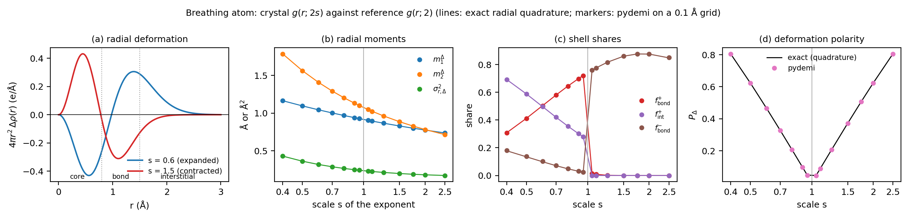

**Fig. 1.** (a) The radial deformation 4πr²Δρ for an expanded (s = 0.6) and a contracted
(s = 1.5) atom, with the three shells. (b–d) pydemi (markers) against exact quadrature
(lines).

**Table A1** (`data/analytic_A.csv`, selected rows):

| s | m1_def | exact | f_bond_def | exact | f_bond_dep | exact | def_polarity | exact |
|---|---|---|---|---|---|---|---|---|
| 0.5 | 1.0967 | 1.0966 | 0.4114 | 0.4121 | 0.1373 | 0.1347 | 0.6225 | 0.6225 |
| 0.8 | 0.9692 | 0.9691 | 0.6446 | 0.6453 | 0.0498 | 0.0479 | 0.2058 | 0.2058 |
| 1.25 | 0.8667 | 0.8668 | 0.0017 | 0.0015 | 0.8164 | 0.8169 | 0.2057 | 0.2058 |
| 2.0 | 0.7754 | 0.7754 | 0.0000 | 0.0000 | 0.8772 | 0.8753 | 0.6223 | 0.6225 |

* The moments and the polarity agree to 10⁻³, and mostly to 10⁻⁴. The largest
  difference is in m2 at s = 0.95 (9 × 10⁻⁴).
* The shell shares agree to 0.003 or better. The residual comes from voxels straddling the shell
  boundaries on a 0.1 Å grid.

Physics:

* **Expansion (s < 1)** moves charge outward: accumulation beyond r₀, depletion inside.
  `f_bond_def` and `f_int_def` share the accumulation, and `f_bond_dep` is small.
* **Contraction (s > 1)** reverses this. The accumulation is at the nucleus (core shell,
  so `f_bond_def` ≈ 0), and the depletion lies in the bond shell (`f_bond_dep` ≈ 0.8–0.9).
* P_Δ is nearly symmetric: s = 0.8 and s = 1.25 (= 1/0.8) both give 0.206.
* m1_def falls steadily with s, because the rearrangement moves inward with the atom.

### 4.2 Bond charge and bond length

Model B has two atoms at separation d. The crystal takes q/2 electrons from each atom
(exponent 2 Å⁻²) and places the q electrons in a Gaussian of exponent 3 Å⁻² at the bond
midpoint. Model C is a charge-transfer model. A cation-like atom (α = 2) gives q
electrons to an anion-like atom (α = 1) 2.2 Å away, and the gained charge sits in a more
diffuse Gaussian (α = 0.6) on the anion.

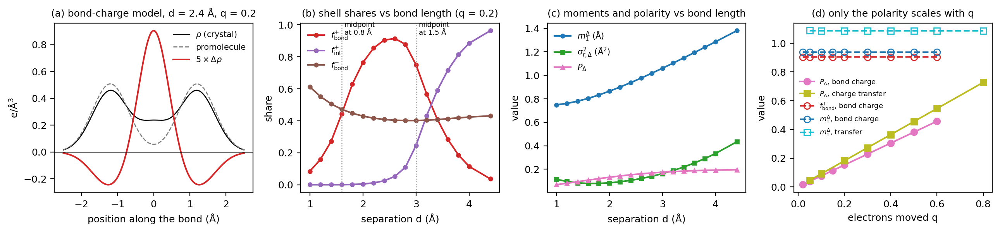

**Fig. 2.** (a) Bond-charge model along the bond axis. (b) Shell shares against the bond
length at q = 0.2. The dotted lines mark d = 1.6 and 3.0 Å, where the midpoint crosses
the 0.8 and 1.5 Å shell boundaries. (c) Moments and polarity against d. (d) Against the
moved charge q: only P_Δ changes.

**Table A2** (`data/analytic_B1.csv`, `analytic_B2.csv`, `analytic_C.csv`):

| model | parameter | m1_def | sigma_r2_def | f_bond_def | f_int_def | f_bond_dep | def_polarity |
|---|---|---|---|---|---|---|---|
| B1, q = 0.2 | d = 1.2 Å | 0.761 | 0.096 | 0.159 | 0.000 | 0.552 | 0.080 |
| B1 | d = 2.4 Å | 0.938 | 0.105 | 0.905 | 0.025 | 0.408 | 0.152 |
| B1 | d = 3.0 Å | 1.061 | 0.162 | 0.750 | 0.246 | 0.401 | 0.175 |
| B1 | d = 3.6 Å | 1.194 | 0.253 | 0.283 | 0.717 | 0.413 | 0.188 |
| B1 | d = 4.4 Å | 1.381 | 0.434 | 0.036 | 0.964 | 0.431 | 0.196 |
| B2, d = 2.4 Å | q = 0 | 1.003 | 0.224 | 0.563 | 0.132 | 0.582 | 0.0002 |
| B2 | q = 0.1 | 0.938 | 0.105 | 0.905 | 0.025 | 0.408 | 0.076 |
| B2 | q = 0.6 | 0.938 | 0.105 | 0.905 | 0.025 | 0.408 | 0.457 |
| C | q = 0.1 | 1.087 | 0.338 | 0.430 | 0.415 | 0.411 | 0.091 |
| C | q = 0.8 | 1.087 | 0.337 | 0.431 | 0.414 | 0.411 | 0.728 |

1. **P_Δ measures the amount.** It is linear in q: P_Δ = 0.762 q for the bond charge and
   0.909 q for the transfer. The slope stays below 1 (∫|Δρ| < 2q) because the gained
   Gaussian overlaps the depleted region, so part of the change cancels within each
   voxel.
2. **The shape descriptors are independent of q**, to within 10⁻³ for q ≥ 0.05, as §2.5
   predicts. At q = 0 they take arbitrary values from the 2 × 10⁻⁴ numerical residual.
3. **The shells are absolute.** Bond charge at a midpoint d/2 from the nuclei counts as
   "bond" for 1.6 < d < 3.0 Å and as "interstitial" beyond that. The two shares are equal
   at d ≈ 3.3 Å. A covalent bond of 3.4 Å, typical of heavy alkali or alkaline-earth
   compounds, is labelled interstitial. The radius-scaled shells (§9.1) are the remedy.
4. **m1_def grows with bond length** (0.76 → 1.38 Å from d = 1.2 to 4.4 Å), since the
   bond charge sits at d/2. It is a direct, shell-free readout of *where* the
   rearrangement is.

---

## 5. What they look like in real materials

`scripts/examples.py` computes Δρ for eight materials from the dataset, read as in the
rerun (ZVAL and RCORE from the run's OUTCAR, otherwise from the dataset's PAW table).

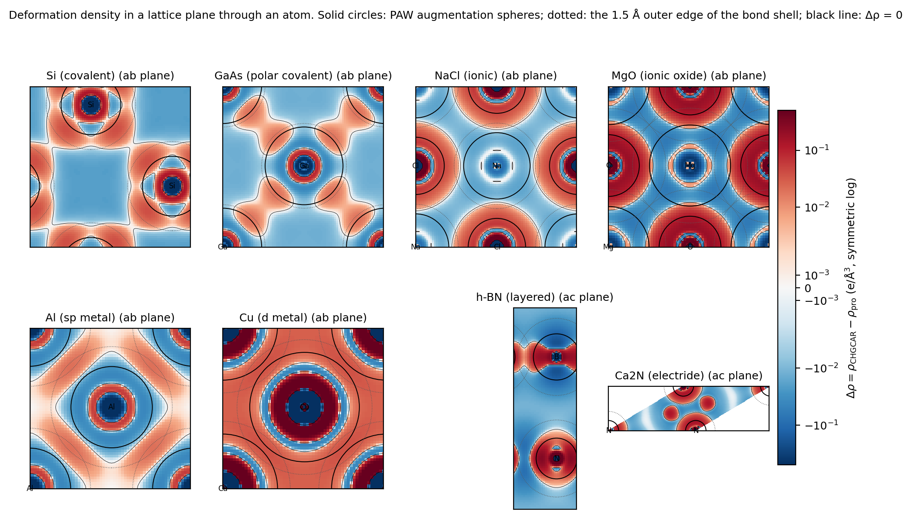

**Fig. 3.** Δρ in a lattice plane through an atom (symmetric-log colour scale, red =
accumulation). Solid circles: PAW augmentation spheres. Dotted circles: the 1.5 Å outer
edge of the bond shell. Black line: Δρ = 0.

What the maps show:

* **Si, GaAs.** Accumulation lobes on the bonds, outside the spheres, and depletion in the
  open interstitial: the textbook covalent picture.
* **NaCl, MgO.** Accumulation on shells around the anion (Cl, O) and depletion around the
  cation. The pattern is nearly spherical, not directed.
* **Al.** A broad accumulation network in the interstitial, which is the only example with
  a sizeable `f_int_def` (0.23).
* **Cu.** Dominated by a strong ring of accumulation and depletion **inside** the Cu
  sphere, together with a weak, uniform accumulation in the interstitial.
* **h-BN** (a plane containing the c axis). Accumulation around N and in-plane lobes at
  B, with depletion between the layers.
* **Ca₂N.** Accumulation around N and inside the Ca spheres. The interlayer region, where
  the electride's anionic electrons live, is weakly *depleted* relative to the neutral
  free atoms (light blue). The diffuse Ca 4s free-atom density already fills that
  region. A plausible reading is that, with a neutral-atom reference, the electride
  electrons do not show up as accumulation (`f_int_def` = 0.003).

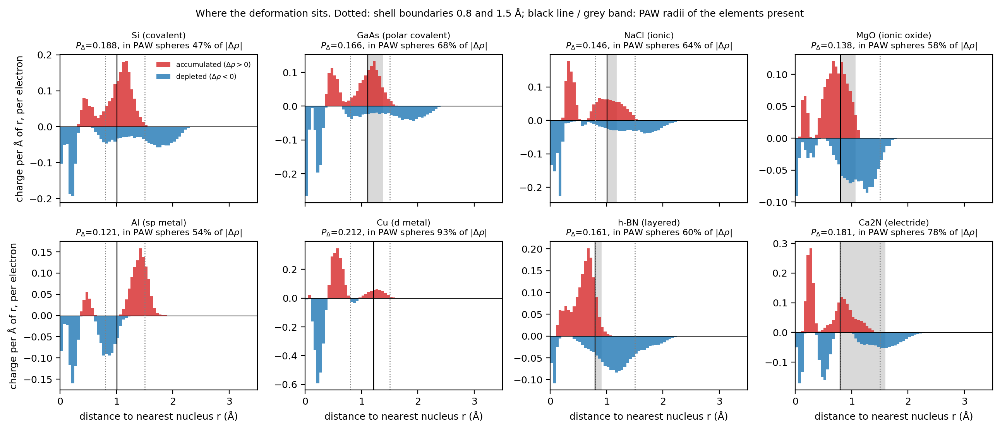

**Fig. 4.** Accumulated (red) and depleted (blue) charge against the distance to the
nearest nucleus, per electron of the cell. Dotted lines: shells. Black line and grey band:
PAW radii of the elements present. The titles give P_Δ and the share of ∫|Δρ| inside the
spheres.

Fig. 4 is the key to reading the whole-cell descriptors on a CHGCAR. In every example,
the largest features sit at r < 0.8 Å, well inside the augmentation spheres: alternating
accumulation and depletion at 0.1–0.6 Å. These features are **not** bonding. They are
the difference between a pseudized valence density and an all-electron-shaped free-atom
valence density (section 6). The bonding features are:

* the Si bond peak at 1.1–1.4 Å (the Si–Si midpoint is at 1.18 Å);
* the Al peak at 1.2–1.6 Å;
* the depletion tails beyond 1.5 Å.

The bonding features are smaller than the pseudization features for most materials.

**Table E1.** Whole-cell values (`data/examples.csv`):

| Material | m1_def (Å) | m2_def (Ų) | sigma_r2_def (Ų) | f_bond_def | f_int_def | f_bond_dep | def_polarity |
|---|---|---|---|---|---|---|---|
| Si (covalent) | 0.980 | 1.264 | 0.303 | 0.752 | 0.003 | 0.242 | 0.188 |
| GaAs (polar covalent) | 0.912 | 1.203 | 0.372 | 0.659 | 0.014 | 0.194 | 0.166 |
| NaCl (ionic) | 0.796 | 0.978 | 0.345 | 0.503 | 0.004 | 0.248 | 0.146 |
| MgO (ionic oxide) | 0.825 | 0.834 | 0.153 | 0.357 | 0.000 | 0.680 | 0.138 |
| Al (sp metal) | 0.909 | 1.085 | 0.258 | 0.636 | 0.231 | 0.354 | 0.121 |
| Cu (d metal) | 0.490 | 0.346 | 0.106 | 0.203 | 0.009 | 0.037 | 0.212 |
| h-BN (layered) | 0.830 | 0.906 | 0.216 | 0.107 | 0.000 | 0.573 | 0.161 |
| Ca₂N (electride) | 0.755 | 0.866 | 0.296 | 0.363 | 0.003 | 0.196 | 0.181 |

**Table E2.** Outside the PAW spheres (`paw` extension):

| Material | m1_def_out | m2_def_out | sigma_r2_def_out | f_bond_def_out | f_int_def_out | f_bond_dep_out | def_polarity_out | volume outside | ∫\|Δρ\| inside |
|---|---|---|---|---|---|---|---|---|---|
| Si | 1.399 | 2.065 | 0.108 | 0.995 | 0.005 | 0.319 | 0.100 | 0.79 | 0.47 |
| GaAs | 1.590 | 2.647 | 0.118 | 0.951 | 0.049 | 0.133 | 0.053 | 0.66 | 0.68 |
| NaCl | 1.450 | 2.197 | 0.095 | 0.989 | 0.011 | 0.346 | 0.052 | 0.76 | 0.64 |
| MgO | 1.161 | 1.400 | 0.052 | 1.000 | 0.000 | 0.877 | 0.058 | 0.63 | 0.58 |
| Al | 1.386 | 1.945 | 0.024 | 0.733 | 0.267 | 1.000 | 0.055 | 0.74 | 0.54 |
| Cu | 1.348 | 1.826 | 0.009 | 0.931 | 0.069 | 0.000 | 0.014 | 0.37 | 0.93 |
| h-BN | 1.294 | 1.778 | 0.105 | 0.962 | 0.000 | 0.731 | 0.064 | 0.77 | 0.60 |
| Ca₂N | 1.413 | 2.172 | 0.176 | 0.976 | 0.014 | 0.008 | 0.041 | 0.56 | 0.78 |

Outside the spheres, the covalent Si has the largest polarity (0.100) of the eight, and
Cu the smallest (0.014). That ordering matches chemical intuition. The whole-cell values
rank them the other way (Cu 0.212 > Si 0.188), because 93% of Cu's |Δρ| is inside its
sphere.

---

## 6. The PAW problem, and the `paw` extension

A VASP CHGCAR stores the **pseudo** valence density. Inside each augmentation sphere
(r < R_PAW, typically 0.8–1.6 Å), the true density's nodal structure is replaced by a
smooth function with the same multipole moments. The free-atom reference, by contrast,
keeps the **all-electron** radial shape of the valence orbitals. Inside the spheres, Δρ
therefore mixes bonding with pseudization, and the pseudization is much larger. The
paper's Table `tab:feni3` shows the scale: around Fe in FeNi₃, about 0.48 electrons move
from r < 0.4 Å to 0.4–0.8 Å between the two densities. Beyond 0.8 Å they agree to 4%.

`scripts/region_shares.py` measured where the sums come from, over 100 random structures
(seed 2026).

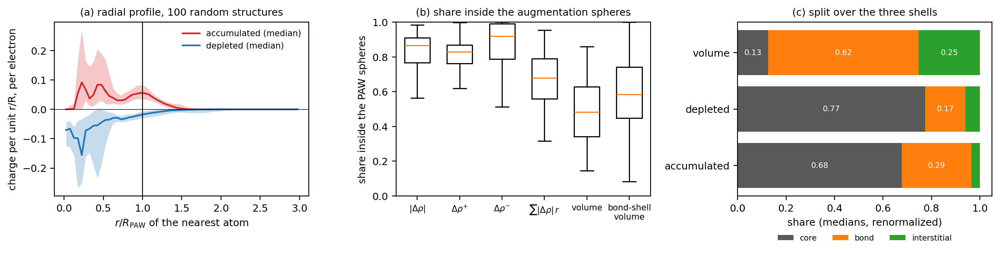

**Fig. 5.** (a) Median (band: interquartile range) radial profile of accumulation and
depletion against r/R_PAW of the nearest atom. Nearly all the structure is inside
r/R_PAW = 1. (b) Shares inside the spheres. (c) The split of the accumulation, the
depletion and the volume over the three shells (medians, renormalized to sum to 1).

| Quantity (100 structures) | median | IQR |
|---|---|---|
| share of ∫\|Δρ\| inside the spheres | 0.87 | 0.77–0.91 |
| share of the accumulation Δρ⁺ inside | 0.83 | 0.76–0.87 |
| share of the depletion Δρ⁻ inside | 0.92 | 0.79–0.99 |
| share of the m1_def numerator Σ\|Δρ\|r inside | 0.68 | 0.56–0.79 |
| volume inside the spheres | 0.48 | 0.34–0.63 |
| **bond-shell volume inside the spheres** | 0.58 | 0.45–0.74 |
| accumulation in core / bond / int shell | 0.65 / 0.28 / 0.03 | |
| depletion in core / bond / int shell | 0.75 / 0.16 / 0.06 | |
| volume in core / bond / int shell | 0.13 / 0.62 / 0.25 | |

These agree with the paper's independent sample of 121 structures that have their own
OUTCAR (87%, IQR 78–93%).

Consequences for CHGCAR input:

* The whole-cell descriptors are dominated by the 0–0.8 Å pseudization pattern.
  `f_bond_def` is at most a quarter of the story: the core shell holds a median 65% of the
  accumulation.
* The whole-cell and outside values are statistically unrelated for the moments and the
  bond shares (section 8.4).
* The `paw` extension removes the problem at the cost of the sphere interiors. The
  outside voxels are where the pseudo-density equals the true valence density. They
  cover a median 54% of the cell over the dataset (5th–95th percentile 24–76%), and less
  for d- and f-rich compounds with large R_PAW (median 48% when a d element is present).
* The proper fix is an all-electron density: AECCAR0 + AECCAR2 with
  `deformation_reference="aeccar0"`. The dataset does not have these files.

---

## 7. Physical significance

The deformation density is a standard picture of chemical bonding in crystallography
and DFT (Coppens; Koritsanszky and Coppens). The neutral spherical atoms are the
"no-bonding" reference. Whatever differs from it, including polarization, charge
transfer, bond charge and metallic smoothing, is what bonding did. The descriptors
compress that picture into seven numbers. What each one tells you, *when Δρ is
trustworthy* (all-electron, or outside the PAW spheres):

| Descriptor | Question it answers | Large value means | Small value means |
|---|---|---|---|
| `m1_def` | At what distance from the atoms does bonding rearrange charge? | rearrangement far out: long bonds, diffuse anions, interstitial electrons | rearrangement close to the nuclei: compact bonds, core polarization (d/f shells) |
| `m2_def` | The same, weighted towards the far part | as above, emphasizing the tail | |
| `sigma_r2_def` | Does the rearrangement happen at one distance or many? | several length scales (e.g. core polarization *and* bond charge) | one well-defined shell of rearrangement |
| `f_bond_def` | Is the gained charge between neighbours? | covalent bond charge, directed accumulation | gained charge at the nuclei (contraction) or far out |
| `f_int_def` | Is the gained charge in the open space? | metallic or free-electron-like smoothing, electride-like accumulation (relative to the reference) | compact, bond-centred or atom-centred rearrangement |
| `f_bond_dep` | Is the lost charge taken from the bond region? | depletion at intermediate distances (e.g. cations losing their outer shell, atom contraction) | lost charge comes from the nuclei or the far tails |
| `def_polarity` | How much charge does bonding move? | strong rearrangement: ionic transfer, strong covalency | a near-promolecular density (weak bonding, noble-gas-like, or a reference that already matches) |

Combined readings:

* **Covalent**: high `f_bond_def`, moderate `m1_def`, noticeable polarity. Example: Si
  outside the spheres, with `f_bond_def_out` 0.995 and `def_polarity_out` 0.100, the
  highest of the eight examples.
* **Ionic**: accumulation in shells around the anion and depletion around the cation.
  `f_bond_dep` is high (MgO: `f_bond_dep_out` 0.88), probably because the charge the
  cation loses lies in the 0.8–1.5 Å band.
* **Metallic**: a large `f_int_def`, and outside the spheres a small `sigma_r2_def_out`
  (a single broad band; Al 0.024, Cu 0.009). Polarity outside the spheres is low
  (0.014–0.055).

Limits of the picture itself, independent of the numerics:

* **Δρ depends on the reference.** A neutral spherical atom is a choice, not a law. A
  charged or valence-state reference would give a different Δρ; Ca₂N (§5) shows how a
  diffuse neutral reference can mask an electride.
* **Spherical and spin-free.** The free atoms are spherical and non-spin-polarized, so
  open-shell atoms' own asphericity and spin density appear as "deformation".
* **The tabulated atoms are LDA.** If the crystal density used another functional, the
  functional difference also enters Δρ. The magnitude was not measured here.

---

## 8. Survey over 6,059 materials

`scripts/dataset_table.py` merges the rerun table with the classes of the anisotropy
report: chemical class by the anions present, and crystal system from the relaxed
structure. It adds the Pauling electronegativity range Δχ and the heaviest block present.
Class counts:

| elemental | intermetallic | boride/carbide | hydride | pnictide | chalcogenide | oxide | halide |
|---|---|---|---|---|---|---|---|
| 86 | 3,195 | 354 | 80 | 653 | 548 | 607 | 536 |

### 8.1 Distributions

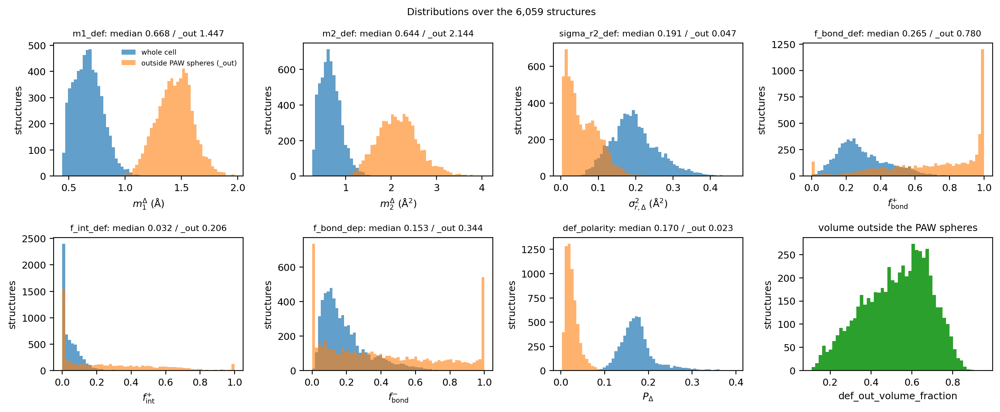

**Fig. 6.** Whole-cell (blue) and outside-sphere (orange) distributions, and the volume
fraction outside the spheres.

| Descriptor | 5% | median | 95% | _out 5% | _out median | _out 95% |
|---|---|---|---|---|---|---|
| m1_def (Å) | 0.489 | 0.668 | 0.892 | 1.177 | 1.447 | 1.703 |
| m2_def (Ų) | 0.347 | 0.644 | 1.081 | 1.457 | 2.144 | 2.977 |
| sigma_r2_def (Ų) | 0.102 | 0.191 | 0.316 | 0.008 | 0.048 | 0.139 |
| f_bond_def | 0.094 | 0.265 | 0.583 | 0.183 | 0.780 | 1.000 |
| f_int_def | 0.000 | 0.033 | 0.165 | 0.000 | 0.206 | 0.803 |
| f_bond_dep | 0.045 | 0.153 | 0.492 | 0.000 | 0.344 | 1.000 |
| def_polarity | 0.122 | 0.170 | 0.264 | 0.008 | 0.023 | 0.058 |

Observations:

* The whole-cell m1_def is about 0.67 Å, below the 0.8 Å core boundary, which again shows
  the pseudization pattern. Outside the spheres it is 1.45 Å, necessarily beyond R_PAW.
* Outside the spheres, the moved charge is a median 2.3% of the valence electrons,
  against 17% for the whole cell.
* **Degenerate values.**
  * `f_int_def` is exactly 0 in 969 structures: no accumulation beyond 1.5 Å.
  * `f_bond_dep_out` takes the `no_depletion` sentinel in 303 structures, which have no
    depletion outside the spheres at all.
  * `f_bond_def_out` and `f_int_def_out` take the `no_accumulation` sentinel in 9.
  * Among the outside shares, 661 structures have `f_bond_def_out` = 1 and 371 have
    `f_bond_dep_out` = 1. The outside region of compact cells can lie entirely in the
    bond shell.
  * The whole-cell descriptors have no sentinels.

### 8.2 By chemical class

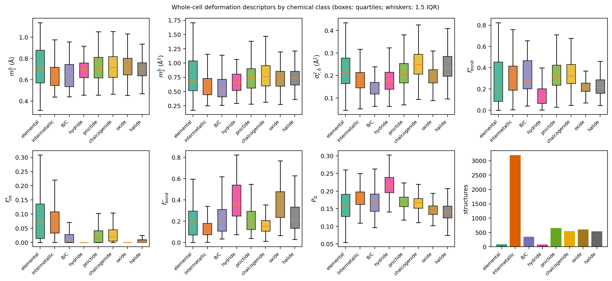

**Fig. 7.** Whole-cell descriptors by class (boxes: quartiles).

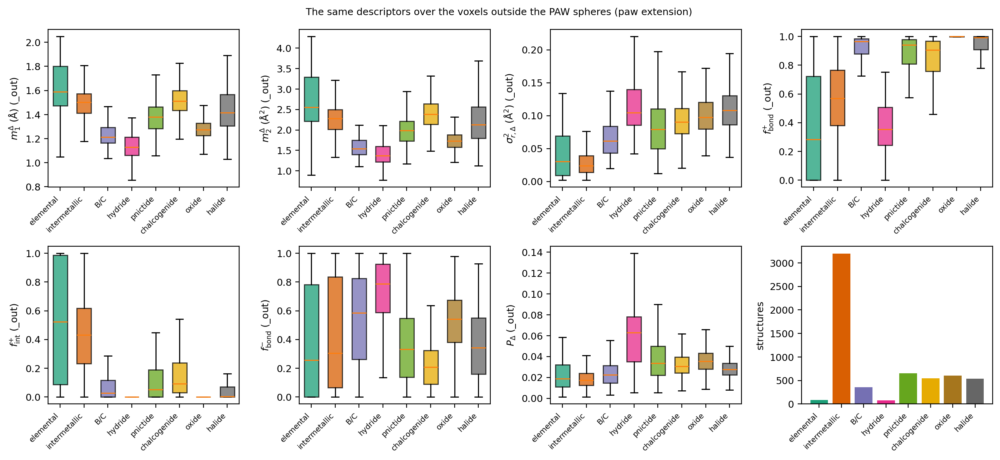

**Fig. 8.** The same outside the PAW spheres.

**Class medians, whole cell:**

| class | m1_def | m2_def | sigma_r2_def | f_bond_def | f_int_def | f_bond_dep | def_polarity |
|---|---|---|---|---|---|---|---|
| elemental | 0.704 | 0.690 | 0.214 | 0.210 | 0.068 | 0.194 | 0.158 |
| intermetallic | 0.637 | 0.591 | 0.181 | 0.274 | 0.069 | 0.116 | 0.179 |
| boride/carbide | 0.638 | 0.564 | 0.147 | 0.283 | 0.005 | 0.215 | 0.167 |
| hydride | 0.708 | 0.666 | 0.176 | 0.117 | 0.000 | 0.360 | 0.215 |
| pnictide | 0.708 | 0.728 | 0.204 | 0.318 | 0.012 | 0.199 | 0.171 |
| chalcogenide | 0.716 | 0.767 | 0.250 | 0.324 | 0.019 | 0.154 | 0.167 |
| oxide | 0.729 | 0.742 | 0.197 | 0.213 | 0.000 | 0.367 | 0.145 |
| halide | 0.705 | 0.740 | 0.235 | 0.212 | 0.001 | 0.215 | 0.140 |

**Class medians, outside the PAW spheres:**

| class | m1_def_out | sigma_r2_def_out | f_bond_def_out | f_int_def_out | f_bond_dep_out | def_polarity_out | volume outside |
|---|---|---|---|---|---|---|---|
| elemental | 1.589 | 0.030 | 0.282 | 0.523 | 0.257 | 0.019 | 0.57 |
| intermetallic | 1.504 | 0.024 | 0.568 | 0.431 | 0.304 | 0.017 | 0.45 |
| boride/carbide | 1.212 | 0.061 | 0.965 | 0.026 | 0.584 | 0.022 | 0.45 |
| hydride | 1.130 | 0.104 | 0.353 | 0.000 | 0.786 | 0.063 | 0.70 |
| pnictide | 1.380 | 0.079 | 0.942 | 0.051 | 0.332 | 0.034 | 0.59 |
| chalcogenide | 1.512 | 0.091 | 0.906 | 0.093 | 0.206 | 0.031 | 0.67 |
| oxide | 1.275 | 0.097 | 1.000 | 0.000 | 0.542 | 0.035 | 0.63 |
| halide | 1.417 | 0.108 | 0.993 | 0.003 | 0.343 | 0.028 | 0.72 |

Reading:

* **Whole cell.** The classes differ little: every class median of `def_polarity` lies
  in 0.14–0.22. The biggest contrast is `f_bond_dep`: oxides 0.37 and hydrides 0.36,
  against intermetallics 0.12. `f_int_def` separates elemental solids and intermetallics
  (0.07) from compounds with anions (≤ 0.02).
* **Outside the spheres, the classes separate clearly:**
  * *Where the accumulation goes.* Compounds with anions put essentially all of it in the
    bond shell (`f_bond_def_out` 0.91–1.00, except hydrides). Metals split it roughly
    evenly between the bond shell and the interstitial.
  * *How spread it is.* `sigma_r2_def_out` is 2–4 times smaller for metals
    (0.024–0.030) than for compounds with anions (0.06–0.11).
  * *Hydrides* have the largest outside polarity (0.063) and outside depletion share
    (0.79). H has the smallest PAW radius in the dataset (0.58 Å), which probably
    leaves more of its deformation outside.
  * *Oxides* are the most compact (m1_def_out 1.28 Å). *Elemental solids* are the most
    extended (1.59 Å).

### 8.3 Ionicity, and the d/f block

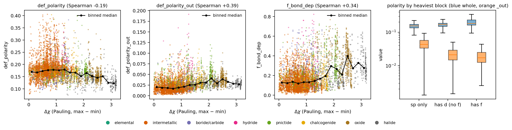

**Fig. 9.** `def_polarity`, `def_polarity_out` and `f_bond_dep` against the
electronegativity range Δχ (compounds only; black: binned medians), and the polarities by
heaviest block present.

Across the compounds:

* The **outside** polarity rises with Δχ (Spearman +0.39), and so does
  `sigma_r2_def_out` (+0.59). More ionic compounds rearrange more charge, over a wider
  range of distances.
* The **whole-cell** polarity falls slightly with Δχ (−0.18). It rises instead with the
  heaviest block, from a median 0.155 (sp only) to 0.170 (d) and 0.185 (f). This is the
  pseudization signature: d and f valence shells are strongly pseudized and give a large
  |Δρ| inside the spheres.
* The outside polarity falls along the same sequence (0.044, 0.021, 0.017). Its
  denominator is the whole-cell Q, which is large for d- and f-rich cells, and they have
  less volume outside the spheres.
* The 1,679 magnetic structures have a smaller whole-cell m1_def (median 0.57 against
  0.70 Å). All but 1% of them contain a d or f element (67% an f element), and their
  deformation is concentrated close to the nucleus.

### 8.4 Relation to each other and to other descriptors

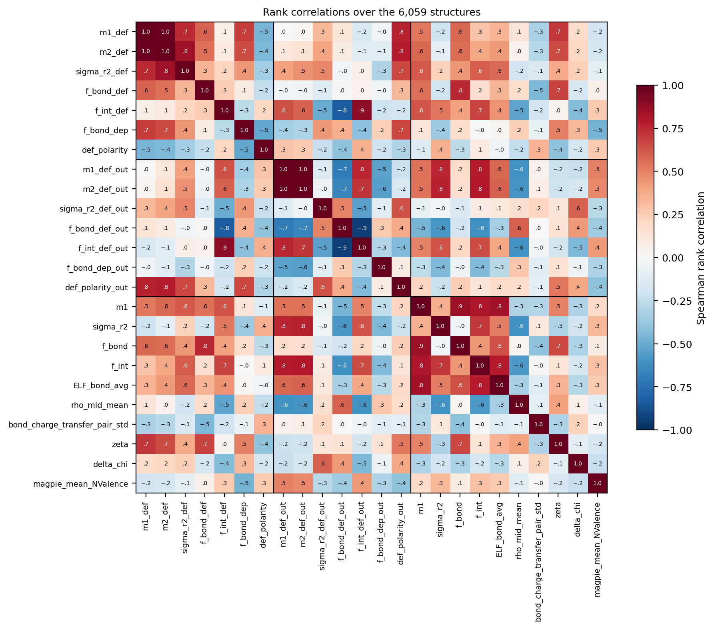

**Fig. 10.** Spearman rank correlations over the 6,059 structures
(`data/spearman_correlations.csv`). Blocks: whole cell, outside the spheres, other pydemi
descriptors and composition.

| pair | Spearman | reading |
|---|---|---|
| m1_def – m2_def | 0.98 | redundant pair; keep one plus sigma_r2_def |
| m1_def – m1_def_out | 0.00 | whole-cell and outside moments are unrelated |
| f_bond_def – f_bond_def_out | 0.01 | same for the bond share |
| f_int_def – f_int_def_out | 0.89 | the interstitial is mostly outside the spheres anyway |
| sigma_r2_def – sigma_r2_def_out | 0.49 | partly shared |
| def_polarity – def_polarity_out | −0.30 | opposite trends (§8.3) |
| m1_def – zeta | 0.71 | both track the core-region PAW pattern |
| f_bond_def – f_bond (charge share in the bond shell) | 0.75 | |
| m1_def_out – f_int (charge share in the interstitial) | 0.79 | outside moments follow how open the structure is |
| m1_def_out – sigma_r2 (density spread) | 0.77 | |
| def_polarity – f_bond_dep | −0.52 | |
| f_bond_dep – mean valence electron count | −0.47 | |

The whole-cell family correlates with the other PAW-sensitive descriptors (`zeta`
0.71, `f_bond`). The outside family correlates with the structural openness of the cell
(`f_int`, `sigma_r2`) and, for `sigma_r2_def_out` and `def_polarity_out`, with Δχ.

### 8.5 Descriptor maps

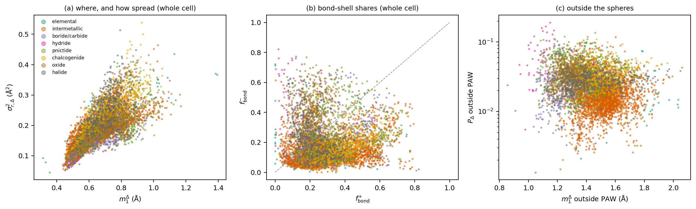

**Fig. 11.** (a) m1_def against sigma_r2_def. (b) f_bond_def against f_bond_dep. (c)
m1_def_out against def_polarity_out (log scale), all coloured by class. In (c), the
intermetallics cluster at large m1_def_out (about 1.5 Å) and low polarity (about
0.015). Hydrides lie at small m1_def_out and high polarity, and the other anion
compounds in between.

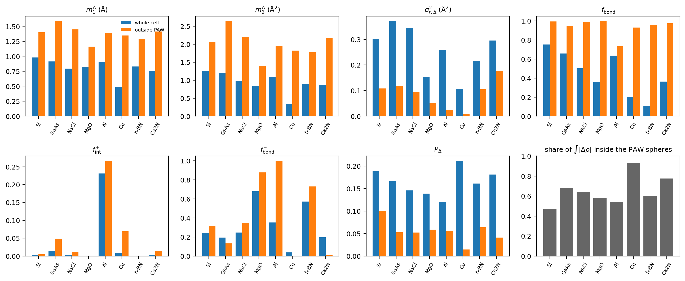

**Fig. 14.** The eight example materials, whole cell against outside the spheres, and
the share of ∫|Δρ| inside the spheres.

---

## 9. Numerical robustness and ML predictability

`scripts/robustness.py`; Fig. 12.

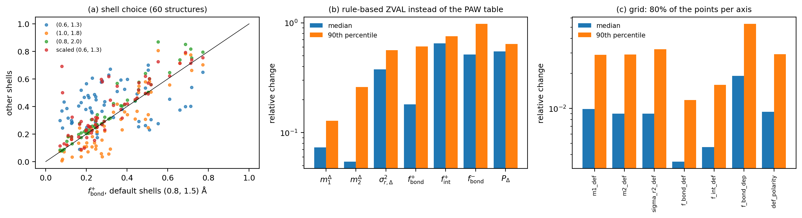

**Fig. 12.** (a) `f_bond_def` with other shell choices against the default, for 60
structures. (b) The relative change when pydemi's rule-based ZVAL replaces the dataset's
PAW table, for 40 OUTCAR-less structures containing K, Ca, Sr, Y, Zr, Nb, Ba, Cs or Rb.
(c) The relative change on an 80% Fourier-coarsened grid, for 30 structures.

### 9.1 Shells (only the three shares depend on them)

| descriptor | shells | median \|change\| | 90th pct | Spearman with default |
|---|---|---|---|---|
| f_bond_def | (0.6, 1.3) Å | 0.197 | 0.312 | **0.25** |
| f_bond_def | (1.0, 1.8) Å | 0.069 | 0.184 | 0.80 |
| f_bond_def | (0.8, 2.0) Å | 0.029 | 0.106 | 0.97 |
| f_bond_def | scaled (0.6, 1.3) × R_cov | 0.052 | 0.195 | 0.77 |
| f_int_def | (0.8, 2.0) Å | 0.029 | 0.106 | 0.47 |
| f_int_def | scaled (0.6, 1.3) × R_cov | 0.042 | 0.173 | **−0.45** |
| f_bond_dep | (0.6, 1.3) Å | 0.059 | 0.273 | 0.59 |
| f_bond_dep | (1.0, 1.8) Å | 0.049 | 0.109 | 0.84 |

* **`f_bond_def` depends mainly on the inner radius c1.** The large pseudization
  accumulation sits at 0.4–0.8 Å (Fig. 4), and lowering c1 to 0.6 Å moves it into the
  bond shell.
* **The outer radius matters much less**: changing c2 from 1.5 to 2.0 Å gives Spearman
  0.97.
* **`f_int_def` changes its meaning** under scaled shells. For light elements with small
  covalent radii, the "interstitial" starts much closer to the nucleus.
* **Recommendation:** fix the shells for a whole study and record them. They are in the
  metadata as `shells`.

### 9.2 Valence counts (ZVAL)

The dataset's PAW choices include semicore states for nine elements (K_pv, Ca_pv, Sr_sv,
Y_sv, Zr_sv, Nb_pv, Ba_sv, Cs_sv, Rb_pv). No electron-configuration rule can infer these.
For such a run without its own POTCAR or OUTCAR, pydemi's rule-based fallback builds a
promolecule with too few electrons. On 40 such structures, the promolecule held a median
20.8 electrons fewer than the cell, and 120 electrons in one case. The effect on the
descriptors:

| descriptor | median rel. change | 90th pct | Spearman (table vs default) |
|---|---|---|---|
| m1_def | 0.073 | 0.129 | 0.81 |
| m2_def | 0.055 | 0.261 | 0.85 |
| sigma_r2_def | 0.377 | 0.562 | 0.47 |
| f_bond_def | 0.181 | 0.609 | 0.25 |
| f_int_def | 0.649 | 0.753 | 0.69 |
| f_bond_dep | 0.516 | 0.978 | 0.38 |
| def_polarity | 0.549 | 0.642 | **−0.04** |

A wrong ZVAL does not just perturb the family; it destroys it. `zval_source` in the
metadata tells you which count was used. Do not mix `default` with `potcar`, `outcar`
or `table` in one training set.

### 9.3 Grid

On a Fourier-coarsened copy with 80% of the points per axis (paper analysis
`e_convergence.py`, 30 structures), the median relative change is:

* 0.35% for f_bond_def and 0.46% for f_int_def;
* 0.9–1.0% for m1_def, m2_def, sigma_r2_def and def_polarity;
* 1.9% for f_bond_dep.

The 90th percentiles are 1.2–5.3%. The single largest change is f_int_def, 35%, in a
structure where f_int_def itself is small. The residual comes from the point sampling
of the cusps (§3.4), which changes with the grid. No derivatives are involved.

### 9.4 ML predictability

The ChargE3Net model (from scratch) was trained on this dataset. For its 605 test
structures, the descriptors were computed from the predicted densities and compared with
those from the DFT densities (`data/ml_scores_scratch.csv`).

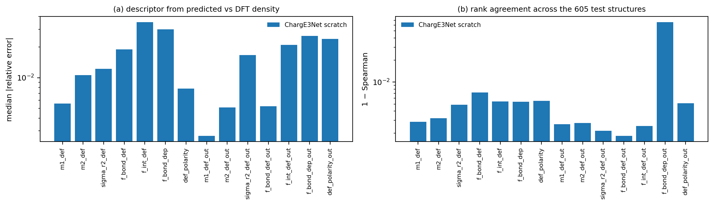

**Fig. 13.** Median |relative error| and 1 − Spearman, for the 14 variants.

| descriptor | median rel. error | 90th pct | Spearman | R² |
|---|---|---|---|---|
| m1_def | 0.56% | 1.9% | 0.9971 | 0.993 |
| m2_def | 1.1% | 3.6% | 0.9968 | 0.991 |
| sigma_r2_def | 1.2% | 4.4% | 0.9951 | 0.986 |
| f_bond_def | 1.9% | 7.4% | 0.9928 | 0.991 |
| f_int_def | 3.5% | 30.9% | 0.9946 | 0.987 |
| f_bond_dep | 3.0% | 10.4% | 0.9946 | 0.990 |
| def_polarity | 0.78% | 2.8% | 0.9945 | 0.991 |
| m1_def_out | 0.27% | 1.1% | 0.9974 | 0.993 |
| f_bond_def_out | 0.52% | 4.0% | 0.9982 | 0.996 |
| f_int_def_out | 2.1% | 24.8% | 0.9975 | 0.996 |
| f_bond_dep_out | 2.6% | 20.5% | **0.934** | 0.881 |
| def_polarity_out | 2.4% | 7.8% | 0.9949 | 0.990 |

* The promolecule is identical for the DFT and ML densities: same structure, same ZVAL.
  The errors are therefore those of the predicted density alone.
* The shares have heavy 90th-percentile tails wherever the share is small. A small
  denominator amplifies the error.
* `f_bond_dep_out` is the weakest (Spearman 0.93): its outside depletion is often tiny
  (303 structures have none, §8.1).
* The fine-tuned model's full-grid test was still running when this was written.
  `make_figures.py` adds its bars to Fig. 13 when `data/ml_scores_finetune.csv` exists.

---

## 10. Utility: what to use them for

1. **Bonding-type descriptors for property models.** On CHGCARs, use the `_out` family.
   The combination (f_bond_def_out, f_int_def_out, sigma_r2_def_out, def_polarity_out)
   separates bond-shell-directed compounds, metals and hydrides/oxides (Fig. 8, 11c). It
   also tracks ionicity (Δχ) without any compositional input.
2. **All-electron studies.** With AECCAR0 + AECCAR2, the whole-cell family is the
   intended, reference-consistent version, and the `_out` restriction is unnecessary.
3. **Comparing polymorphs or strained cells of one compound.** Same elements, same ZVAL
   and same PAW radii mean the pseudization pattern largely cancels in *differences*.
   Changes in `def_polarity` and `m1_def` then report changes in bonding. This was not
   measured here; it is a reasoned expectation, and worth checking before use.
4. **Checking inputs.** `def_charge_mismatch` and `zval_source` catch wrong valence counts
   before they reach a model. A promolecule off by whole electrons is immediately
   visible (§9.2).
5. **ML-density quality checks.** Descriptors computed from predicted densities are
   within about 1–3% of DFT (§9.4), so they can serve as physically interpretable
   validation metrics for a density model, beyond the voxel-wise error.
6. **Interpretation.** Fig. 3/4-style maps and profiles (via `examples.py`) show directly
   where a structure's bonding charge sits relative to the atoms and the PAW spheres.

---

## 11. Caveats and recommendations

| Issue | Effect | Recommendation |
|---|---|---|
| PAW pseudo-density against an all-electron-shaped reference | 87% of ∫\|Δρ\| is inside the spheres; the whole-cell values are dominated by pseudization | CHGCAR: use `extensions=("paw",)` and the `_out` variants; or write AECCAR0/AECCAR2 (`LAECHG = .TRUE.`) |
| Absolute shells | bond charge of bonds longer than ≈ 3 Å is counted as interstitial; `f_bond_def` is very sensitive to c1 | keep the default fixed within a study; consider scaled shells for chemically diverse sets, and record the choice |
| Valence counts | the rule-based ZVAL fails for semicore PAW datasets; up to 120 e missing from the reference | always provide POTCAR/OUTCAR or a PAW table; filter on `zval_source` |
| Neutral spherical LDA reference | open-shell asphericity, spin and functional differences appear as deformation; diffuse neutral atoms can mask electride electrons (Ca₂N) | interpret "accumulation" as relative to neutral atoms; use a `custom` reference from the same functional if it matters |
| Near-zero Δρ | the shape descriptors become ratios of noise | check `def_polarity` against the numerical floor (≈ 10⁻⁴ on the models) |
| m1_def / m2_def | ρ = 0.98 | keep one of the two, plus `sigma_r2_def` |
| Cusp sampling | median 0.06 e per cell mismatch; about 1% grid sensitivity | fine for ML; use the same grid density across a study |

**Stability tags.** All seven are tagged `robust` in the registry (`descriptor_names()`
includes them). They do not depend on the derivative method, and their grid convergence
is at the 1% level. The fragility documented here comes from **input choices** (reference,
ZVAL, shells), which the metadata records. Numerical noise is not the problem.

---

## 12. Reproducing this document

Run from `docs/deformation_descriptors/scripts/`, in the pydemi environment, niced, with
`OMP_NUM_THREADS=1` on the shared machine:

| Order | Script | Inputs | Outputs (`../data/`) | Run time |
|---|---|---|---|---|
| 1 | `analytic_models.py` | none | `analytic_A/B1/B2/C.csv`, `analytic_reference/` | minutes |
| 2 | `dataset_table.py` | rerun table; `../../anisotropy_descriptors/data/anisotropy_dataset.csv` | `deformation_dataset.csv` | < 1 min |
| 3 | `examples.py` | dataset CHGCARs | `slices.npz`, `radial_examples.csv`, `examples.csv` | minutes |
| 4 | `region_shares.py [N=100]` | dataset CHGCARs | `region_shares.csv`, `radial_paw.csv` | minutes |
| 5 | `robustness.py [N=60] [M=40]` | dataset CHGCARs; `paper/analysis/out/convergence.csv` | `robust_shells*.csv`, `robust_zval*.csv`, `robust_grid.csv` | minutes |
| 6 | `make_figures.py` | all of the above; `ml_scores_*.csv` | `../figures/fig01–fig14` (PNG + PDF), `spearman_correlations.csv` | minutes |

Structures are read with `paper/analysis/common.py` (`load`), exactly as in the dataset
rerun. Random samples use fixed seeds (2026 for the region shares, 31 for the shells, 5
for the ZVAL set). `ml_scores_scratch.csv` is copied from the ML evaluation
(`descriptor_eval.py` + `score.py` on ChargE3Net's test-set predictions).

The document is plain Markdown with LaTeX math (`$…$`, `$$…$$`), so it renders on GitHub,
in VS Code and in Typora. For a PDF: `pandoc deformation_descriptors.md -o
deformation_descriptors.pdf --pdf-engine=xelatex` (pandoc is not installed on this
machine).

---

## 13. References

* P. Coppens, *X-ray Charge Densities and Chemical Bonding*, Oxford University Press
  (1997). (Deformation densities, the promolecule.)
* T. S. Koritsanszky and P. Coppens, "Chemical applications of X-ray charge-density
  analysis", *Chem. Rev.* **101**, 1583 (2001).
* F. L. Hirshfeld, "Bonded-atom fragments for describing molecular charge densities",
  *Theor. Chim. Acta* **44**, 129 (1977). (The promolecule as a partition weight.)
* P. E. Blöchl, "Projector augmented-wave method", *Phys. Rev. B* **50**, 17953 (1994);
  G. Kresse and D. Joubert, *Phys. Rev. B* **59**, 1758 (1999). (PAW pseudo-densities,
  AECCAR files.)
* G. Henkelman, A. Arnaldsson and H. Jónsson, *Comput. Mater. Sci.* **36**, 354 (2006).
  (The Bader code; its documentation uses AECCAR0 + AECCAR2 as the all-electron
  reference density for VASP.)
* pydemi `prompt.md`, §6.1 (deformation density), §8.1 (bonding-domain descriptors), §11
  (analytic validation); `README.md` §6.6 (stability tags); the pydemi paper,
  "Numerical considerations: PAW" (Table `tab:feni3`).
