# Site-heterogeneity descriptors in pydemi: `m1_site_std`, `f_bond_site_std`, `zeta_site_std` and the within/between-element variances

Definitions, implementation, physical meaning, numerical behaviour and a survey over
6,059 VASP charge densities.

**Author:** Shubham Maurya, CMS Lab, IIT Kanpur · **Date:** 2026-09-25 ·
**pydemi:** `main` (prompt.md build) · **Data:** 6,059-structure VASP dataset
(`/data/sai/new_charge/6000_data_aug13`), descriptor table
`results/prompt_spec/descriptors_6000_data_aug13.csv`

Every number and figure in this document comes from the scripts in `scripts/`
(section 12). The intermediate tables are in `data/`.

---

## A note on the names

The specification (`prompt.md` §8.4) defines the heterogeneity domain as a
*meta-operator*. For a base descriptor X with per-site values X^(i), it generates
`X_site_std`, `X_site_range`, `X_site_max`, `X_site_min`, `X_within_element_var` and
`X_between_element_var`, and applies this to X = `m1`, `f_bond`, `zeta` and the site
magnetic moment `mu`. The name **`elemental_bonding_variance_within` /
`elemental_bonding_variance_between`** appears in the specification only once, in the
table of degenerate cases (§10: "Single element → `elemental_bonding_variance_between`
→ 0.0 plus flag"). It is the collective name for this within/between pair. In the code
and in the output, the pair is emitted per base descriptor:

| collective name (spec §10) | emitted columns |
|---|---|
| `elemental_bonding_variance_within` | `m1_within_element_var`, `f_bond_within_element_var`, `zeta_within_element_var` (and `mu_within_element_var`, magnetic) |
| `elemental_bonding_variance_between` | `m1_between_element_var`, `f_bond_between_element_var`, `zeta_between_element_var` (and `mu_between_element_var`) |

This document covers the nine bonding-density members, the three site standard
deviations and the six variances. The `mu` statistics belong to the magnetic analysis
and are mentioned only where they share the machinery.

---

## Summary

A crystal-level descriptor such as `m1` (the charge-weighted mean distance from the
nearest nucleus) averages over all atoms. The heterogeneity descriptors instead ask **how
different the atoms are**:

* Each atom i gets its own value X^(i), computed from the voxels its partition cell
  holds.
* `X_site_std` is the spread of X^(i) over the sites.
* The within/between pair splits the site variance exactly into two parts. The
  **between-element** part comes from different elements behaving differently. The
  **within-element** part comes from atoms of the same element behaving differently
  (inequivalent sites, defects, distortion).

Main findings:

1. **The decomposition is exact.** The one-way ANOVA identity
   std² = within + between holds to round-off: a relative residual of 10⁻¹⁵ over the
   6,059 structures (Fig. 1d) and 10⁻¹⁷ on model crystals.
   * In a model crystal where symmetry makes every site of an element equivalent, the
     within-element variance is 10⁻²⁹, i.e. exactly 0.
   * A single "defect" site makes the within-element variance appear, and it then
     exceeds the between-element part (Fig. 1b).
   * A 2 × 1 × 1 supercell gives identical values, since they are population statistics
     (§9.4).
2. **In real crystals, element identity dominates the site variance.**
   * Of the 5,638 structures with a repeated element, 3,721 have all sites of each
     element symmetry-equivalent. There the within-element variance is numerical noise
     (median 2 × 10⁻⁹ Ų for m1).
   * In the other 1,917, it is a median 0.1% of the total site variance for m1 and
     f_bond, and 0.6% for zeta. It exceeds half of the total in only 2–5% of them
     (Fig. 7d). So `X_site_std²` ≈ `X_between_element_var` in practice: their rank
     correlation for m1 is 1.00.
3. **The within-element variance is informative, but only above a noise floor.** For
   structures with inequivalent sites, the median is 1.2 × 10⁻⁵ Ų (m1), about 5,000
   times the symmetric-structure median. The distributions overlap, though: 32% of the
   inequivalent structures fall below the 95th percentile of the symmetric ones (Fig. 5,
   8).
4. **The partition and the shells change them strongly.** These descriptors are
   properties of the density *and* the partition.
   * *Partition.* Becke cells keep the ranking of structures (Spearman ≥ 0.97 for the
     site std). The power diagram and Hirshfeld do not (down to 0.34 for
     `m1_site_std`).
   * *Shells.* Changing the shell radii moves the f_bond statistics by a median 25–64%
     (Spearman 0.58–0.95).
   * *Derivatives and grid.* The zeta statistics are insensitive to the derivative
     scheme beyond second order (FD4 vs FFT: 10⁻⁴). The site std and between terms
     converge with the grid to about 1%.
5. **What drives them.**
   * **Site std rises with the number of elements.** Median `m1_site_std` is 0.092 Å
     for binaries and 0.149 Å for ternaries.
   * **`m1_site_std` does not follow the difference in atomic size** (Spearman −0.03
     with the covalent-radius range). This is expected, because the nearest-atom
     partition gives every atom a cell set by distance, not size.
   * **It is large where one atom's cell is filled by a neighbour's density.** An
     example is a low-valence cation next to an anion: in NaCl, Na has per-site m1 1.44
     Å against 0.91 Å for Cl, and ζ^(i) 0.36 against 0.0002. In ZrO₂, with the Zr_sv
     semicore on Zr, the Zr and O values nearly coincide.
6. **ML predictability.** From ChargE3Net's predicted densities (from-scratch model),
   the m1 and f_bond site std and between variances agree with DFT to a median 0.5–0.9%
   (Spearman ≥ 0.9996). The zeta ones agree to 3–6%. The within-element variances agree
   to 5–12% (Spearman 0.985–0.995).

---

## Contents

1. Notation
2. Definitions and formulas
3. How pydemi computes them
4. Analytic behaviour
5. What they look like in real materials
6. Physical significance
7. Survey over 6,059 materials
8. The symmetry noise floor of the within-element variance
9. Numerical robustness and ML predictability
10. Utility: what to use them for
11. Caveats and recommendations
12. Reproducing this document
13. References

---

## 1. Notation

| Symbol | Meaning |
|---|---|
| k | voxel index; ρ_k the (valence) density at voxel k, e/ų |
| i = 1 … n | the sites (atoms) of the cell |
| e(i) | the element of site i; n_e sites of element e; w_e = n_e / n |
| w_i(k) | partition weight of voxel k for site i: 0/1 for the nearest-atom and power partitions, smooth for Becke and Hirshfeld; Σ_i w_i(k) = 1 |
| r_ik, **u**_ik | distance from voxel k to site i (its nearest image) and the unit vector from the site to the voxel |
| c1, c2 | shell radii (default 0.8 and 1.5 Å, absolute); bond shell c1 < r ≤ c2 |
| X^(i) | per-site value of base descriptor X (m1, f_bond or zeta) |
| X̄, X̄_e | mean of X^(i) over all sites, and over the sites of element e |

All variances are **population** variances (divided by n, not n − 1).

---

## 2. Definitions and formulas

### 2.1 Per-site base descriptors

Each base descriptor is the cell-level formula restricted to one atom's voxels,
weighted by the partition:

$$
m_1^{(i)} = \frac{\sum_k w_i(k)\,\rho_k\, r_{ik}}{\sum_k w_i(k)\,\rho_k}\quad(\text{Å}),
\qquad
f_{\mathrm{bond}}^{(i)} = \frac{\sum_{k:\,c_1<r_{ik}\le c_2} w_i(k)\,\rho_k}{\sum_k w_i(k)\,\rho_k},
$$

$$
\zeta^{(i)} = 1-\frac{\sum_k w_i(k)\,\left|\nabla\rho_k\cdot\mathbf u_{ik}\right|}{\sum_k w_i(k)\,\left|\nabla\rho_k\right|}.
$$

* m1^(i) is the mean distance of the charge in atom i's region from atom i.
* f_bond^(i) is the fraction of that charge in atom i's bond shell.
* ζ^(i) is the non-radial fraction of the density gradient in the region. It is 0 when
  ρ there is spherical about atom i, and grows when the density in the region is shaped
  by something else (bonds, a neighbour's tail).

For the shells, the cutoffs c1 and c2 of site i's element are used, which matters only
with radius-scaled shells.

### 2.2 The site standard deviation

$$
\texttt{X\_site\_std} = \sqrt{\frac1n\sum_{i=1}^{n}\left(X^{(i)}-\bar X\right)^2}\;,\qquad \bar X=\frac1n\sum_i X^{(i)} .
$$

Units: Å for m1; dimensionless for f_bond and ζ. `X_site_range`, `X_site_max` and
`X_site_min` are computed alongside and are in the output table, but are not the subject
here. `m1_site_range` has rank correlation 0.97 with `m1_site_std`.

### 2.3 The within/between decomposition (one-way ANOVA)

$$
\underbrace{\frac1n\sum_i\left(X^{(i)}-\bar X\right)^2}_{\texttt{X\_site\_std}^2}
=\underbrace{\sum_e w_e\,\mathrm{Var}_{i\in e}\!\left(X^{(i)}\right)}_{\texttt{X\_within\_element\_var}}
+\underbrace{\sum_e w_e\left(\bar X_e-\bar X\right)^2}_{\texttt{X\_between\_element\_var}},
\qquad w_e=\frac{n_e}{n}.
$$

* **Within** is the site-fraction-weighted mean, over elements, of the variance among
  one element's sites. It is zero when all atoms of every element are alike.
* **Between** is the site-fraction-weighted variance of the element means. It is zero
  when every element has the same mean.

Units: Ų for m1; dimensionless for f_bond and ζ.

The weights w_e are what make the identity exact; it is the law of total variance. The
specification's first form, "mean over elements of Var", would weight elements equally
and break the identity. pydemi uses w_e, and the identity is unit-tested
(`tests/test_sites.py`).

### 2.4 Degenerate cases (sentinels)

| case | affected | value | flag |
|---|---|---|---|
| no element has two or more sites | `*_within_element_var` | NaN | `one_site_per_element`; the per-element counts are in the metadata (`site_counts`, `max_sites_per_element`) |
| single-element structure | `*_between_element_var` | 0.0 | `single_element` |
| uniform density | zeta statistics | 0.0 | `uniform_density` |

In the dataset:

* 421 structures have one site per element, so their within-element variance is NaN.
* 86 are elemental, so their between-element variance is 0.

For elemental solids, `X_site_std² = X_within_element_var` exactly.

---

## 3. How pydemi computes them

Code: `src/pydemi/descriptors/heterogeneity.py` (the meta-operator, 147 lines),
`src/pydemi/operators/sitestats.py` (site sums, the variance decomposition) and
`src/pydemi/core/partition.py` (the four partitions).

1. **Partition.** `partition_of(vd, options.partition)` returns the partition:
   * `nearest` (default): each voxel goes to its nearest nucleus;
   * `power`: a power diagram with the covalent radii as weights;
   * `becke`: smooth Becke cells;
   * `hirshfeld`: weights from the free-atom densities.

   Every partition is iterated as (voxel, atom, weight, distance, direction) pairs.
2. **One pass for all sums.** `site_sums` accumulates, per atom and with `np.bincount`,
   the sums Σwρ, Σwρr, Σwρr², Σ_core wρ, Σ_bond wρ, Σw|∇ρ·u| and Σw|∇ρ|. The gradient
   comes from `field_derivatives(vd, "rho")`, which is FFT by default. The result is
   cached on the structure, keyed by the partition, shells, derivative backend and FD
   order.
3. **Per-site values.** `site_m1`, `site_f_bond` and `site_zeta` are ratios of those
   sums.
4. **Statistics.** `site_statistics(x, species)` returns std, range, max, min and
   (within, between) from `variance_decomposition`. It sets within to NaN when no
   element has two sites.
5. **Registration.** `heterogeneity(base, per_site, ...)` registers the six names per
   base descriptor. It is one higher-order function, not copy-paste, as the
   specification requires. It is applied to `m1`, `f_bond`, `zeta` and `mu`.

The cost is one extra pass over the partition pairs. For the nearest-atom partition the
geometry pass is shared with every other descriptor.

**Stability tag.** All nine are registered as `robust` and are in the model-ready set
`descriptor_names(include_fragile=False)`. The `robust` tag describes the numerics, and
the numerics are indeed robust. The sensitivity documented in §9 comes from options
(partition, shells), which are recorded in the metadata.

---

## 4. Analytic behaviour

`scripts/analytic_models.py` builds a model crystal. It is a 2 × 2 × 2 block of a simple
cubic lattice (spacing 3 Å, box 6 Å, 0.1 Å grid) with rock-salt ordering: four A and four
B sites. Every site is a normalized Gaussian g(r; α) = (α/π)^{3/2} e^{−αr²} holding one
electron, periodic images included. All descriptors use the defaults: nearest-atom
partition, shells 0.8–1.5 Å.

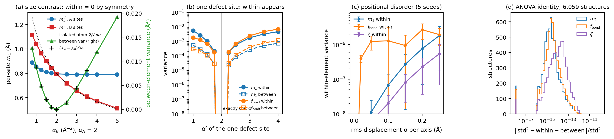

**Fig. 1.** (a) Size contrast: per-site m1 of the A and B sites against the B exponent,
and the between-element variance, which equals (X̄_A − X̄_B)²/4 exactly. (b) One
"defect" A site with exponent α′. (c) Random displacements of all atoms. (d) The ANOVA
identity over the dataset.

### 4.1 Size contrast (model A): within = 0, between = (Δ/2)²

With α_A = 2 Å⁻² and α_B varied, all A sites are equivalent by symmetry, and so are all
B sites.

* **Within is exactly zero.** The computed within-element variances are 10⁻³⁰–10⁻²⁸
  for all three base descriptors.
* **The identity holds.** Its residual is ≤ 2 × 10⁻¹⁷.
* **Between follows the two-group formula.** With two groups of equal size, it is
  (X̄_A − X̄_B)²/4. At α_B = 0.8: (0.8888 − 1.1146)²/4 = 0.01275 Ų, as computed.

The per-site values also show what the partition does:

| α_B | m1^(A) | m1^(B) | f_bond^(A) | f_bond^(B) | ζ^(A) | ζ^(B) |
|---|---|---|---|---|---|---|
| 0.8 (B diffuse) | 0.889 | 1.115 | 0.437 | 0.576 | 0.038 | 0.002 |
| 2.0 (identical) | 0.796 | 0.796 | 0.438 | 0.438 | 0.002 | 0.002 |
| 5.0 (B compact) | 0.790 | 0.513 | 0.438 | 0.096 | 0.000 | 0.004 |

* **The nearest-atom cell cuts the diffuse atom off.** The isolated-atom m1 of
  g(r; 0.8) is 2/√(0.8π) = 1.26 Å. Its cell (a 3 Å cube) truncates it to 1.11 Å.
* **The compact atom's cell holds its neighbour's tail.** When B is diffuse, A's
  ζ^(A) rises from 0.002 to 0.038: the density gradient in A's cell points partly
  towards the B atoms, not radially about A. This is the mechanism behind the large
  cation ζ^(i) in NaCl (§5).

### 4.2 One defect site (model B): within appears

All sites have α = 2 except one A site with α′.

* Symmetry is broken for both elements. The defect's m1 moves (1.039 Å at α′ = 1,
  against 0.797 for the other A sites).
* The three B sites that touch the defect shift too (0.8165 against 0.7958 Å for the one
  that does not).
* With one defect in four sites, the **within-element variance exceeds the between one
  by a factor of about 6–10**. At α′ = 1: m1 within 5.5 × 10⁻³, between 5.3 × 10⁻⁴ Ų.
  Within-element variance is the signature of a point defect or of chemically distinct
  sites of one element.

### 4.3 Positional disorder (model C): the grid-registration floor

Every atom is displaced by a Gaussian random vector with rms σ per axis (α_A = 2,
α_B = 3; 5 seeds per σ):

| σ (Å) | m1 within (Ų) | f_bond within | ζ within |
|---|---|---|---|
| 0 | 10⁻²⁹ | 10⁻³⁰ | 10⁻³⁰ |
| 0.02 | 2.3 × 10⁻⁹ | 4.0 × 10⁻⁷ | 5.4 × 10⁻⁹ |
| 0.10 | 6.7 × 10⁻⁸ | 1.3 × 10⁻⁶ | 2.0 × 10⁻⁸ |
| 0.25 | 1.8 × 10⁻⁶ | 2.0 × 10⁻⁶ | 5.4 × 10⁻⁷ |

* **m1 and ζ within grow smoothly and steadily**, by three orders of magnitude from
  σ = 0.02 to 0.25 Å: a real, continuous measure of distortion.
* **f_bond within jumps to about 10⁻⁶ already at σ = 0.02 Å and then stays flat.**
  f_bond^(i) counts whole voxels inside a sharp 0.8–1.5 Å shell. Displacing an atom
  relative to the grid changes which voxels fall inside, so each site's f_bond carries
  a grid-registration noise of order 10⁻³, whose square gives the 10⁻⁶ floor. The
  within-element variance of f_bond cannot resolve distortions below this floor.

---

## 5. What they look like in real materials

`scripts/examples.py` computed per-site values for eight materials under all four
partitions. Each site is labelled with its Wyckoff letter, symmetry-equivalence class
(spglib, 0.01 Å), nearest-neighbour distance and coordination number.

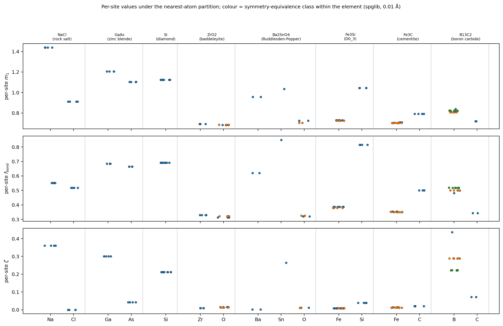

**Fig. 2.** Per-site m1, f_bond and ζ (nearest-atom partition), grouped by material and
element. Colours distinguish the symmetry-inequivalent sites of one element.

**Table E1.** Symmetry-distinct sites (nearest-atom partition; also Becke, power and
Hirshfeld for m1):

| material | site | CN | d_nn (Å) | m1 nearest | m1 Becke | m1 power | m1 Hirshfeld | f_bond | ζ |
|---|---|---|---|---|---|---|---|---|---|
| NaCl | Na a | 6 | 2.849 | 1.440 | 1.569 | 1.646 | 2.255 | 0.552 | 0.360 |
| | Cl b | 6 | 2.849 | 0.912 | 0.906 | 0.830 | 0.926 | 0.518 | 0.000 |
| ZrO₂ (baddeleyite) | Zr e | 7 | 2.074 | 0.693 | 0.709 | 1.054 | 0.975 | 0.330 | 0.010 |
| | O e (3-coord.) | 3 | 2.074 | 0.683 | 0.695 | 0.499 | 0.643 | 0.314 | 0.015 |
| | O e (4-coord.) | 4 | 2.179 | 0.685 | 0.698 | 0.484 | 0.643 | 0.322 | 0.013 |
| Ba₂SnO₄ | Ba e | 9 | 2.670 | 0.957 | 0.956 | 1.283 | 1.285 | 0.620 | 0.002 |
| | Sn a | 6 | 2.072 | 1.034 | 1.137 | 1.217 | 1.597 | 0.849 | 0.264 |
| | O e (apical) | 1 | 2.072 | 0.726 | 0.742 | 0.518 | 0.646 | 0.320 | 0.012 |
| | O c (equatorial) | 2 | 2.086 | 0.705 | 0.721 | 0.512 | 0.641 | 0.326 | 0.011 |
| Fe₃Si (D0₃) | Fe c | 8 | 2.429 | 0.730 | 0.743 | 0.757 | 0.872 | 0.386 | 0.009 |
| | Fe b | 8 | 2.429 | 0.726 | 0.740 | 0.739 | 0.874 | 0.380 | 0.009 |
| | Si a | 8 | 2.429 | 1.043 | 1.073 | 0.964 | 1.364 | 0.816 | 0.039 |
| Fe₃C (cementite) | Fe c | – | 1.962 | 0.708 | 0.718 | 0.754 | 0.870 | 0.354 | 0.014 |
| | Fe d | – | 1.996 | 0.704 | 0.714 | 0.754 | 0.871 | 0.352 | 0.013 |
| | C c | 6 | 1.962 | 0.791 | 0.824 | 0.607 | 0.894 | 0.500 | 0.020 |
| B₁₃C₂ | B b (chain centre) | 2 | 1.436 | 0.839 | 0.856 | 0.849 | 1.073 | 0.482 | 0.436 |
| | B h | 6 | 1.605 | 0.808 | 0.836 | 0.814 | 1.071 | 0.500 | 0.289 |
| | B h | 6 | 1.763 | 0.824 | 0.848 | 0.824 | 1.066 | 0.518 | 0.222 |
| | C c (chain end) | 4 | 1.436 | 0.719 | 0.743 | 0.695 | 0.855 | 0.344 | 0.072 |

Sites are labelled by element and Wyckoff letter (spglib). CN counts neighbours within
1.15 × the shortest distance. For the Fe sites of Fe₃C this
counts only the nearest C, so it is shown as –.

**Table E2.** The descriptors (nearest-atom partition; `data/examples.csv`):

| material | atoms | distinct sites | m1 std (Å) | m1 within (Ų) | m1 between (Ų) | f_bond std | f_bond within | f_bond between | ζ std | ζ within | ζ between |
|---|---|---|---|---|---|---|---|---|---|---|---|
| NaCl | 8 | 2 | 0.264 | 1.0e-27 | 0.0696 | 0.0171 | 3.2e-30 | 2.9e-04 | 0.18 | 5.8e-29 | 0.0324 |
| GaAs | 8 | 2 | 0.0509 | 4.5e-30 | 0.00259 | 0.00948 | 5.4e-30 | 9.0e-05 | 0.129 | 1.2e-29 | 0.0167 |
| Si | 8 | 1 | 6.6e-15 | 4.3e-29 | 0 (single element) | 8.5e-15 | 7.3e-29 | 0 | 9.5e-15 | 9.1e-29 | 0 |
| ZrO₂ | 12 | 3 | 0.00418 | 7.1e-07 | 1.7e-05 | 0.00663 | 1.1e-05 | 3.3e-05 | 0.00217 | 7.6e-07 | 4.0e-06 |
| Ba₂SnO₄ | 7 | 4 | 0.135 | 6.3e-05 | 0.0181 | 0.198 | 4.9e-06 | 0.0391 | 0.0896 | 4.1e-07 | 0.00803 |
| Fe₃Si | 16 | 3 | 0.137 | 2.7e-06 | 0.0186 | 0.187 | 6.9e-06 | 0.0349 | 0.0128 | 4.6e-09 | 1.6e-04 |
| Fe₃C | 16 | 3 | 0.0372 | 4.6e-06 | 0.00138 | 0.0639 | 1.9e-06 | 0.00409 | 0.00317 | 2.4e-07 | 9.8e-06 |
| B₁₃C₂ | 15 | 4 | 0.0349 | 8.4e-05 | 0.00113 | 0.0566 | 1.1e-04 | 0.00308 | 0.0859 | 0.00288 | 0.00449 |

What the examples show:

* **Symmetric crystals (NaCl, GaAs, Si).** Within is 10⁻³⁰–10⁻²⁷, i.e. zero. Si's site
  std is 10⁻¹⁴: numerically zero, as it should be.
* **Ionic NaCl** has the largest site spread. Under the nearest-atom partition, Na's
  cell is as large as Cl's (both are bounded by the same midplanes). The dataset's Na PAW
  dataset has ZVAL 1, against 7 for Cl, so most of the charge in Na's
  cell is the tail of the Cl density. That charge is far from Na (m1^(Na) = 1.44 Å)
  and is not radial about Na (ζ^(Na) = 0.36). Cl's cell holds its own, nearly spherical
  density (ζ^(Cl) ≈ 0).
* **ZrO₂ is the opposite.** Zr_sv puts its 4s4p semicore electrons in Zr's cell, close
  to the nucleus, so m1^(Zr) (0.69 Å) is almost the same as m1^(O) (0.68 Å). The
  between-element variance is then tiny (1.7 × 10⁻⁵ Ų), despite the strong ionicity.
  This is a warning: the per-site values reflect the valence partitioning of the PAW
  dataset as well as the chemistry (§11).
* **Inequivalent sites of one element are resolved, but the differences are small.**
  * The apical and equatorial O of Ba₂SnO₄ differ by 0.021 Å in m1.
  * The two Fe sites (c and b) of Fe₃Si differ by 0.004 Å.
  * The three B sites of boron carbide differ by up to 0.21 in ζ. This gives the largest
    ζ within in Table E2 (2.9 × 10⁻³), because the chain-B site (CN 2) has a much more
    anisotropic environment than the icosahedral ones.

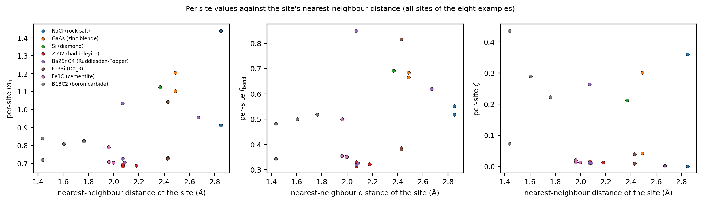

**Fig. 3.** Per-site values against the site's nearest-neighbour distance, for all sites
of the eight examples. Within one material, the sites separate by element first. There
is no universal relation with the bond length across materials.

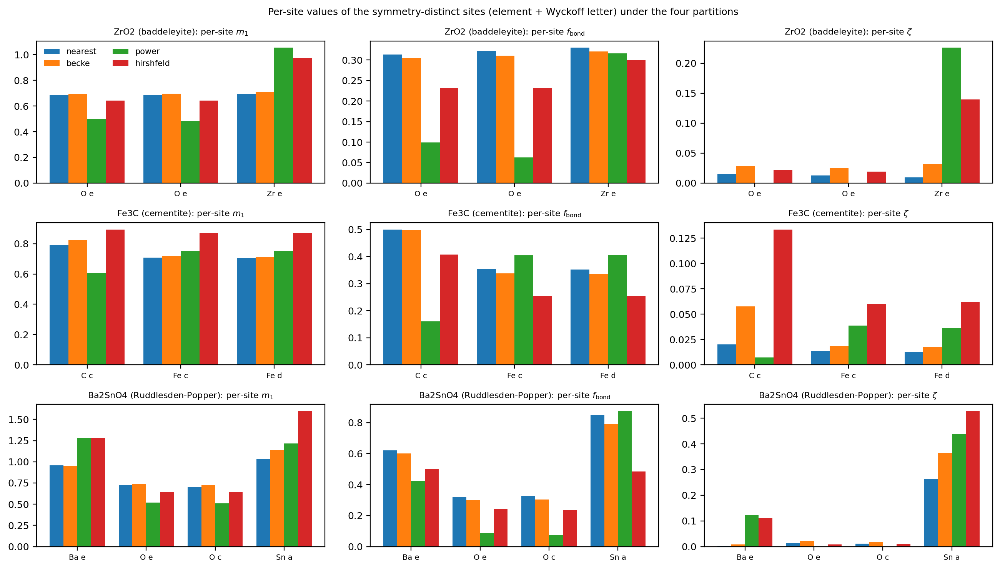

**Fig. 4.** Per-site values of the symmetry-distinct sites of ZrO₂, Fe₃C and Ba₂SnO₄
under the four partitions. The power diagram and Hirshfeld give larger atoms (Zr, Ba,
Sn) larger regions: their m1 goes up and O's goes down. This is why those partitions
reorder the site statistics (§9.1).

---

## 6. Physical significance

The site statistics describe how *inhomogeneous* the bonding environment of a crystal
is, atom by atom.

| descriptor | question it answers | large value | small value |
|---|---|---|---|
| `m1_site_std` | Do the atoms hold their charge at different distances? | atoms of very different "valence extent" in their regions: low-valence cations next to anions (NaCl 0.26 Å), mixed metal/metalloid (Fe₃Si 0.14 Å) | similar atoms (GaAs 0.05 Å), or semicore cations whose compact charge mimics the anion (ZrO₂ 0.004 Å) |
| `f_bond_site_std` | Do the atoms place different fractions of their charge in the bond shell? | charge on some atoms concentrated at 0.8–1.5 Å and on others at the nucleus (Ba₂SnO₄ 0.20, Fe₃Si 0.19) | similar radial profiles |
| `zeta_site_std` | Are some atoms' regions strongly non-spherical while others are spherical? | a mix of atoms whose regions are shaped by neighbours (cations filled by anion tails, directionally bonded sites) and atoms with spherical densities (NaCl 0.18) | all regions similarly (non-)spherical; typical of metals (Fe₃Si 0.013) |
| `X_between_element_var` | How much of the site spread comes from different elements behaving differently? | chemically contrasting elements | similar elements; exactly 0 for elemental solids |
| `X_within_element_var` | Do atoms of the *same* element differ? | inequivalent sites (Wyckoff positions, coordination), point defects, distortion, magnetic or charge ordering | all atoms of each element equivalent (then it is numerical noise, §8) |

The pair (between, within) is thus a **chemical versus structural** split of site
heterogeneity:

* **Between** carries elemental contrast.
* **Within** carries site inequivalence at fixed chemistry. Examples: the apical and
  equatorial O of a Ruddlesden–Popper phase, the tetrahedral and octahedral cations of
  a spinel, the chain and icosahedral B of boron carbide, a vacancy's neighbours in a
  supercell.

---

## 7. Survey over 6,059 materials

`scripts/dataset_table.py` merges the rerun table with the classes of the anisotropy
report: chemical class by anions, and crystal system from the relaxed structure. It adds
spglib site symmetry (0.01 Å) and composition features.

| class | elemental | intermetallic | boride/carbide | hydride | pnictide | chalcogenide | oxide | halide |
|---|---|---|---|---|---|---|---|---|
| structures | 86 | 3,195 | 354 | 80 | 653 | 548 | 607 | 536 |
| with inequivalent sites of one element | 15 | 806 | 109 | 24 | 278 | 198 | 336 | 151 |

### 7.1 Distributions

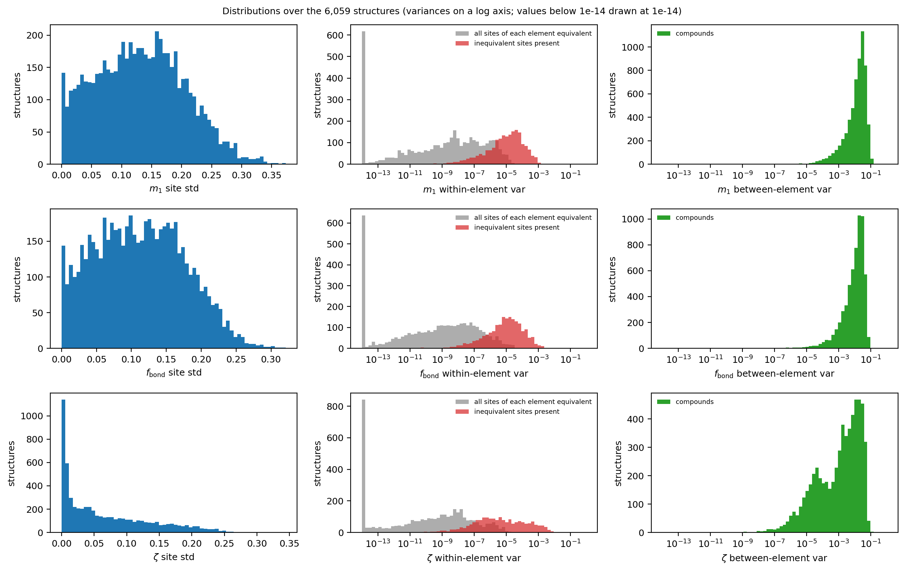

**Fig. 5.** Distributions. The variances are on a log axis. The within-element variance
is split into structures whose sites are all equivalent (grey: noise) and those with
inequivalent sites (red).

| descriptor | 5% | median | 95% |
|---|---|---|---|
| m1_site_std (Å) | 0.017 | 0.130 | 0.254 |
| f_bond_site_std | 0.014 | 0.111 | 0.219 |
| zeta_site_std | 0.001 | 0.044 | 0.203 |
| m1_between_element_var (Ų) | 2.5e-4 | 1.7e-2 | 6.5e-2 |
| f_bond_between_element_var | 1.7e-4 | 1.2e-2 | 4.8e-2 |
| zeta_between_element_var | ≈ 0 | 2.0e-3 | 4.1e-2 |
| m1_within_element_var (Ų, inequivalent sites) | – | 1.2e-5 | 3.2e-4 |
| f_bond_within_element_var (inequivalent sites) | – | 9.6e-6 | 3.7e-4 |
| zeta_within_element_var (inequivalent sites) | – | 3.4e-6 | 1.5e-3 |

`zeta_site_std` is strongly skewed. Many structures have all regions nearly spherical
(the mode is near 0), and a long tail runs to 0.34.

### 7.2 By chemical class

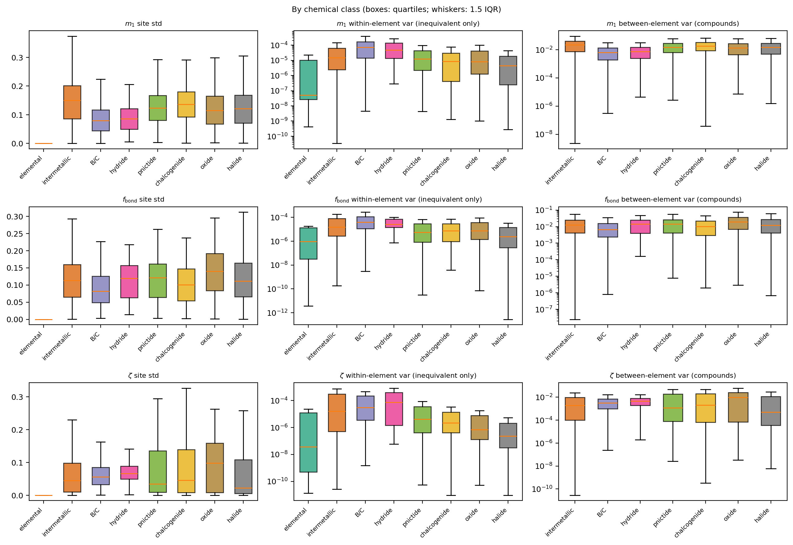

**Fig. 6.** By class. Site std over all structures; between variance for compounds;
within variance only for structures with inequivalent sites.

| class | m1_site_std | f_bond_site_std | zeta_site_std | m1 between (compounds) | ζ between (compounds) | m1 within (inequivalent) |
|---|---|---|---|---|---|---|
| elemental | 0 | 0 | 0 | – | – | 5.2e-8 |
| intermetallic | 0.150 | 0.113 | 0.045 | 2.3e-2 | 2.0e-3 | 1.5e-5 |
| boride/carbide | 0.080 | 0.082 | 0.056 | 6.3e-3 | 3.2e-3 | 7.1e-5 |
| hydride | 0.086 | 0.120 | 0.067 | 7.4e-3 | 4.4e-3 | 4.8e-5 |
| pnictide | 0.123 | 0.121 | 0.035 | 1.5e-2 | 1.2e-3 | 1.2e-5 |
| chalcogenide | 0.136 | 0.100 | 0.045 | 1.9e-2 | 2.1e-3 | 8.5e-6 |
| oxide | 0.115 | 0.140 | 0.098 | 1.3e-2 | 9.6e-3 | 8.3e-6 |
| halide | 0.121 | 0.111 | 0.022 | 1.5e-2 | 5.0e-4 | 4.4e-6 |

Reading:

* **Elemental solids** have zero site spread in the median. 71 of the 86 have a single
  symmetry class of sites, and only 8 have `m1_site_std` above 10⁻³ Å. The largest is
  Ta_136, with 8 distinct sites: `m1_site_std` 0.013 Å and `zeta_site_std` 0.034.
* **Intermetallics** have the largest `m1_site_std` (0.150 Å). The largest values in the
  dataset are rare-earth–Mg compounds (ErMg, TmMg, HoMg, 0.35–0.37 Å) and the Heusler
  phases Lu₂MgIn and Er₂MgIn.
* **Oxides** have the largest `f_bond_site_std` and `zeta_site_std` (0.140 and 0.098),
  and the largest ζ between variance. Metal and O regions differ strongly in shape.
  **Halides** have the smallest ζ between variance (5.0 × 10⁻⁴).
* **The within variances are largest for borides/carbides and hydrides** (7.1 × 10⁻⁵
  and 4.8 × 10⁻⁵ Ų for m1). These are classes with complex light-element frameworks,
  where one element occupies chemically different sites. The largest in the dataset
  (m1 within ≈ 10⁻³ Ų) are Li₄NCl, TlPd₃O₄, Na₄I₂O, Lu₄C₇, CsN₃ and RbN₃. In the
  azides, the central and terminal N of N₃⁻ are very different sites of one element.

### 7.3 Number of elements, magnetism and the d/f block

| n_elements | 1 | 2 | 3 | 4 | 5 |
|---|---|---|---|---|---|
| structures | 86 | 2,207 | 3,546 | 213 | 6 |
| median m1_site_std (Å) | 0 | 0.092 | 0.149 | 0.157 | 0.138 |
| median f_bond_site_std | 0 | 0.075 | 0.129 | 0.159 | 0.169 |
| median zeta_site_std | 0 | 0.024 | 0.060 | 0.095 | 0.140 |

* **Site spread rises with the number of elements**, as the between term predicts.
* **Magnetic structures** (1,679) have a similar m1 and f_bond spread, but a much
  smaller `zeta_site_std` (0.020 against 0.060). The same happens for the heaviest block
  present: 0.109 with sp elements only, 0.048 with a d element, 0.015 with an f element.
  The d/f-rich regions are dominated by compact, nearly spherical atomic densities.

### 7.4 What the between-element term does and does not track

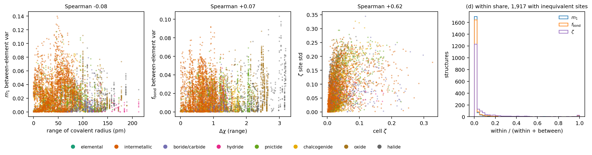

**Fig. 7.** (a–c) Between/site-std terms against composition and the cell ζ. (d) The
within share within/(within + between) for the 1,917 structures with inequivalent sites.

| pair | Spearman |
|---|---|
| m1_between_element_var – range of covalent radius | −0.08 (compounds) |
| m1_site_std – range of covalent radius | −0.03 |
| f_bond_between_element_var – Δχ (electronegativity range) | +0.07 (compounds) |
| zeta_site_std – cell ζ | +0.60 |
| m1_site_std – m1_between_element_var | 1.00 |
| m1_site_std – f_bond_site_std | 0.70 |
| m1_site_std – zeta_site_std | 0.25 |
| m1_site_std – cell m1 | −0.05 |
| f_bond_site_std – cell f_bond | −0.37 |

* **Neither atomic-size contrast nor electronegativity contrast predicts the between
  terms.** With the nearest-atom partition, region sizes are fixed by geometry, and the
  per-site values reflect how each element's *valence* charge (as defined by its PAW
  dataset) fills that region (§5, ZrO₂ vs NaCl). The descriptors therefore carry
  information that compositional features (Magpie ranges) do not. That is useful for
  ML, but it limits a naïve "ionicity" reading.
* **`zeta_site_std` follows the cell-level ζ** (0.60). When the cell's density is
  non-spherical overall, it is usually because some sites are.
* **The within share is almost always small** (Fig. 7d). Among structures with
  inequivalent sites, it has median 0.001 (m1), 0.001 (f_bond) and 0.006 (ζ), and 90th
  percentile 0.03, 0.05 and 0.30. For ζ it is not negligible in the tail.

### 7.5 Correlations

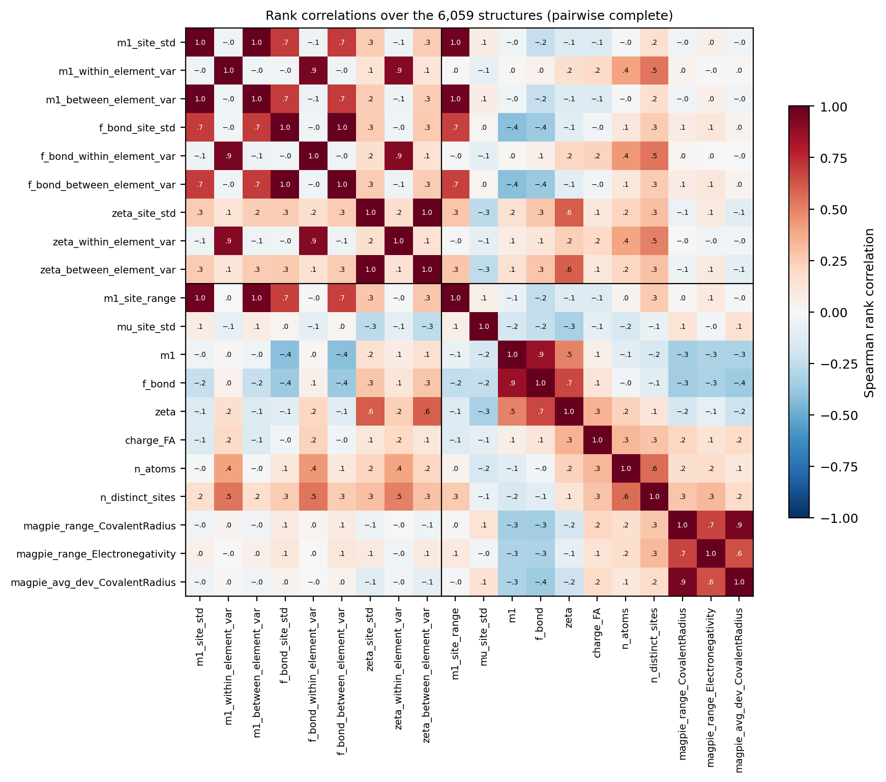

**Fig. 9.** Spearman rank correlations (`data/spearman_correlations.csv`).

* The three within variances correlate strongly with each other across the whole
  dataset: 0.95 for m1–f_bond and 0.92 for m1–ζ. Much of this is shared noise scaling,
  since symmetric structures give tiny values for all three. Restricted to structures
  with inequivalent sites, the correlations are 0.76 and 0.54.
* The within variances correlate with the number of symmetry-distinct sites (0.54 for
  m1 over all structures).

---

## 8. The symmetry noise floor of the within-element variance

If every site of every element is symmetry-equivalent, the true within-element variance
is exactly 0. Any computed value then comes from how differently the equivalent sites
sit relative to the grid, together with round-off. This affects 3,721 of the 5,638
structures with a repeated element.

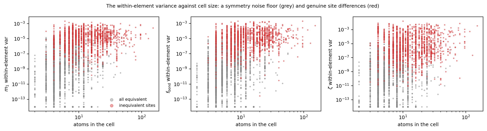

**Fig. 8.** Within-element variance against cell size. Grey: all sites equivalent. Red:
inequivalent sites present.

| base | all equivalent: median | 95th pct | inequivalent: median | 95th pct | inequivalent below the equivalent 95th pct |
|---|---|---|---|---|---|
| m1 (Ų) | 2.3e-9 | 3.3e-6 | 1.2e-5 | 3.2e-4 | 32% |
| f_bond | 6.8e-10 | 1.8e-6 | 9.6e-6 | 3.7e-4 | 27% |
| ζ | 2.2e-10 | 1.3e-6 | 3.4e-6 | 1.5e-3 | 41% |

* The medians differ by a factor of about 5,000 for m1, the same figure as in the
  paper.
* Individual inequivalent structures often fall inside the noise: a third of them lie
  below the 95th percentile of the equivalent ones.
* A structure that is inequivalent in the spglib sense, at 0.01 Å, can have sites that
  are *nearly* equivalent. Examples are slightly distorted relaxed cells, or the two Fe
  sites of Fe₃Si (difference 0.004 Å in m1).

Practical rule: treat `X_within_element_var` below about 10⁻⁶ (m1 in Ų, f_bond, ζ) as
zero. Use the spglib equivalence, or `max_sites_per_element` and the site counts in the
metadata, to separate "no information" from "no difference".

---

## 9. Numerical robustness and ML predictability

`scripts/robustness.py`; Fig. 10.

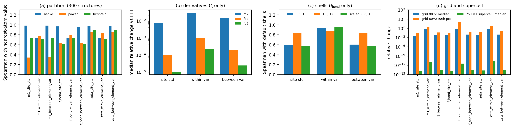

**Fig. 10.** (a) Rank agreement with the nearest-atom partition (300 structures, paper
analysis). (b) Derivative scheme, ζ statistics only. (c) Shells, f_bond statistics only.
(d) Grid (80% Fourier-coarsened, 30 structures) and a 2 × 1 × 1 supercell (12
structures).

### 9.1 Partition

From `paper/analysis/b_partitions.py`: 300 random structures; 289 have a within value.

| descriptor | Becke: median rel. change / Spearman | power: | Hirshfeld: |
|---|---|---|---|
| m1_site_std | 8% / 0.99 | 37% / 0.34 | 46% / 0.73 |
| m1_between_element_var | 15% / 0.99 | 60% / 0.35 | 70% / 0.73 |
| m1_within_element_var | 100% / 0.74 | 72% / 0.78 | 100% / 0.72 |
| f_bond_site_std | 9% / 0.97 | 25% / 0.64 | 28% / 0.62 |
| f_bond_between_element_var | 17% / 0.97 | 43% / 0.64 | 48% / 0.62 |
| f_bond_within_element_var | 97% / 0.74 | 72% / 0.79 | 100% / 0.73 |
| zeta_site_std | 16% / 0.98 | 24% / 0.85 | 51% / 0.90 |
| zeta_between_element_var | 30% / 0.98 | 43% / 0.85 | 76% / 0.90 |
| zeta_within_element_var | 77% / 0.73 | 51% / 0.84 | 93% / 0.71 |

* **Becke preserves the ranking.** Like the nearest-atom partition, it ignores atomic
  size.
* **Power and Hirshfeld reorder structures.** They give larger atoms larger regions
  (Fig. 4).
* The within values change by nearly 100% under every alternative partition, because in
  most structures they are noise (§8).
* **Conclusion:** choose one partition per study and record it (`partition` in the
  metadata).

### 9.2 Derivatives (ζ statistics only)

60 random structures, FFT against central differences:

* FD2: median relative change 0.8% (site std), 1.5% (between) and 3.0% (within).
* FD4 and higher: 10⁻⁴ or below for the site std and between terms, and 10⁻³ for
  the within term.

m1 and f_bond use no derivatives.

### 9.3 Shells (f_bond statistics only)

| shells | f_bond_site_std: median rel. / Spearman | between | within |
|---|---|---|---|
| (0.6, 1.3) Å | 42% / 0.60 | 64% / 0.60 | 63% / 0.94 |
| (1.0, 1.8) Å | 25% / 0.83 | 44% / 0.83 | 75% / 0.88 |
| scaled (0.6, 1.3) × R_cov | 34% / 0.58 | 58% / 0.58 | 60% / 0.95 |

The f_bond statistics are **defined** by the shells. A different shell choice gives a
related but different descriptor. Fix the shells within a study.

### 9.4 Grid and supercell

* **Grid (80% of the points per axis, 30 structures).** The median relative change is
  0.35% (m1_site_std), 0.59% (f_bond_site_std, zeta_site_std) and 0.7–1.1% (the between
  terms). The 90th percentiles are 3–17%. The within terms change by a median 63–75%,
  their noise level.
* **Supercell (2 × 1 × 1, density tiled and atoms duplicated; 12 structures).** Every
  value is unchanged, with median relative change 0. The ζ within, in the noise regime,
  has a 90th percentile of 6%. The statistics are population statistics and do not
  depend on the choice of cell.

### 9.5 ML predictability

For ChargE3Net's 605 test structures, the descriptors were computed from the predicted
densities (from-scratch model) against those from DFT. 564 structures have a within
value. Source: `data/ml_scores_scratch.csv`.

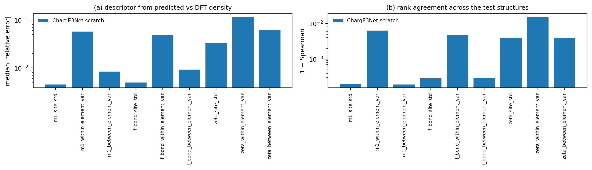

**Fig. 11.** Median |relative error| and 1 − Spearman.

| descriptor | median rel. error | 90th pct | Spearman | R² |
|---|---|---|---|---|
| m1_site_std | 0.45% | 2.9% | 0.9998 | 0.999 |
| m1_between_element_var | 0.84% | 5.2% | 0.9998 | 0.998 |
| m1_within_element_var | 5.7% | 41% | 0.9937 | 0.942 |
| f_bond_site_std | 0.50% | 3.3% | 0.9997 | 1.000 |
| f_bond_between_element_var | 0.93% | 5.8% | 0.9997 | 0.999 |
| f_bond_within_element_var | 4.8% | 35% | 0.9952 | 0.976 |
| zeta_site_std | 3.3% | 18% | 0.9960 | 0.992 |
| zeta_between_element_var | 6.2% | 31% | 0.9960 | 0.986 |
| zeta_within_element_var | 12% | 68% | 0.9848 | 0.964 |

* **The site std and between terms of m1 and f_bond are among the best-predicted
  descriptors of all.**
* **The ζ statistics are less accurate.** ζ needs the gradient, which amplifies
  small-scale density errors.
* **The within terms have large relative errors** (they are small numbers), yet high
  rank agreement. For symmetric structures, both the DFT and ML values sit in the same
  noise band, which inflates the rank agreement. Their predictability should not be
  over-read.
* The fine-tuned model's full-grid test was still running when this was written.
  `make_figures.py` adds its bars when `data/ml_scores_finetune.csv` exists.

---

## 10. Utility: what to use them for

1. **Features for property models of multicomponent compounds.** The site std and
   between terms are robust, well predicted from ML densities, and nearly independent of
   the composition features (§7.4). They say how chemically inhomogeneous the density
   is, beyond what the element list says.
2. **Detecting site inequivalence and defects.** Above the noise floor (§8), a within
   term marks:
   * inequivalent sites of one element, such as the apical/equatorial O or the
     chain/icosahedral B;
   * symmetry breaking by relaxation;
   * in a supercell, the neighbours of a defect (§4.2).

   Compare it with the spglib equivalence classes.
3. **Screening for distortion.** m1 and ζ within grow smoothly with positional disorder
   (§4.3). Tracking them along a relaxation, an MD snapshot series or a strain path
   measures how far the sites of one element diverge.
4. **Choosing a partition-invariant subset.** For comparisons across partitions, use
   the Becke-consistent set: the site std and between terms, with Spearman ≥ 0.97
   between nearest and Becke.
5. **Quality control of predicted densities.** Site-resolved statistics test whether a
   density model gets *each atom* right, not only the cell average.

---

## 11. Caveats and recommendations

| issue | effect | recommendation |
|---|---|---|
| partition dependence | power and Hirshfeld reorder structures (Spearman down to 0.34) | fix the partition per study; the default nearest-atom and Becke agree |
| shell dependence (f_bond) | 25–64% median change for other shells | keep the default shells and record them |
| symmetry noise floor | within values of symmetric cells are 10⁻¹⁰–10⁻⁶ noise | treat within < 10⁻⁶ as zero; use spglib or `max_sites_per_element` |
| f_bond grid registration | sharp shells give each site a ~10⁻³ noise; within floor ~10⁻⁶ | do not read f_bond within below 10⁻⁵ as distortion |
| PAW valence partitioning | semicore electrons (e.g. Zr_sv) sit in their atom's region and change m1^(i); low-valence cations' regions fill with neighbours' tails | compare structures computed with the same PAW datasets; interpret per-site values as "valence charge in the region", not as atomic size |
| NaN within for one site per element | 421 structures | impute (e.g. 0 with an indicator column) before ML, using the metadata counts |
| site_std² ≈ between | redundant pair in practice (Spearman 1.00 for m1) | keep one of them, plus the within term |
| small cells | few sites make every statistic coarse (a 2-atom cell has one number per element) | filter or weight by `n_atoms` and the site counts |

---

## 12. Reproducing this document

Run from `docs/heterogeneity_descriptors/scripts/`, in the pydemi environment, niced, with
`OMP_NUM_THREADS=1` on the shared machine:

| order | script | inputs | outputs (`../data/`) |
|---|---|---|---|
| 1 | `analytic_models.py` | none | `analytic_A/B/C.csv` |
| 2 | `dataset_table.py` | rerun table; `../../anisotropy_descriptors/data/anisotropy_dataset.csv`; CHGCAR headers (spglib) | `heterogeneity_dataset.csv` |
| 3 | `examples.py` | dataset CHGCARs | `sites_examples.csv`, `examples.csv` |
| 4 | `robustness.py [N=60] [M=12]` | dataset CHGCARs; `paper/analysis/out/partitions_summary.csv`, `convergence.csv` | `robust_*.csv` |
| 5 | `make_figures.py` | all of the above; `ml_scores_*.csv` | `../figures/fig01–fig12` (PNG + PDF), `spearman_correlations.csv` |

Each takes minutes. Structures are read with `paper/analysis/common.py` (`load`),
exactly as in the dataset rerun. Random samples use fixed seeds: 31 for the derivative
and shell sample, 77 for the supercell set, 0–4 in model C. `ml_scores_scratch.csv` is
copied from the ML evaluation (`descriptor_eval.py` + `score.py` on ChargE3Net's
test-set predictions).

The document is Markdown with LaTeX math. For a PDF: `pandoc heterogeneity_descriptors.md
-o heterogeneity_descriptors.pdf --pdf-engine=xelatex` (pandoc is not installed on this
machine).

---

## 13. References

* A. D. Becke, "A multicenter numerical integration scheme for polyatomic molecules",
  *J. Chem. Phys.* **88**, 2547 (1988). (Becke cells.)
* F. L. Hirshfeld, "Bonded-atom fragments for describing molecular charge densities",
  *Theor. Chim. Acta* **44**, 129 (1977). (Hirshfeld partition.)
* F. Aurenhammer, "Power diagrams: properties, algorithms and applications", *SIAM J.
  Comput.* **16**, 78 (1987). (Power diagram.)
* R. A. Fisher, *Statistical Methods for Research Workers* (1925). (Analysis of
  variance: the within/between decomposition.)
* A. Togo and I. Tanaka, spglib, https://spglib.readthedocs.io. (Site symmetry and
  Wyckoff positions.)
* L. Ward, A. Agrawal, A. Choudhary and C. Wolverton, "A general-purpose machine
  learning framework for predicting properties of inorganic materials", *npj Comput.
  Mater.* **2**, 16028 (2016). (Magpie composition features used for comparison.)
* pydemi `prompt.md`, §8.4 (heterogeneity domain), §9 (partitions), §10 (sentinels);
  the pydemi paper, Table `tab:partition-sensitivity` and the site-symmetry analysis.
