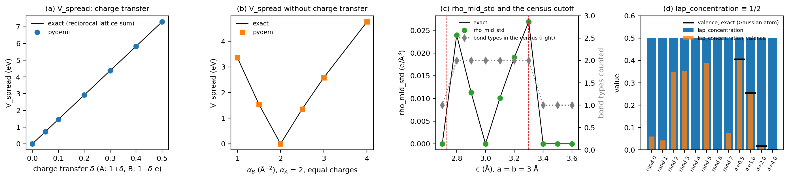
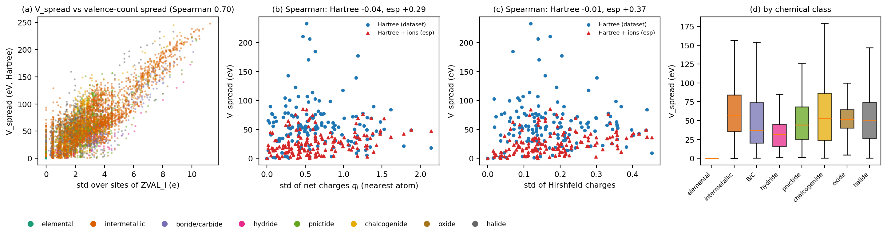
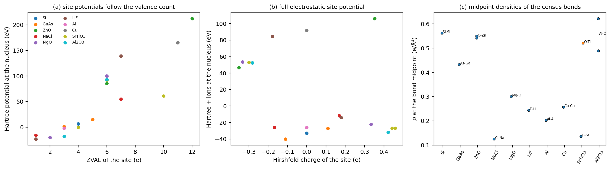
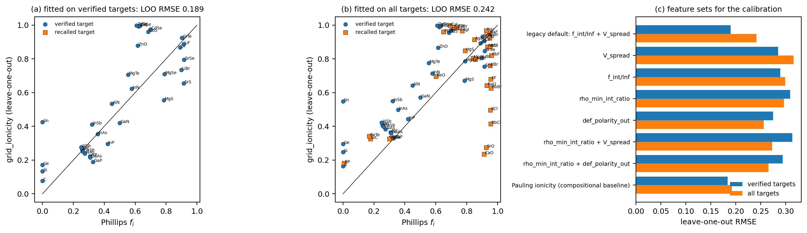
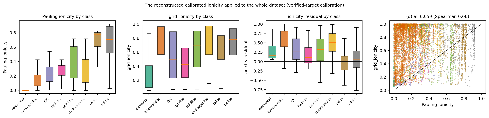
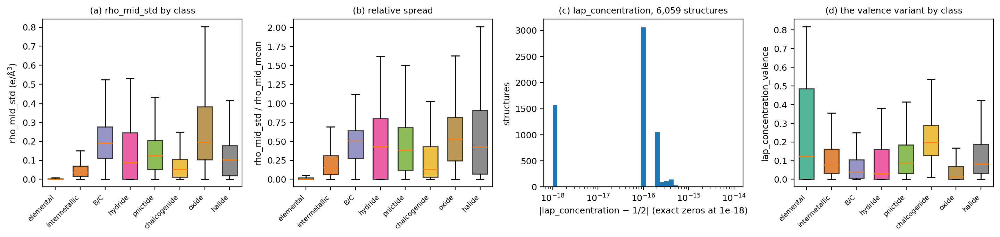
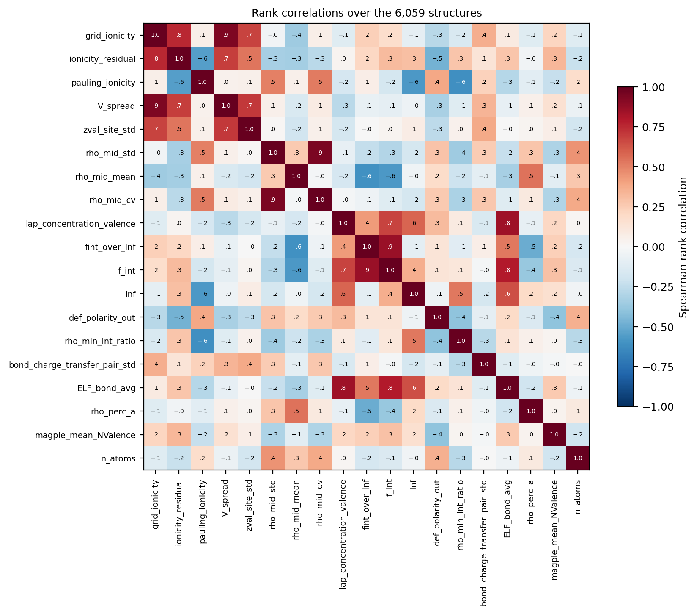
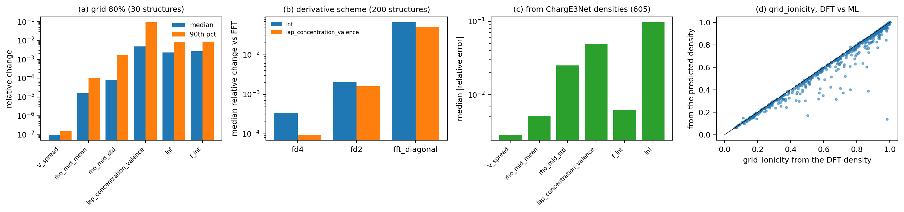

# Calibrated ionicity and related descriptors: `grid_ionicity`, `ionicity_residual`, `V_spread`, `rho_mid_std`, `lap_concentration`

Definitions, implementation, physical meaning, numerical behaviour and a survey over
6,059 VASP charge densities.

**Author:** Shubham Maurya, CMS Lab, IIT Kanpur · **Date:** 2026-09-25 ·
**pydemi:** `main` (prompt.md build) · **Data:** 6,059-structure VASP dataset
(`/data/sai/new_charge/6000_data_aug13`), descriptor table
`results/prompt_spec/descriptors_6000_data_aug13.csv`

Every number and figure in this document comes from the scripts in `scripts/`
(section 12). The intermediate tables are in `data/`.

---

## Status of the five descriptors

| descriptor | in the current pydemi? | source of the numbers here |
|---|---|---|
| `V_spread` | yes (bonding domain, prompt.md §8.1) | the dataset rerun |
| `rho_mid_std` | yes (bonding domain) | the dataset rerun |
| `lap_concentration` | yes (bonding domain); plus `lap_concentration_valence` (documented correction) | the dataset rerun |
| `grid_ionicity` | **no**: entry 60 of the superseded PDF-spec build, dropped in the prompt.md rebuild | **reconstructed** in `scripts/calibrate_ionicity.py` from the legacy definition, applied to the current descriptor table |
| `ionicity_residual` | **no**: entry 62 of the PDF-spec build, dropped with it | reconstructed likewise |

The rebuild kept only the descriptors of `prompt.md`, which has no calibrated ionicity
(`PROGRESS.md`: "the PDF-era extras (Tier 3, calibrated ionicity / Cohen modulus, …)
are dropped"). The two calibrated quantities below therefore describe what the legacy
definition gives on today's densities and descriptors. They are not part of the library.
The results in section 6 bear on whether they should come back.

---

## Summary

* **`V_spread`** is the standard deviation, over the sites, of the potential at the
  nuclei (eV). The dataset has no LOCPOT, so pydemi computes the electronic Hartree
  potential from ρ by one FFT.
* **`rho_mid_std`** is the standard deviation of ρ at the midpoints of the
  nearest-neighbour bonds of the bond census (e/ų).
* **`lap_concentration`** is the fraction of Σ|∇²ρ| carried by voxels with ∇²ρ < 0. The
  specification defines it, but on any periodic density it is **identically 1/2**.
  pydemi keeps it and adds `lap_concentration_valence`, the same ratio outside the 0.8 Å
  core shell.
* **`grid_ionicity`** (legacy) = sigmoid of a linear combination of standardized
  (f_int/lnf, V_spread), fitted to Phillips' spectroscopic ionicities f_i.
  **`ionicity_residual`** = grid_ionicity − (1 − e^{−Δχ²/4}), the Pauling ionicity.

Main findings:

1. **Exact on model densities** (Fig. 1).
   * `V_spread` matches a grid-independent reciprocal-space lattice sum to five decimals.
     It is linear in the charge transfer δ (14.6 eV per unit δ).
   * `V_spread` is also nonzero with **no** charge transfer (3.4 eV for two
     equally-charged atoms of different sizes).
   * `rho_mid_std` matches exact midpoint densities. It jumps when a bond type enters or
     leaves the census, whose first shell is set at 1.1 × the shortest bond.
   * `lap_concentration` = 0.5 for every density tested. On the 6,059 structures the
     largest deviation from 1/2 is 9 × 10⁻¹⁶.
2. **In this dataset, `V_spread` measures valence-count contrast, not charge
   transfer.** Its rank correlation is:
   * 0.70 with the spread of ZVAL over the sites;
   * −0.04 with the spread of net atomic charges;
   * −0.01 with the spread of Hirshfeld charges;
   * 0.04 with the Pauling ionicity.

   With the ionic term added (`potential_source="esp"`), the charge-transfer correlations
   rise to 0.29–0.37.
3. **The reconstructed `grid_ionicity` is no better than composition.**
   * *Fit on the 32 verified Phillips compounds in the dataset.* LOO RMSE 0.189, against
     0.184 for a sigmoid of the Pauling ionicity alone.
   * *Fit on all 62 compounds (including 30 unverified "recalled" targets).* LOO RMSE
     0.242, against 0.192 for Pauling.
   * *Where it fails.* It over-predicts the Zn and Cd chalcogenides (0.96–1.00 against
     f_i 0.61–0.70). In the fit on all targets, it also under-predicts K, Rb, Ca and Sr
     compounds (KCl 0.50, CaO 0.24 against 0.91–0.95). These are exactly the elements
     with d¹⁰ or semicore electrons in their PAW valence.
   * *On the whole dataset.* It follows V_spread (Spearman 0.93), not the Pauling
     ionicity (0.06), and gives intermetallics a median "ionicity" of 0.83.
4. **`rho_mid_std` is a bond-heterogeneity measure.** It is 0 for single-bond-type
   crystals (NaCl, GaAs, MgO) and large for multi-cation oxides (SrTiO₃ 0.18 e/ų). It
   is highest for oxides and borides/carbides (median 0.20 and 0.19). Its relative form,
   rho_mid_std/rho_mid_mean, rises with ionicity (Spearman 0.52 with Pauling).
5. **`lap_concentration_valence` tracks electron localization.** Its rank correlation
   with the bond-shell ELF is 0.85. It is largest for chalcogenides (median 0.20) and
   smallest for oxides (0.014). It depends on the Laplacian scheme: the diagonal-only
   Laplacian of non-orthogonal cells changes it by a median 5%.
6. **ML predictability.**
   * From ChargE3Net's predicted densities (from scratch): `V_spread` 0.3% median
     error, `rho_mid_std` 2.5%, `lap_concentration_valence` 5%.
   * `lnf`, a component of the legacy ionicity feature, has 9.7% median error. The
     reconstructed `grid_ionicity` still agrees with its DFT value to a median 0.007
     (Spearman 0.98).

---

## Contents

1. Notation
2. Definitions and formulas
3. How pydemi computes them (and how the calibration was reconstructed)
4. Analytic behaviour
5. What V_spread measures on real densities
6. The calibrated ionicity: fit, validation and application
7. rho_mid_std and lap_concentration on real densities
8. Survey over 6,059 materials
9. Numerical robustness and ML predictability
10. Utility: what to use them for
11. Caveats and recommendations
12. Reproducing this document
13. References

---

## 1. Notation

| Symbol | Meaning |
|---|---|
| ρ_k | valence (PAW pseudo-) density at voxel k, e/ų |
| ∇²ρ_k | its Laplacian, by FFT on the periodic grid (default; with metric cross terms) |
| V(**r**) | potential energy of an electron, eV, cell average 0 |
| V_i | V at nucleus i, by exact Fourier interpolation |
| bond census | j is a first-shell neighbour of i when \|R_ij\| ≤ (1 + BOND_TOL) d_i, d_i the shortest distance from i, BOND_TOL = 0.1 |
| **m**_ij | midpoint of the bond i–j; ρ(**m**_ij) by exact Fourier interpolation |
| Δχ | Pauling electronegativity range, max − min over the elements present |
| f_i | Phillips' spectroscopic ionicity (0 covalent, 1 ionic) |
| f_int, lnf | fraction of the charge in the interstitial shell (r > 1.5 Å); fraction of the voxels with ∇²ρ < 0 |

---

## 2. Definitions and formulas

### 2.1 V_spread

$$
\texttt{V\_spread}=\operatorname{std}_i V(\mathbf R_i)
=\sqrt{\tfrac1n\sum_i\left(V_i-\bar V\right)^2}\ \ (\text{eV}).
$$

The potential depends on the source (`potential_source`):

* **`locpot`**: VASP's LOCPOT, when read.
* **`hartree`**: the electronic Hartree term,
  V_H(**G**) = 4πk ρ(**G**)/G², G ≠ 0, with k = e²/4πε₀ = 14.40 eV Å.
* **`esp`**: the full electrostatic potential, V = 4πk [ρ(**G**) − ρ_ion(**G**)]/G²,
  where the ions are Gaussians of charge Z_i (ZVAL for a pseudo-density).

`auto` picks `locpot` if a LOCPOT was read, else `hartree`. For all 6,059 dataset
structures this is `hartree`. The sign convention is the potential energy of an
electron, so V_H > 0 where electrons are dense. The G = 0 term, a constant, drops out of
the standard deviation.

### 2.2 rho_mid_std

$$
\texttt{rho\_mid\_std}=\operatorname{std}_{(i,j)\in\text{census}}\ \rho(\mathbf m_{ij})\ \ (\text{e/Å}^3),
\qquad
\texttt{rho\_mid\_mean}=\operatorname{mean}_{(i,j)}\ \rho(\mathbf m_{ij}).
$$

The census counts, for each atom i, its first-shell neighbours j (periodic images
included). Each pair appears once per direction. No bonds gives 0 with sentinel
`no_bonds`.

### 2.3 lap_concentration and its valence variant

$$
\texttt{lap\_concentration}=\frac{\sum_{k:\nabla^2\rho_k<0}|\nabla^2\rho_k|}{\sum_k|\nabla^2\rho_k|},
\qquad
\texttt{lap\_concentration\_valence}=\frac{\sum_{k:\,r_k>c_1,\ \nabla^2\rho_k<0}|\nabla^2\rho_k|}{\sum_{k:\,r_k>c_1}|\nabla^2\rho_k|}.
$$

**Why the first is always 1/2.** On a periodic grid, Σ_k ∇²ρ_k = 0 exactly: the
G = 0 Fourier coefficient of a Laplacian is 0, and the discrete Gauss theorem holds on
the torus. Hence

Σ_{∇²ρ<0} |∇²ρ| = Σ_{∇²ρ>0} ∇²ρ,

and the ratio is exactly 1/2 for every density. This is a documented correction to the
specification.

The valence variant excludes the core shell r ≤ c1 = 0.8 Å of the nearest nucleus.
It then measures the share of charge *concentration* (∇²ρ < 0, the Bader
valence-shell charge concentrations) among the Laplacian's activity in the valence and
bonding region.

### 2.4 grid_ionicity and ionicity_residual (legacy; reconstructed)

$$
\texttt{grid\_ionicity}=\sigma\!\left(b_0+\sum_j b_j\,\frac{x_j-\mu_j}{s_j}\right),\qquad
\sigma(t)=\frac1{1+e^{-t}},\qquad x=\left(\frac{f_{\mathrm{int}}}{\mathrm{lnf}},\ \texttt{V\_spread}\right).
$$

* The b_j are fitted by least squares to Phillips' f_i on reference compounds.
* μ_j and s_j are the mean and standard deviation of the features over those compounds.
* The legacy default features pair f_int/lnf with the electronic-Hartree site-potential
  spread (`VH_spread` in the legacy code, identical to `V_spread` with
  `potential_source="hartree"`).

$$
\texttt{ionicity\_residual}=\texttt{grid\_ionicity}-\left(1-e^{-\Delta\chi^2/4}\right).
$$

The subtracted term is the Pauling ionicity of the legacy compositional descriptor
`ionicity` (legacy entry 26).

---

## 3. How pydemi computes them (and how the calibration was reconstructed)

* **V_spread** (`descriptors/bonding.py`, `fields/potential.py`).
  * The potential is built on the grid: one real FFT of ρ; for `esp`, the ionic
    structure factor with a Gaussian form factor; division by G²; one inverse FFT.
  * It is cached, then Fourier-interpolated exactly at the nuclei (`site_potentials`),
    and the standard deviation is taken.
  * The Hartree term is band-limited, so coarsening the grid by Fourier truncation
    barely changes it (§9).
* **rho_mid_std** (`bond_census_of`, `_rho_mid`). The census comes from the geometry.
  Midpoint densities are exact Fourier interpolations of ρ at the midpoints; then std
  and mean.
* **lap_concentration(_valence)** (`operators/laplacian.py`). The Laplacian comes from
  the cached derivatives: FFT by default, with the full metric (cross terms) for
  non-orthogonal cells. It is then split by sign, with the core shell masked for the
  valence variant.
* **The legacy calibration, reconstructed** (`scripts/calibrate_ionicity.py`). A
  standalone re-implementation of `legacy/pydemi_pdf_spec/calibration/__init__.py`:
  1. Read the Phillips table, copied to `data/phillips_ionicity.csv`: 67 compounds, 33
     "verified" against a secondary source and 34 "recalled", i.e. compiled from memory
     and unchecked, as the table's own header warns.
  2. Match each compound to the dataset by reduced formula, preferring the polymorph in
     Phillips' structure (diamond 227, zinc blende 216, wurtzite 186, rock salt 225). 62
     compounds are in the dataset and 53 in Phillips' structure. The other 9 (e.g. MgS,
     LiBr, CuI) use the dataset's polymorph and are flagged.
  3. Take f_int, lnf and V_spread from the current rerun table.
  4. Fit the sigmoid by `scipy.optimize.least_squares`, with a leave-one-out refit for
     every compound.
  5. The primary calibration uses the 32 verified matched compounds. It was then
     applied to all 6,059 structures (`data/ionicity_predictions.csv`).

---

## 4. Analytic behaviour

`scripts/analytic_models.py`.

**Fig. 1.** (a) V_spread against charge transfer in a rock-salt model. (b) V_spread with
equal charges but different atomic sizes. (c) rho_mid_std in a tetragonal lattice
against c, with the census cutoffs (red dashed). (d) lap_concentration (always 1/2) and
its valence variant, with the exact radial value for single Gaussian atoms.

### 4.1 V_spread against an exact lattice sum

The model is a rock-salt 8-site cell (spacing 3 Å) of Gaussians (α = 2 Å⁻²). The A sites
carry 1 + δ electrons and the B sites 1 − δ. The exact Hartree potential at a nucleus is
the reciprocal-space sum of the Gaussian charges, independent of any real-space grid.

| δ | V_A pydemi | exact | V_B pydemi | exact | V_spread | exact |
|---|---|---|---|---|---|---|
| 0 | 10.19755 | 10.19755 | 10.19755 | 10.19755 | 0 | 0 |
| 0.1 | 11.65659 | 11.65659 | 8.73851 | 8.73851 | 1.45904 | 1.45904 |
| 0.5 | 17.49276 | 17.49276 | 2.90235 | 2.90235 | 7.29520 | 7.29520 |

`V_spread` is exact and linear, at 14.59 eV per unit δ in this geometry.

**Width contrast (model A2).** Now give the A and B sites equal charges (1 e each) but
different exponents. `V_spread` is 3.36 eV at α_B = 1 and 4.76 eV at α_B = 4 (exact
values 3.36481 and 4.75899). A compact charge puts more of its own electrons close to its
nucleus, which raises V_H there. **Site potential differences arise from how compact
each atom's charge is, not only from charge transfer.** This is the mechanism that
dominates the real data (§5).

### 4.2 rho_mid_std and the census cutoff

Take a tetragonal lattice, a = b = 3 Å, of Gaussian atoms (Z = 4, α = 1 Å⁻²):

* **c < 2.727 Å.** Only the c bonds are in the census (3 Å > 1.1 c), so rho_mid_std = 0.
* **2.727 ≤ c ≤ 3.3 Å.** Both bond types are in the census, and rho_mid_std is their
  spread (0 at c = 3, where they are equal).
* **c > 3.3 Å.** Only the a/b bonds remain, so rho_mid_std = 0 again.

Every value matches the exact midpoint densities. Across a cutoff, `rho_mid_std` jumps
from 0.027 to 0 (c = 3.3 → 3.4 Å) and `rho_mid_mean` from 0.132 to 0.151. The census is
discrete, so these descriptors are discontinuous in the geometry.

### 4.3 lap_concentration

* **Whole cell.** Eight random periodic Gaussian superpositions and four single atoms
  all give exactly 0.5.
* **Valence variant, single Gaussian atom** of exponent α. Here ∇²ρ < 0 for
  r < √(3/2α). The exact radial ratio outside 0.8 Å is 0.4045, 0.2545, 0.0174 and 0 for
  α = 0.5, 1, 2 and 4. pydemi gives 0.4050, 0.2556, 0.0183 and 0: the same to 10⁻³.
* **Compact atoms reach 0.** Their charge concentration lies entirely inside the core
  shell.

---

## 5. What V_spread measures on real densities

`scripts/potential_analysis.py`: 150 random structures (seed 2026) and 10 examples. The
site potentials were computed with both sources, alongside the per-site valence charges
(nearest atom), the net charges q_i = ZVAL_i − Q_i and the Hirshfeld charges.

**Fig. 2.** (a) V_spread against the spread of the valence counts ZVAL_i over the sites
(all 6,059 structures). (b, c) Against the spread of the net and Hirshfeld charges, for
the Hartree and the full electrostatic potential (150 structures). (d) By class.

| rank correlation (150 structures) | V_spread (Hartree, dataset) | V_spread (Hartree + ions) |
|---|---|---|
| std of ZVAL_i | 0.68 (0.70 over all 6,059) | 0.08 |
| std of net charges q_i | −0.04 | 0.29 |
| std of Hirshfeld charges | −0.01 | 0.37 |
| each other | 1 | 0.46 |

**Fig. 3.** (a) The Hartree potential at each nucleus against that site's ZVAL, for the
10 examples. (b) The full electrostatic site potential against the Hirshfeld charge.
(c) Midpoint densities of the census bonds.

**Table E1** (`data/examples.csv`):

| material | V_spread Hartree (eV) | V_spread esp (eV) | std ZVAL | std net charge (e) | std Hirshfeld (e) | rho_mid_mean | rho_mid_std |
|---|---|---|---|---|---|---|---|
| Si | 0 | 0 | 0 | 0 | 0 | 0.562 | 0 |
| GaAs | 7.07 | 6.43 | 1.0 | 0.028 | 0.110 | 0.433 | 0 |
| ZnO | 63.3 | 29.8 | 3.0 | 1.04 | 0.352 | 0.548 | 0.004 |
| NaCl | 35.4 | 7.07 | 3.0 | 0.377 | 0.169 | 0.125 | 0 |
| MgO | 60.2 | 37.9 | 2.0 | 1.06 | 0.332 | 0.301 | 0 |
| LiF | 81.2 | 49.3 | 3.0 | 0.452 | 0.178 | 0.244 | 0 |
| Al, Cu | 0 | 0 | 0 | 0 | 0 | 0.203, 0.257 | 0 |
| SrTiO₃ | 36.0 | 39.1 | 1.96 | 1.45 | 0.367 | 0.264 | 0.181 |
| Al₂O₃ | 54.4 | 41.3 | 1.47 | 1.35 | 0.345 | 0.555 | 0.066 |

Reading:

* **The Hartree potential at a nucleus is dominated by that atom's own valence
  electrons.** It is roughly ZVAL_i ⟨1/r⟩_i (Fig. 3a). The spread over sites therefore
  follows the spread of valence counts and shapes. That is fixed by the PAW datasets
  (Zn and Ga with d¹⁰, Na and Li with one electron), not by charge transfer.
* **Examples.** GaAs, nearly covalent, has 7 eV. ZnO has 63 eV, driven by the 12
  valence electrons of Zn against 6 for O. NaCl has 35 eV.
* **Adding the ionic term** cancels part of the "own electrons" contribution, and the
  result correlates better with charge transfer. The magnitudes are still dominated by
  the ionic self-term, whose value depends on the Gaussian ion width.
* **An ionicity-like site-potential descriptor** would need the full electrostatic
  potential, ideally from a LOCPOT or an all-electron density, and a
  valence-count-independent normalization.

---

## 6. The calibrated ionicity: fit, validation and application

`scripts/calibrate_ionicity.py`.

**Fig. 5.** (a) Leave-one-out predictions against Phillips f_i, calibrated on the 32
verified compounds. (b) The same on all 62 (orange: unverified targets). (c) LOO RMSE of
alternative feature sets, including a sigmoid of the compositional Pauling ionicity.

**Table C1. Leave-one-out validation** (`data/calibration_fits.csv`):

| features | verified targets (n = 32): LOO RMSE | Spearman | all targets (n = 62): LOO RMSE | Spearman |
|---|---|---|---|---|
| **legacy default: f_int/lnf + V_spread** | **0.189** | 0.80 | **0.242** | 0.49 |
| V_spread | 0.285 | 0.67 | 0.315 | 0.29 |
| f_int/lnf | 0.289 | 0.21 | 0.298 | 0.24 |
| rho_min_int_ratio | 0.309 | 0.12 | 0.296 | 0.43 |
| def_polarity_out | 0.274 | 0.42 | 0.256 | 0.52 |
| rho_min_int_ratio + V_spread | 0.313 | 0.54 | 0.272 | 0.42 |
| rho_min_int_ratio + def_polarity_out | 0.293 | 0.27 | 0.265 | 0.50 |
| Pauling ionicity (compositional baseline) | **0.184** | 0.81 | **0.192** | 0.82 |

**Where the calibration goes wrong** (Fig. 5a, b):

* **Zn and Cd chalcogenides.** ZnS, ZnSe, ZnTe, CdS and CdSe, with f_i 0.61–0.70, are
  predicted at 0.96–1.00. Their d¹⁰ PAW valence gives a very large V_spread (§5).
* **Tetrahedral group-IV elements are pushed away from 0.** Sn is predicted at 0.43
  (f_i = 0).
* **In the all-target fit, the semicore alkali and alkaline-earth compounds collapse**:
  KCl 0.50, RbCl 0.42, CaO 0.24 and SrO 0.28, against f_i 0.91–0.96. Their semicore
  (K_pv, Rb_pv, Ca_pv, Sr_sv) electrons change V_spread and f_int/lnf in ways unrelated
  to ionicity. The same fit places the II-VI compounds too high.

**Applied to the whole dataset** (`data/ionicity_predictions.csv`, verified
calibration):

**Fig. 6.** Pauling ionicity, grid_ionicity and ionicity_residual by class, and
grid_ionicity against Pauling for all structures.

| class | Pauling ionicity | grid_ionicity | ionicity_residual |
|---|---|---|---|
| elemental | 0 | 0.16 | 0.16 |
| intermetallic | 0.12 | **0.83** | 0.65 |
| boride/carbide | 0.20 | 0.50 | 0.26 |
| hydride | 0.31 | 0.42 | 0.11 |
| pnictide | 0.33 | 0.70 | 0.33 |
| chalcogenide | 0.21 | 0.85 | 0.51 |
| oxide | 0.77 | 0.68 | −0.01 |
| halide | 0.71 | 0.78 | 0.05 |

(Medians.)

Over the 6,059 structures:

* `grid_ionicity` has rank correlation 0.93 with V_spread, 0.68 with the ZVAL spread, and
  **0.06 with the Pauling ionicity**.
* `ionicity_residual` correlates 0.53 with the ZVAL spread.

The calibration is an extrapolation beyond the tetrahedral and rock-salt binaries it was
fitted on. It labels metals as ionic, because their elements have very different PAW
valence counts. **As defined, the calibrated ionicity mostly re-encodes the valence
counts of the PAW datasets, and does not beat the compositional baseline on its own
reference set.** This supports leaving it out of the library.

---

## 7. rho_mid_std and lap_concentration on real densities

**Fig. 4.** (a, b) rho_mid_std and rho_mid_std/rho_mid_mean by class. (c) |lap_concentration − 1/2| over the dataset. (d) lap_concentration_valence by class.

### 7.1 rho_mid_std

* **Zero for single-bond-type crystals.** In NaCl, MgO, GaAs, Si, Al and Cu every census
  bond is symmetry-equivalent. That is 4.1% of the dataset, and 10% of the binaries.
* **Large where several distinct bonds coexist in the first shells.** SrTiO₃ has Ti–O at
  1.97 Å (midpoint density 0.52 e/ų) and Sr–O at 2.79 Å (0.14), the first-shell bonds of
  Ti and of Sr, giving rho_mid_std 0.18. Al₂O₃ has Al–O distances from 1.87 to 1.99 Å
  (0.066).
* **By class** (medians): oxides 0.197, borides/carbides 0.191, pnictides 0.125, halides
  0.103, hydrides 0.088, chalcogenides 0.051, intermetallics 0.036, elemental 0.
* **Relative spread.** rho_mid_std/rho_mid_mean is 0.53 for oxides and 0.15 for
  intermetallics. It correlates with the Pauling ionicity at 0.52: ionic compounds pair
  high-density short bonds with low-density long ones.
* **Other correlations:** 0.45 with the number of atoms (more atoms, more distinct
  bonds) and 0.26 with rho_mid_mean.

### 7.2 lap_concentration

* **Over all 6,059 structures, |lap_concentration − 1/2| ≤ 8.9 × 10⁻¹⁶.** It carries no
  information and should be dropped from any feature set.
* **`lap_concentration_valence`** (medians by class):

  | chalcogenide | elemental | pnictide | halide | intermetallic | boride/carbide | hydride | oxide |
  |---|---|---|---|---|---|---|---|
  | 0.197 | 0.124 | 0.089 | 0.082 | 0.077 | 0.039 | 0.030 | 0.014 |

  Its rank correlation is 0.85 with the mean ELF of the bond shell, 0.43 with
  f_int/lnf, and −0.17 with the Pauling ionicity.
* **Reading.** It measures how much valence-shell charge concentration lies beyond
  0.8 Å. Large values mean lone pairs and bonding concentrations far from the nuclei:
  chalcogen and pnictogen lone pairs, covalent bonds. Small values mean compact, closed
  anion shells whose concentration lies within 0.8 Å: O²⁻, H⁻.

---

## 8. Survey over 6,059 materials

`scripts/dataset_table.py`.

| descriptor | 5% | median | 95% |
|---|---|---|---|
| V_spread (eV) | 5.4 | 52.0 | 152.4 |
| std of ZVAL over sites (e) | 0.43 | 2.5 | 7.0 |
| rho_mid_mean (e/ų) | 0.118 | 0.280 | 0.638 |
| rho_mid_std (e/ų) | 0 | 0.056 | 0.381 |
| rho_mid_std / rho_mid_mean | 0 | 0.21 | 1.05 |
| lap_concentration | 0.5 | 0.5 | 0.5 |
| lap_concentration_valence | 0 | 0.079 | 0.413 |
| f_int / lnf | 0.063 | 0.42 | 1.24 |
| Pauling ionicity | 0.007 | 0.20 | 0.80 |

**Medians by class:**

| class | V_spread (eV) | std ZVAL | rho_mid_mean | rho_mid_std | lap_conc_valence | Pauling |
|---|---|---|---|---|---|---|
| elemental | 0 | 0 | 0.195 | 0 | 0.124 | 0 |
| intermetallic | 57.3 | 2.98 | 0.242 | 0.036 | 0.077 | 0.12 |
| boride/carbide | 37.3 | 3.06 | 0.422 | 0.191 | 0.039 | 0.20 |
| hydride | 31.6 | 3.35 | 0.256 | 0.088 | 0.030 | 0.31 |
| pnictide | 44.2 | 2.27 | 0.338 | 0.125 | 0.089 | 0.33 |
| chalcogenide | 52.9 | 2.36 | 0.326 | 0.051 | 0.197 | 0.21 |
| oxide | 51.6 | 2.19 | 0.463 | 0.197 | 0.014 | 0.77 |
| halide | 50.6 | 1.74 | 0.243 | 0.103 | 0.082 | 0.71 |

Intermetallics have the largest median V_spread (57 eV). Oxides (52 eV), despite being
far more ionic, are no higher than chalcogenides (53) or halides (51). This again shows
the valence-count origin of the Hartree V_spread.

**Fig. 7.** Spearman rank correlations (`data/spearman_correlations.csv`).

---

## 9. Numerical robustness and ML predictability

**Fig. 8.** (a) Grid: an 80% Fourier-coarsened grid, 30 structures (paper analysis).
(b) Derivative scheme: FD2, FD4 and the diagonal-only Laplacian against FFT, 200
structures (paper analysis). (c) Median error from ChargE3Net-predicted densities.
(d) grid_ionicity from DFT against predicted densities.

**Grid** (median / 90th percentile relative change):

| V_spread | rho_mid_mean | rho_mid_std | lap_concentration_valence | lnf | f_int |
|---|---|---|---|---|---|
| < 10⁻⁴ / < 10⁻⁴ | < 10⁻⁴ / 10⁻⁴ | 10⁻⁴ / 0.17% | 0.48% / 9.3% | 0.24% / 0.86% | 0.27% / 0.87% |

V_spread and the midpoint densities come from band-limited Fourier interpolation, so
removing the highest frequencies barely changes them.

**Derivatives.** Only lnf and lap_concentration_valence depend on the Laplacian:

| scheme | lnf: median | 95th pct | lap_concentration_valence: median | 95th pct |
|---|---|---|---|---|
| FD4 | 0.03% | 0.7% | 0.01% | 0.8% |
| FD2 | 0.20% | 1.6% | 0.16% | 4.8% |
| FFT, diagonal Laplacian (non-orthogonal cells only) | 6.6% | 37% | 5.1% | 89% |

The diagonal-only Laplacian omits the metric cross terms of non-orthogonal cells, which
is wrong. The default includes them.

**ML predictability** (ChargE3Net from scratch, 605 test structures):

| descriptor | median rel. error | 90th pct | Spearman | R² |
|---|---|---|---|---|
| V_spread | 0.29% | 2.1% | 0.99993 | 1.000 |
| rho_mid_mean | 0.52% | 1.9% | 0.9996 | 0.999 |
| rho_mid_std | 2.5% | 52% | 0.998 | 0.998 |
| lap_concentration_valence | 5.0% | 80% | 0.980 | 0.974 |
| f_int | 0.61% | 2.2% | 0.9997 | 1.000 |
| lnf | 9.7% | 35% | 0.874 | 0.639 |
| f_int / lnf | 10% | 35% | 0.961 | – |
| grid_ionicity (reconstructed) | 1.3% (abs 0.007) | 11% | 0.982 | – |
| lap_concentration | 0 | 0 | (constant) | – |

Notes:

* The large 90th percentiles of `rho_mid_std` and `lap_concentration_valence` come from
  structures where these values are near zero.
* `lnf` is poorly predicted. It counts voxels by the sign of ∇²ρ, which is sensitive to
  small density errors in near-zero-Laplacian regions.
* The fine-tuned model's full-grid test was still running when this was written. Adding
  `data/ml_scores_finetune.csv`, and running `ml_ionicity.py` on the fine-tuned table,
  updates Fig. 8.

---

## 10. Utility: what to use them for

1. **`V_spread` (Hartree).** A density-based proxy for the contrast in valence count and
   compactness between the atoms. It is well predicted from ML densities (0.3%). Do not
   use it as an ionicity. Use it as a chemical-contrast feature, alongside compositional
   ones.
2. **`V_spread` with `potential_source="esp"` or a LOCPOT.** Closer to a Madelung-type
   site-potential spread, and better correlated with charge transfer. It needs the ionic
   term, which depends on the Gaussian ion width, so it is best compared within one
   setting.
3. **`rho_mid_std` and rho_mid_std/rho_mid_mean.** Bond heterogeneity: several bond
   types, mixed covalent/ionic frameworks, perovskites, and distorted structures in
   which the first shell contains inequivalent bonds. Watch the census discontinuity
   near the 1.1 d_min cutoff.
4. **`lap_concentration_valence`.** Valence-shell charge concentration beyond the core,
   i.e. lone pairs and covalent bonding. It correlates strongly with the bond-shell ELF
   (0.85), so it is partly redundant with the ELF descriptors.
5. **`lap_concentration`.** None: it is identically 1/2.
6. **`grid_ionicity` / `ionicity_residual`.** As reconstructed, not recommended. They do
   not beat the Pauling baseline on the reference compounds and extrapolate badly. A
   density-derived ionicity would more usefully start from atomic charges (Hirshfeld,
   Bader) or from the ESP site-potential spread, calibrated within one class of
   compounds and with verified targets.

---

## 11. Caveats and recommendations

| issue | effect | recommendation |
|---|---|---|
| lap_concentration ≡ 1/2 | zero information | drop it; use lap_concentration_valence |
| Hartree-only V_spread | dominated by the ZVAL and shape contrast of the PAW datasets (Spearman 0.70 with ZVAL spread; −0.04 with charge transfer) | do not interpret as ionicity; use `esp`/LOCPOT for electrostatics; compare within one set of PAW datasets |
| grid_ionicity reconstructed from a dropped legacy definition | LOO RMSE 0.19–0.24, no better than Pauling; wrong for d¹⁰ and semicore compounds; extrapolates to metals | keep it out of the library; if wanted, restore only with verified targets, class-restricted scope and an ESP-based feature |
| Phillips targets | 34 of the 67 table rows are "recalled", unverified | check against Phillips (1970, 1973) before any use in publication |
| census discontinuity | rho_mid_std/mean jump when a bond type crosses 1.1 d_min | treat small changes in bond counts with care; the census is recorded with every structure |
| Laplacian scheme | lap_concentration_valence changes by 5% median with the diagonal Laplacian | keep the default (metric) Laplacian |
| lnf ML error | 10% median; affects f_int/lnf | prefer charge-weighted variants (`lnf_charge_weighted`, 1.2% ML error) in ML pipelines |

---

## 12. Reproducing this document

Run from `docs/ionicity_descriptors/scripts/`, in the pydemi environment, niced, with
`OMP_NUM_THREADS=1` on the shared machine:

| order | script | inputs | outputs (`../data/`) |
|---|---|---|---|
| 1 | `analytic_models.py` | none | `analytic_A/A2/B/C.csv` |
| 2 | `dataset_table.py` | rerun table; anisotropy-report classes; dataset PAW table | `ionicity_dataset.csv` |
| 3 | `calibrate_ionicity.py` | `ionicity_dataset.csv`, `phillips_ionicity.csv` | `phillips_matched.csv`, `calibration_fits.csv`, `calibration.json`, `ionicity_predictions.csv` |
| 4 | `potential_analysis.py [N=150]` | dataset CHGCARs | `potential_sample.csv`, `examples.csv`, `sites_examples.csv`, `bonds_examples.csv` |
| 5 | `ml_ionicity.py DESC_DFT DESC_MODEL TAG` | the ML evaluation's descriptor tables | `ml_ionicity_TAG.csv` |
| 6 | `make_figures.py` | all of the above; `ml_scores_scratch.csv`; `paper/analysis/out/convergence.csv`, `derivatives_summary.csv` | `../figures/fig01–fig08` (PNG + PDF), `spearman_correlations.csv` |

`phillips_ionicity.csv` is copied unchanged from `legacy/pydemi_pdf_spec/data/`. The
random sample uses seed 2026.

The document is Markdown with LaTeX math. For a PDF: `pandoc ionicity_descriptors.md -o
ionicity_descriptors.pdf --pdf-engine=xelatex` (pandoc is not installed on this
machine).

---

## 13. References

* J. C. Phillips, "Ionicity of the chemical bond in crystals", *Rev. Mod. Phys.* **42**,
  317 (1970); *Bonds and Bands in Semiconductors*, Academic Press (1973). (Spectroscopic
  ionicity f_i.)
* L. Pauling, *The Nature of the Chemical Bond*, 3rd ed., Cornell University Press
  (1960). (Ionic character 1 − exp(−Δχ²/4).)
* R. F. W. Bader, *Atoms in Molecules: A Quantum Theory*, Oxford University Press (1990).
  (Laplacian of the density; valence-shell charge concentration.)
* P. P. Ewald, "Die Berechnung optischer und elektrostatischer Gitterpotentiale", *Ann.
  Phys.* **369**, 253 (1921). (Lattice sums of Gaussian charges.)
* F. L. Hirshfeld, *Theor. Chim. Acta* **44**, 129 (1977). (Hirshfeld charges.)
* pydemi `prompt.md`, §6.3 (potentials), §8.1 (bonding domain); `PROGRESS.md` (the
  dropped PDF-era descriptors); `legacy/pydemi_pdf_spec/calibration/__init__.py` (the
  legacy calibrated ionicity).
