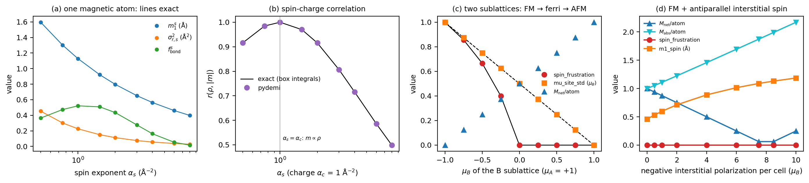
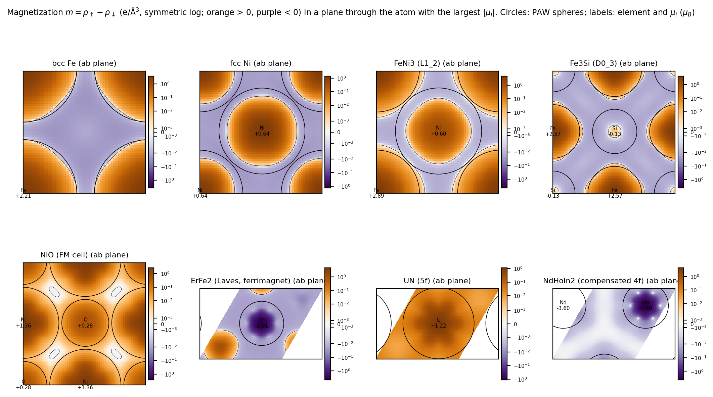
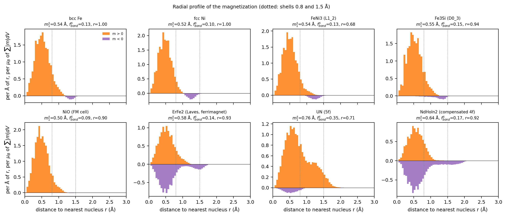
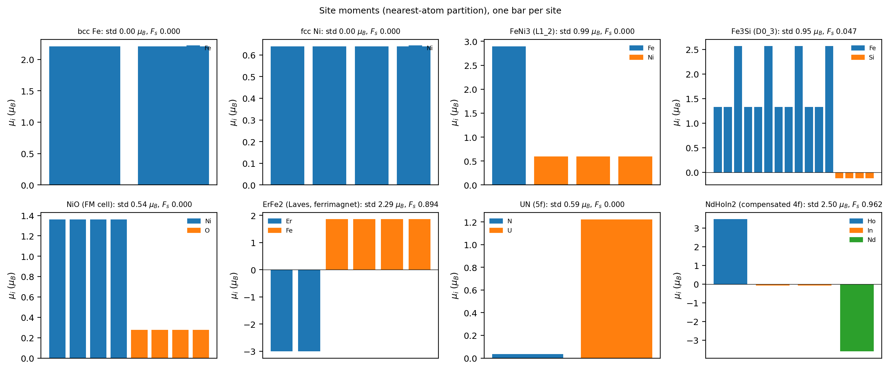
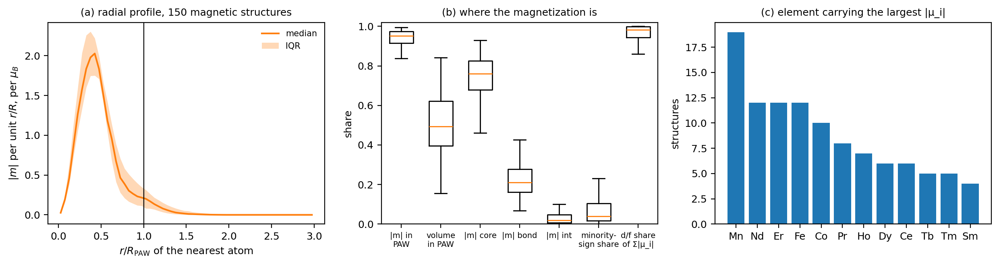
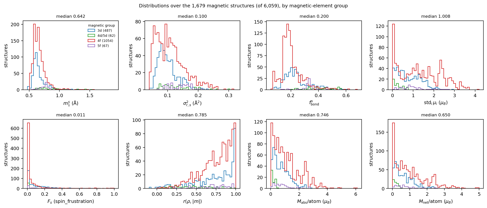
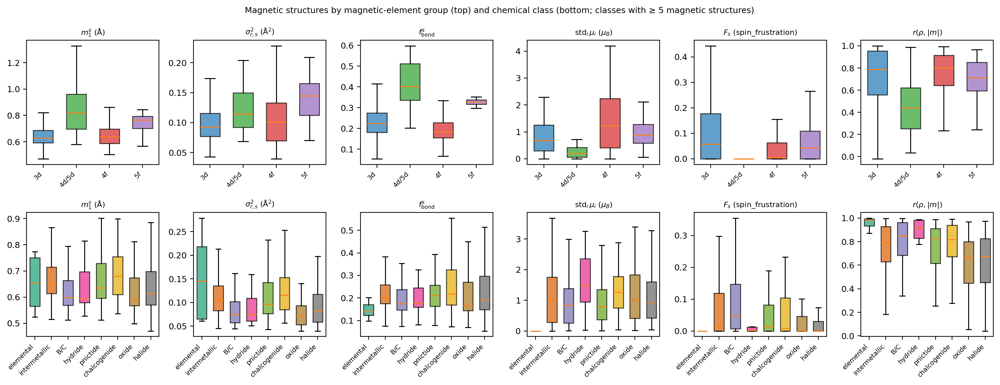
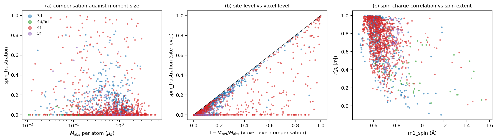
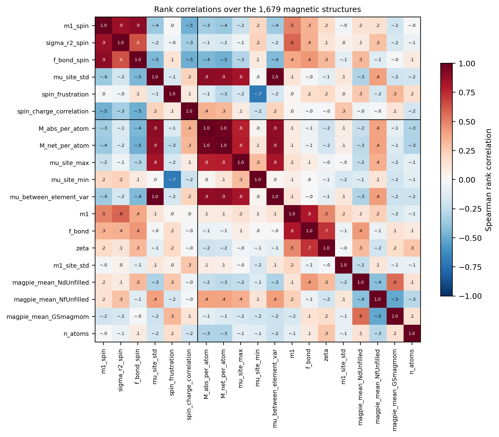
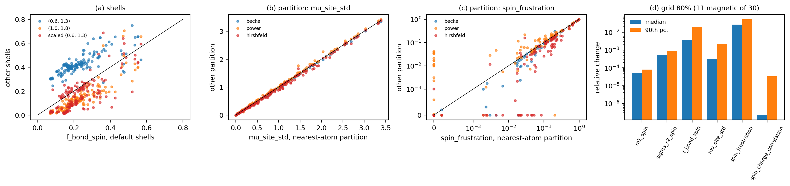

# Magnetic descriptors in pydemi: `m1_spin`, `sigma_r2_spin`, `f_bond_spin`, `mu_site_std`, `spin_frustration`, `spin_charge_correlation`

Definitions, implementation, physical meaning, numerical behaviour and a survey over
the 1,679 magnetic structures of the 6,059-structure VASP dataset.

**Author:** Shubham Maurya, CMS Lab, IIT Kanpur · **Date:** 2026-09-25 ·
**pydemi:** `main` (prompt.md build) · **Data:** 6,059-structure VASP dataset
(`/data/sai/new_charge/6000_data_aug13`), descriptor table
`results/prompt_spec/descriptors_6000_data_aug13.csv`

Every number and figure in this document comes from the scripts in `scripts/`
(section 12). The intermediate tables are in `data/`.

---

## Summary

The magnetic domain describes the **magnetization density** m(**r**) = ρ↑ − ρ↓ (e/ų)
and its integrals, the site moments μ_i (μ_B). The six descriptors answer four
questions:

* **Where is the spin density?**
  * `m1_spin` is the mean distance of |m| from the nearest nucleus.
  * `sigma_r2_spin` is the spread of that distance.
  * `f_bond_spin` is the share of |m| in the 0.8–1.5 Å bond shell.
* **How different are the site moments?** `mu_site_std` is their standard deviation.
* **Are the site moments aligned?** `spin_frustration` = 1 − |Σμ_i| / Σ|μ_i|. It is 0 when
  all site moments share a sign and 1 for a fully compensated antiparallel arrangement.
* **Does the spin follow the charge?** `spin_charge_correlation` is the Pearson
  correlation between ρ and |m| over the voxels.

All six are 0.0 for a non-magnetic structure, with `magnetic = False` in the metadata,
and never NaN. A structure counts as magnetic when Σ|m| dV > 0.01 μ_B per atom. Every
run in the dataset is collinear spin-polarized, and 1,679 of the 6,059 are magnetic.

Main findings:

1. **Exact on model densities** (Fig. 1).
   * For a Gaussian spin density, `m1_spin` and `sigma_r2_spin` agree with the closed
     forms to 10⁻⁵, and `f_bond_spin` to 10⁻³ (shell-boundary voxels).
   * `spin_charge_correlation` agrees with the exact box-integral Pearson coefficient to
     five decimals. It equals 1 when m ∝ ρ, and is almost independent of the vacuum
     (0.808 → 0.806 from a 7 to a 16 Å box).
   * In a two-sublattice model, `spin_frustration` and `mu_site_std` follow their exact
     formulas through ferromagnetic, ferrimagnetic and antiferromagnetic arrangements.
   * The spec's identity Σ_i μ_i = Σ_k m_k dV holds to 10⁻¹³ on 150 real structures.
2. **`spin_frustration` measures compensation between site moments, not geometric
   frustration.** It is bounded above by the voxel-level compensation 1 − M_net/M_abs,
   by the triangle inequality, and correlates with it at Spearman 0.74. It misses
   antiparallel spin that the partition absorbs into the sites: a ferromagnet with a
   negative interstitial polarization cancelling the whole net moment still gives 0
   (Fig. 1d).
   * In the dataset it is ≤ 0.001 for 43% of the magnetic structures.
   * It exceeds 0.5 for 83 of them: 61 contain a 4f element, 19 a 3d element and 3 a 5f
     element. ErFe₂ is an example (Er −3.0 μ_B, Fe +1.86 μ_B; F_s = 0.89).
3. **The spin density is compact and sits inside the PAW spheres.** Over 150 random
   magnetic structures:
   * a median 95% of Σ|m| lies inside the augmentation spheres, which fill 49% of the
     volume;
   * 76% lies within 0.8 Å of a nucleus;
   * median `m1_spin` is 0.64 Å.

   The site moments are integrals and are well defined. The radial shape within R_PAW
   (`m1_spin`, `sigma_r2_spin`, `f_bond_spin`) is that of the PAW pseudo-magnetization.
4. **By magnetic element.**
   * *Extent.* 5f spin density is more extended than 4f (`m1_spin` 0.77 against 0.64 Å;
     `f_bond_spin` 0.33 against 0.19). The 4d/5d moments are small, spread out and poorly
     correlated with the charge (`m1_spin` 0.82 Å, correlation 0.44).
   * *Moment spread.* `mu_site_std` is largest for 4f compounds (1.23 μ_B). It mostly
     measures the moment magnitude: Spearman 0.89 with M_abs per atom.
   * *Spin-charge correlation.* 0.99 for the magnetic elemental metals, and lower in
     compounds where anions or non-magnetic atoms hold charge without spin (oxides 0.66,
     halides 0.68).
5. **Robust to the numerics, sensitive to the shells.**
   * *Grid.* Coarsening to 80% per axis changes the moments by ≤ 0.4% (median, 11
     magnetic structures), and `spin_frustration` by 2.7%.
   * *Partition.* `mu_site_std` is nearly partition-independent (Spearman ≥ 0.998).
     `spin_frustration` is less so (0.90–0.99).
   * *Shells.* `f_bond_spin` changes by a median 41–51% for other shells. The 3d/4f spin
     peak at 0.3–0.6 Å sits right at the inner shell boundary.
6. **Not available from the ML model.** ChargE3Net, as trained here, predicts the total
   density only, so these descriptors cannot yet come from a CIF.

---

## Contents

1. Notation
2. Definitions and formulas
3. How pydemi computes them
4. Analytic behaviour
5. What they look like in real materials
6. Where the magnetization sits: PAW spheres and shells
7. Physical significance
8. Survey over the 1,679 magnetic structures
9. Numerical robustness
10. Utility: what to use them for
11. Caveats and recommendations
12. Reproducing this document
13. References

---

## 1. Notation

| Symbol | Meaning |
|---|---|
| k | voxel index; dV the voxel volume |
| ρ_k | total (valence) density, e/ų (CHGCAR block 1 / V) |
| m_k | magnetization density ρ↑ − ρ↓, e/ų (CHGCAR block 2 / V, collinear) |
| r_k | distance from voxel k to its nearest nucleus (periodic images included) |
| bond shell | c1 < r_k ≤ c2, default c1 = 0.8 Å, c2 = 1.5 Å |
| w_i(k) | partition weight of voxel k for site i (default: nearest atom, 0/1) |
| μ_i | site moment Σ_k w_i(k) m_k dV (μ_B; 1 e of spin imbalance = 1 μ_B for g = 2) |
| M_abs, M_net | Σ_k \|m_k\| dV and \|Σ_k m_k dV\| (μ_B per cell; in the metadata) |

For non-collinear runs, m is a vector: |m| is its norm and μ_i a vector sum. The dataset
has no non-collinear runs.

---

## 2. Definitions and formulas

### 2.1 Spatial distribution of the spin density

$$
m_1^{s}=\frac{\sum_k |m_k|\,r_k}{\sum_k |m_k|}\ (\text{Å}),\qquad
\sigma^2_{r,s}=\frac{\sum_k |m_k|\,r_k^2}{\sum_k |m_k|}-\left(m_1^{s}\right)^2\ (\text{Å}^2),\qquad
f^{s}_{\mathrm{bond}}=\frac{\sum_{k\in\mathrm{bond}}|m_k|}{\sum_k |m_k|}.
$$

These are the radial-moment and shell-fraction operators of the charge-density
descriptors (`m1`, `sigma_r2`, `f_bond`), applied with the weight |m| instead of ρ.
Majority and minority spin count alike.

### 2.2 Site moments and their spread

$$
\mu_i=\sum_k w_i(k)\,m_k\,dV,\qquad
\texttt{mu\_site\_std}=\sqrt{\frac1n\sum_i\left(\mu_i-\bar\mu\right)^2}\ (\mu_B).
$$

The μ_i keep their sign (collinear). With a partition that tiles space, as all four in
pydemi do, the site moments add up to the net moment exactly:
Σ_i μ_i = Σ_k m_k dV. The specification requires a test of this, and it holds to
2 × 10⁻¹³ μ_B on 150 dataset structures (§6). This distinguishes pydemi's moments from
VASP's RWIGS-sphere moments, which neither tile space nor add up to the total.

`mu_site_std` is the magnetic member of the heterogeneity family. `mu_site_range`,
`mu_site_max`, `mu_site_min`, `mu_within_element_var` and `mu_between_element_var` are
generated by the same meta-operator (see the site-heterogeneity report).

### 2.3 Spin frustration (site-moment compensation)

$$
F_s = 1-\frac{\left|\sum_i \mu_i\right|}{\sum_i |\mu_i|}\in[0,1].
$$

* F_s = 0 when all site moments have the same sign: ferromagnetic order, including
  moments of different sizes on different sites.
* F_s = 1 when the site moments cancel exactly (compensated antiferromagnet).
* A two-sublattice ferrimagnet with moments μ_A > 0 > μ_B gives
  F_s = 2|μ_B| / (μ_A + |μ_B|) for |μ_B| ≤ μ_A.

**What the name does and does not mean.** F_s measures how much the *site* moments
cancel each other. It is not geometric frustration in the usual sense (competing
exchange on triangular or tetrahedral lattices). A frustrated magnet can have any F_s,
and so can an unfrustrated collinear antiferromagnet.

**An exact bound.** Because |μ_i| = |Σ_{k∈i} m_k dV| ≤ Σ_{k∈i} |m_k| dV,

$$
F_s \le 1-\frac{M_{\mathrm{net}}}{M_{\mathrm{abs}}},
$$

where the right-hand side is the voxel-level compensation. Spin of opposite sign
*inside* one site's region cancels before F_s sees it (Fig. 8b).

### 2.4 Spin-charge correlation

$$
r(\rho,|m|)=\frac{\sum_k(\rho_k-\bar\rho)(|m_k|-\overline{|m|})}
{\sqrt{\sum_k(\rho_k-\bar\rho)^2\,\sum_k(|m_k|-\overline{|m|})^2}}\in[-1,1],
$$

the Pearson coefficient over the voxels, which is volume-weighted.

* r = 1 when |m| is an affine function of ρ, for example m ∝ ρ.
* It falls when charge and spin are shaped or located differently: charge on anions,
  spin on cations; spin in a compact d/f shell, charge in diffuse s/p states.

### 2.5 Degenerate cases

| case | value | flag |
|---|---|---|
| non-magnetic (Σ\|m\| dV ≤ 0.01 μ_B per atom), or no magnetization block | 0.0 for all six | `non_magnetic`; `magnetic = False` in the metadata |
| Σ_i \|μ_i\| = 0 | `spin_frustration` 0.0 | `non_magnetic` |
| constant ρ or \|m\| | `spin_charge_correlation` 0.0 | `non_magnetic` |

---

## 3. How pydemi computes them

Code: `src/pydemi/descriptors/magnetic.py` (183 lines), `src/pydemi/fields/density.py`
(`abs_m`) and `src/pydemi/core/partition.py`.

1. **Reading.** `read_vasp` reads the second CHGCAR block as the collinear
   magnetization, and three blocks for non-collinear runs. Like ρ, it is divided by the
   cell volume.
2. **Magnetic test.** `total_moments` returns (M_abs, M_net). `is_magnetic` compares
   M_abs with `MAGNETIC_TOL` = 0.01 μ_B × n_atoms, and every descriptor is wrapped so
   that a non-magnetic structure returns the flagged 0.0.
3. **Spatial descriptors.** `abs_m(vd)` (cached) and the shared geometry pass (nearest
   nucleus distance, shells) feed `radial_moment` and `shell_fraction`. These are the
   same operators as for ρ.
4. **Site moments.** `site_moments(vd)` evaluates `partition.site_sum(m) · dV` under the
   requested partition, cached per partition. `mu_site_std` and `spin_frustration` are
   one line each on that array.
5. **Correlation.** `np.corrcoef(ρ, |m|)` over all voxels.

No derivatives are involved, so none of the six depends on `derivative_backend`. Only
`f_bond_spin` depends on the shells, and only `mu_site_std` and `spin_frustration` on
the partition. All six are tagged `robust`.

---

## 4. Analytic behaviour

`scripts/analytic_models.py`. Densities are normalized Gaussians
g(r; α) = (α/π)^{3/2} e^{−αr²} on 0.1 Å grids, passed to pydemi as a collinear run. ρ and
m are built separately.

**Fig. 1.** (a) One magnetic atom: `m1_spin`, `sigma_r2_spin` and `f_bond_spin` against
the spin exponent (lines exact). (b) `spin_charge_correlation` against α_s, for a fixed
charge exponent α_c = 1 Å⁻². (c) Two sublattices, from ferromagnetic to
antiferromagnetic. (d) A ferromagnet with a growing antiparallel interstitial
polarization.

### 4.1 One magnetic atom

The atom has 1 μ_B with spin exponent α_s and a charge of 8 e with α_c = 1 Å⁻², in a
12 Å box. The exact values are:

* m1 = 2/√(πα_s);
* ⟨r²⟩ = 3/(2α_s);
* f_bond = P(3/2, α_s c2²) − P(3/2, α_s c1²), with P the regularized lower incomplete
  gamma function;
* the Pearson coefficient of two Gaussians over the box volume V, from their overlap
  integrals I_ab = Q_a Q_b (α_a α_b / (π(α_a + α_b)))^{3/2}.

| α_s | m1_spin | exact | sigma_r2_spin | exact | f_bond_spin | exact | r(ρ,\|m\|) | exact |
|---|---|---|---|---|---|---|---|---|
| 0.5 | 1.59577 | 1.59577 | 0.45352 | 0.45352 | 0.36523 | 0.36505 | 0.91614 | 0.91614 |
| 1.0 | 1.12838 | 1.12838 | 0.22676 | 0.22676 | 0.52237 | 0.52160 | 1.00000 | 1.00000 |
| 3.0 | 0.65146 | 0.65147 | 0.07560 | 0.07559 | 0.27720 | 0.27560 | 0.80632 | 0.80632 |
| 8.0 | 0.39891 | 0.39894 | 0.02837 | 0.02835 | 0.01692 | 0.01663 | 0.49877 | 0.49877 |

* **The moments and the correlation are exact to the digits shown.** `f_bond_spin`
  carries a 10⁻³ error from voxels straddling the sharp shell boundaries.
* **The correlation peaks at exactly 1 when α_s = α_c**, where the spin density is a
  scaled copy of the charge. It falls on both sides: more compact spin (α_s = 8: 0.50),
  or more diffuse spin (α_s = 0.5: 0.92).
* **Vacuum barely matters.** With α_s = 3, boxes of 7, 10 and 16 Å give 0.8081, 0.8066
  and 0.8061. The empty voxels add points near (0, 0), close to the regression line.

### 4.2 Two sublattices: FM → ferrimagnet → AFM

This is the rock-salt 8-site cell (spacing 3 Å). The A sites carry +1 μ_B and the B
sites μ_B from +1 to −1, all as compact spin Gaussians (α = 6 Å⁻²).

| μ_B | spin_frustration | exact | mu_site_std | exact | M_net/atom |
|---|---|---|---|---|---|
| +1 | 0 | 0 | 0 | 0 | 1.000 |
| 0 | 0 | 0 | 0.500 | 0.500 | 0.500 |
| −0.25 | 0.400 | 0.400 | 0.625 | 0.625 | 0.375 |
| −0.5 | 0.667 | 0.667 | 0.750 | 0.750 | 0.250 |
| −1 | 1.000 | 1.000 | 1.000 | 1.000 | 0.000 |

* F_s is exactly 0 as long as no moment is antiparallel, and then rises as
  2|μ_B|/(1 + |μ_B|).
* `mu_site_std` = |μ_A − μ_B|/2 is linear throughout. It does not distinguish "one
  sublattice non-magnetic" (μ_B = 0) from "half-compensated": both have std 0.5.
* Σ_i μ_i − Σ m dV = 0 to machine precision in every case.

### 4.3 What the site-level measure misses

The same cell, ferromagnetic (all sites +1 μ_B), is given a negative polarization of
−p μ_B per cell. It sits in diffuse Gaussians at the centres of the eight octants,
2.6 Å from the nearest atoms.

| p (μ_B) | M_net/atom | M_abs/atom | spin_frustration | m1_spin (Å) | f_bond_spin |
|---|---|---|---|---|---|
| 0 | 1.000 | 1.000 | 0 | 0.461 | 0.053 |
| 4 | 0.500 | 1.457 | 0 | 0.888 | 0.088 |
| 8.5 | 0.062 | 1.991 | 0 | 1.131 | 0.116 |

* **F_s stays exactly 0 while the net moment disappears.** The nearest-atom partition
  gives each octant's negative spin to the surrounding atoms, whose site moments shrink
  but keep one common sign.
* **The voxel-level compensation sees it.** It rises from 0 to 1 − 0.062/1.991 = 0.97.
* **m1_spin and M_abs grow with p**, because the negative polarization is far out.

In real metals, Fe and Ni carry exactly this kind of negative interstitial polarization
(Fig. 2), at a few per cent of Σ|m| (§6).

---

## 5. What they look like in real materials

`scripts/examples.py`. Eight magnetic structures were read as in the rerun. They include
elemental ferromagnets, a ferromagnetic alloy, a silicide with two inequivalent Fe
sites, an oxide, a rare-earth–transition-metal ferrimagnet, a 5f nitride and a
compensated 4f intermetallic.

**Fig. 2.** m in a lattice plane through the atom with the largest |μ_i| (orange m > 0,
purple m < 0, symmetric log). Circles: PAW spheres. Labels: element and μ_i (μ_B).

**Fig. 3.** Radial profiles of the positive and negative magnetization against the
distance to the nearest nucleus.

**Fig. 4.** Site moments, one bar per site.

**Table E1** (nearest-atom partition; `data/examples.csv`, `data/sites_examples.csv`):

| material | site moments (μ_B) | m1_spin (Å) | sigma_r2_spin (Ų) | f_bond_spin | mu_site_std (μ_B) | spin_frustration | r(ρ,\|m\|) | M_abs/atom | M_net/atom | \|m\| in PAW | minority-sign share |
|---|---|---|---|---|---|---|---|---|---|---|---|
| bcc Fe | Fe +2.21 | 0.544 | 0.060 | 0.126 | 0 | 0 | 0.996 | 2.323 | 2.207 | 0.976 | 0.025 |
| fcc Ni | Ni +0.64 | 0.524 | 0.067 | 0.099 | 0 | 0 | 0.997 | 0.727 | 0.639 | 0.962 | 0.060 |
| FeNi₃ (L1₂) | Fe +2.89, Ni +0.60 | 0.544 | 0.066 | 0.129 | 0.994 | 0 | 0.682 | 1.291 | 1.173 | 0.973 | 0.046 |
| Fe₃Si (D0₃) | Fe +1.33 and +2.57, Si −0.13 | 0.555 | 0.063 | 0.147 | 0.953 | 0.047 | 0.939 | 1.385 | 1.274 | 0.970 | 0.040 |
| NiO (8-atom cell, FM) | Ni +1.36, O +0.28 | 0.502 | 0.045 | 0.088 | 0.541 | 0 | 0.900 | 0.824 | 0.819 | 0.978 | 0.003 |
| ErFe₂ (C15 Laves) | Er −3.01, Fe +1.86 | 0.578 | 0.090 | 0.138 | 2.294 | 0.894 | 0.930 | 2.346 | 0.238 | 0.957 | 0.449 |
| UN (rock salt) | U +1.22, N +0.035 | 0.759 | 0.142 | 0.345 | 0.593 | 0 | 0.706 | 0.700 | 0.628 | 0.894 | 0.051 |
| NdHoIn₂ | Nd −3.60, Ho +3.48, In −0.07 | 0.637 | 0.116 | 0.170 | 2.503 | 0.962 | 0.915 | 1.847 | 0.069 | 0.961 | 0.481 |

The minority-sign share is min(Σm⁺, Σm⁻)/Σ|m|.

What the examples show:

* **Elemental ferromagnets (Fe, Ni).**
  * The spin density is a compact d shell: m1_spin 0.52–0.54 Å, 96–98% inside the PAW
    spheres.
  * It is almost a scaled copy of the charge: r = 0.996–0.997.
  * The purple interstitial regions in Fig. 2 are the well-known negative polarization
    of the sp electrons: 2.5% (Fe) and 6.0% (Ni) of Σ|m|.
  * The calculated site moments are 2.21 μ_B (Fe) and 0.64 μ_B (Ni). They include the
    interstitial share assigned to each atom.
* **FeNi₃.** The Fe moment (2.89 μ_B) is five times the Ni moment (0.60 μ_B), while the
  charges are similar. The spin therefore does not follow the charge, and the
  correlation drops to 0.68 even though all moments are parallel (F_s = 0).
* **Fe₃Si.** The two Fe sites carry 1.33 and 2.57 μ_B, and Si picks up a small
  antiparallel moment (−0.13 μ_B). F_s = 0.047 comes entirely from the induced Si
  moments.
* **ErFe₂.** The Er moments (−3.01 μ_B) oppose the Fe moments (+1.86 μ_B). This is the
  ferrimagnetic arrangement of a heavy rare earth with iron. Net 0.24 μ_B per atom
  against 2.35 μ_B absolute gives F_s = 0.89.
* **NdHoIn₂.** Nd (−3.60) and Ho (+3.48) nearly cancel: F_s = 0.96. The antiparallel
  4f moments in this computed state need not be the experimental ground state (§11).
* **NiO.** In this 8-atom cell the Ni moments are ferromagnetic (F_s = 0). The
  experimental type-II antiferromagnetic order needs a doubled rhombohedral cell. The
  descriptor reports the computed state faithfully; the computed state is not the
  ground state.
* **UN.** The 5f spin density is more extended (m1_spin 0.76 Å, f_bond_spin 0.35) and
  less of it lies inside the spheres (89%) than for the 3d metals.

---

## 6. Where the magnetization sits: PAW spheres and shells

`scripts/region_shares.py`: 150 random magnetic structures (seed 2026).

**Fig. 5.** (a) Median (band: IQR) radial profile of |m| against r/R_PAW. (b) Shares.
(c) The element carrying the largest |μ_i|.

| quantity | median | IQR |
|---|---|---|
| share of Σ\|m\| inside the PAW spheres | 0.951 | 0.916–0.974 |
| volume inside the spheres | 0.493 | 0.395–0.621 |
| share of Σ\|m\| in the core shell (r ≤ 0.8 Å) | 0.761 | 0.679–0.826 |
| … in the bond shell (0.8–1.5 Å) | 0.210 | 0.161–0.277 |
| … in the interstitial (> 1.5 Å) | 0.019 | 0.007–0.047 |
| minority-sign share of Σ\|m\| | 0.040 | 0.016–0.105 |
| share of Σ_i \|μ_i\| on d- and f-block atoms | 0.983 | 0.943–0.998 |
| identity Σ_i μ_i − Σ_k m_k dV | 0 | (max \|·\| 2.2 × 10⁻¹³ μ_B) |

The radial profile peaks at r ≈ 0.4 R_PAW. The elements that most often carry the
largest site moment are Mn (19 of 150), Nd, Er and Fe (12 each), then Co (10).

Consequences:

* **Site moments are reliable.** Inside a sphere, the CHGCAR density includes the PAW
  compensation charge, which restores the sphere's monopole. The integrated spin in a
  region that contains whole spheres is therefore physical, and so are μ_i and the
  quantities built from them (`mu_site_std`, `spin_frustration`).
* **The radial shape inside the spheres is pseudized.** `m1_spin`, `sigma_r2_spin` and
  `f_bond_spin` describe the shape of the pseudo-magnetization, which is smoothed
  inside R_PAW. They are consistent across structures computed with the same PAW
  datasets. They are not the all-electron shape of the 3d or 4f shell.
* **`f_bond_spin` measures the tail of a compact shell.** The spin peak lies below the
  0.8 Å inner boundary, so `f_bond_spin` is the fraction of spin in that tail, not
  spin "in the bonds".

---

## 7. Physical significance

| descriptor | question it answers | large value | small value |
|---|---|---|---|
| `m1_spin` | How far from the nuclei does the spin live? | extended moments: 5f, 4d/5d, induced or itinerant spin; spin in diffuse or interstitial states | compact 3d or 4f shells |
| `sigma_r2_spin` | At one distance, or at several? | several contributions (local shell + induced polarization of neighbours or interstitial) | a single, well-defined magnetic shell |
| `f_bond_spin` | How much spin lies at the bond distance? | extended or hybridized moments (4d/5d 0.40, 5f 0.33) | localized moments (4f 0.19) |
| `mu_site_std` | How unequal are the site moments? | large moments next to non-magnetic atoms (RE compounds), or antiparallel sublattices | ferromagnetic elements, or equal moments |
| `spin_frustration` | Do the site moments cancel? | ferrimagnets and antiferromagnets (ErFe₂ 0.89, NdHoIn₂ 0.96) | ferromagnets, including those with induced antiparallel moments on minority atoms (Fe₃Si 0.05) |
| `spin_charge_correlation` | Does the spin follow the charge? | spin carried by the same states that carry the charge (Fe, Ni: 0.996) | charge and spin on different atoms or in different orbitals (FeNi₃ 0.68, UN 0.71, 4d/5d 0.44) |

---

## 8. Survey over the 1,679 magnetic structures

`scripts/dataset_table.py`.

* **Magnetic-element group** is assigned by the elements present, first match: 4f
  (La–Lu), 5f (Ac–Lr), 3d (Sc–Zn), 4d/5d, else sp.
* **Chemical class** follows the anisotropy report.

| group | structures | magnetic | fraction |
|---|---|---|---|
| 4f | 1,300 | 1,054 | 81% |
| 3d (no f) | 1,793 | 487 | 27% |
| 5f | 227 | 67 | 30% |
| 4d/5d (no 3d, no f) | 1,731 | 62 | 4% |
| sp only | 1,008 | 9 | 1% |

Among the compounds containing a given element, the magnetic fraction is Gd 100%, Mn 90%,
Fe 71%, U 64%, Co 57%, Cr 53%, Ni 33% and V 28%. Most 4f compounds are magnetic because
the dataset's lanthanide PAW datasets keep the 4f electrons in the valence.

### 8.1 Distributions

**Fig. 6.** Distributions over the magnetic structures, by group.

| descriptor | 5% | 25% | median | 75% | 95% |
|---|---|---|---|---|---|
| m1_spin (Å) | 0.545 | 0.592 | 0.642 | 0.712 | 0.878 |
| sigma_r2_spin (Ų) | 0.053 | 0.075 | 0.100 | 0.133 | 0.195 |
| f_bond_spin | 0.106 | 0.164 | 0.200 | 0.265 | 0.427 |
| mu_site_std (μ_B) | 0.033 | 0.313 | 1.008 | 1.725 | 2.797 |
| spin_frustration | 0 | 0 | 0.011 | 0.093 | 0.498 |
| spin_charge_correlation | 0.270 | 0.604 | 0.785 | 0.916 | 0.988 |
| M_abs per atom (μ_B) | 0.068 | 0.303 | 0.746 | 1.362 | 2.547 |

`spin_frustration` is strongly skewed:

| F_s | ≤ 0.001 | 0.001–0.05 | 0.05–0.2 | 0.2–0.5 | 0.5–0.9 | > 0.9 |
|---|---|---|---|---|---|---|
| structures | 719 | 366 | 363 | 148 | 67 | 16 |

### 8.2 By magnetic group and chemical class

**Fig. 7.** By magnetic group (top) and chemical class (bottom).

**Medians by magnetic group:**

| group | n | m1_spin | sigma_r2_spin | f_bond_spin | mu_site_std | spin_frustration | r(ρ,\|m\|) | M_abs/atom |
|---|---|---|---|---|---|---|---|---|
| 3d | 487 | 0.627 | 0.093 | 0.225 | 0.688 | 0.058 | 0.789 | 0.633 |
| 4d/5d | 62 | 0.819 | 0.114 | 0.402 | 0.197 | 0.000 | 0.441 | 0.135 |
| 4f | 1,054 | 0.639 | 0.101 | 0.185 | 1.231 | 0.006 | 0.804 | 0.870 |
| 5f | 67 | 0.766 | 0.145 | 0.328 | 0.885 | 0.044 | 0.714 | 0.740 |
| sp | 9 | 1.291 | 0.219 | 0.241 | 0.080 | 0.000 | 0.134 | 0.104 |

**Medians by chemical class:**

| class | n | m1_spin | f_bond_spin | mu_site_std | spin_frustration | r(ρ,\|m\|) | M_abs/atom |
|---|---|---|---|---|---|---|---|
| elemental | 15 | 0.653 | 0.140 | 0 | 0 | 0.986 | 1.792 |
| intermetallic | 1,039 | 0.649 | 0.204 | 1.026 | 0.015 | 0.791 | 0.791 |
| boride/carbide | 115 | 0.598 | 0.176 | 0.842 | 0.046 | 0.848 | 0.533 |
| hydride | 12 | 0.593 | 0.177 | 1.482 | 0.001 | 0.913 | 1.146 |
| pnictide | 109 | 0.636 | 0.210 | 0.789 | 0.014 | 0.828 | 0.630 |
| chalcogenide | 136 | 0.680 | 0.218 | 1.269 | 0.009 | 0.817 | 0.837 |
| oxide | 120 | 0.589 | 0.166 | 1.024 | 0.000 | 0.664 | 0.624 |
| halide | 133 | 0.614 | 0.190 | 0.939 | 0.000 | 0.675 | 0.538 |

Reading:

* **The spin extent follows the magnetic shell.** 3d and 4f are the most compact
  (0.63–0.64 Å). 5f is more extended (0.77 Å), consistent with the larger radial extent
  and stronger hybridization of 5f orbitals. The 4d/5d moments are weak (median 0.14
  μ_B per atom), extended (0.82 Å) and largely induced: their correlation with the
  charge is 0.44.
* **Ionic compounds have the lowest spin-charge correlation** (oxides 0.66, halides
  0.68). The anions hold much of the charge and little spin. The magnetic elemental
  metals are near 1.
* **Compensation is a 3d and 5f feature in the median** (F_s 0.058 and 0.044), from
  induced antiparallel moments on partner atoms. The high-F_s tail (> 0.5) is dominated
  by 4f compounds (61 of 83).
* **Oxides and halides have median F_s = 0.** In most of these cells, all site moments
  share one sign (compare NiO, §5).
* **The 9 "sp" magnetic structures are borderline.** Examples are elemental Sr
  (M_abs 0.03–0.08 μ_B per atom, m1_spin 1.9 Å) and Ca₅Sb₃. A weak, diffuse spin
  polarization just above the 0.01 μ_B/atom threshold makes their descriptors ratios of
  a small signal. In all, 59 magnetic structures have M_abs < 0.05 μ_B per atom.

### 8.3 Compensation and correlation

**Fig. 8.** (a) spin_frustration against moment size. (b) Site-level F_s against the
voxel-level compensation 1 − M_net/M_abs: every point lies on or below the diagonal,
the bound of §2.3. (c) spin_charge_correlation against m1_spin.

* The **bound F_s ≤ 1 − M_net/M_abs** holds for every structure (Fig. 8b), and the two
  measures correlate at Spearman 0.74.
* Points far below the diagonal are structures whose antiparallel spin is inside the
  atoms' regions rather than on separate sites: induced polarization of interstitial or
  neighbouring states.
* **More extended spin correlates less with the charge**: Spearman −0.48 between
  `m1_spin` and `spin_charge_correlation`. Compact d/f spin in a cell whose charge is
  compact on the same atoms gives r → 1. Extended spin gives lower values.

### 8.4 Correlations

**Fig. 9.** Spearman rank correlations over the magnetic structures
(`data/spearman_correlations.csv`).

| pair | Spearman |
|---|---|
| m1_spin – f_bond_spin | 0.90 |
| m1_spin – sigma_r2_spin | 0.85 |
| mu_site_std – M_abs per atom | 0.89 |
| mu_site_std – mu_site_max | 0.83 |
| m1_spin – spin_charge_correlation | −0.48 |
| m1_spin – m1 (charge) | 0.49 |
| f_bond_spin – f_bond (charge) | 0.43 |
| spin_frustration – M_abs per atom | −0.14 |
| M_abs per atom – Magpie mean unfilled f electrons | 0.40 |
| M_abs per atom – Magpie mean elemental ground-state moment | −0.09 |
| mu_site_std – Magpie mean elemental ground-state moment | −0.20 |

* The three spatial descriptors are strongly related. `f_bond_spin` and `m1_spin` are
  nearly redundant (0.90).
* `mu_site_std` is essentially a moment-size measure.
* The compositional "ground-state moment" feature does not predict the computed moments
  (−0.09). The density-derived magnetic descriptors carry information the composition
  features do not.

---

## 9. Numerical robustness

**Fig. 10.** (a) `f_bond_spin` with other shells. (b, c) `mu_site_std` and
`spin_frustration` under other partitions. (d) Grid convergence.

| test | descriptor | median rel. change | 90th pct | Spearman |
|---|---|---|---|---|
| partition: Becke | mu_site_std | 1.0% | 3.9% | 1.000 |
| | spin_frustration | 1.7% | 34% | 0.987 |
| partition: power | mu_site_std | 1.9% | 11% | 0.999 |
| | spin_frustration | 4.5% | 100% | 0.903 |
| partition: Hirshfeld | mu_site_std | 2.7% | 13% | 0.998 |
| | spin_frustration | 6.4% | 100% | 0.918 |
| shells (0.6, 1.3) Å | f_bond_spin | 51% | 66% | 0.75 |
| shells (1.0, 1.8) Å | f_bond_spin | 46% | 71% | 0.92 |
| scaled shells (0.6, 1.3) × R_cov | f_bond_spin | 41% | 80% | 0.68 |

These come from 150 magnetic structures (`data/robust_summary.csv`). The paper's
partition analysis (300 random structures, of which 84 are magnetic) agrees:
`mu_site_std` Spearman ≥ 0.9997, `spin_frustration` 0.84–0.96.

* **The site moments barely depend on the partition.** The spin is concentrated near
  the nuclei, where every partition agrees.
* **`spin_frustration` is sensitive where it is small.** A 100% change at the 90th
  percentile comes from structures where F_s moves between 0 and a few × 10⁻² (Fig.
  10c). Small induced antiparallel moments can be absorbed into a neighbour under one
  partition and not another.
* **`f_bond_spin` is defined by the shells.** Moving c1 from 0.8 to 0.6 Å takes the
  median from 0.21 to 0.41, because the d/f spin peak sits at 0.3–0.6 Å.
* **Grid.** On an 80% Fourier-coarsened grid (paper analysis, the 11 magnetic structures
  among 30 random ones), the median changes are:
  * m1_spin 0.01%, sigma_r2_spin 0.05%, mu_site_std 0.03%, spin_charge_correlation 0%;
  * f_bond_spin 0.37%;
  * spin_frustration 2.7% (90th percentile 5.3%).
* **Derivatives:** not used.

**ML predictability.** ChargE3Net, trained on this dataset, predicts the total density
ρ only. The magnetization block was dropped in training and evaluation
(`descriptor_eval.py`), so none of these descriptors can be computed from a predicted
density yet. A spin-resolved model, predicting ρ↑ and ρ↓ or m, would be needed.

---

## 10. Utility: what to use them for

1. **Classifying the computed magnetic state.**
   * F_s separates ferromagnetic (0), weakly compensated (induced antiparallel moments,
     0.01–0.2) and ferri-/antiferromagnetic (> 0.5) states.
   * Together with 1 − M_net/M_abs, it tells whether the compensation is between sites
     (F_s ≈ bound) or within them (F_s ≪ bound).
2. **Localization of the magnetism.** `m1_spin`, `sigma_r2_spin` and `f_bond_spin`
   distinguish compact 3d and 4f moments from extended 5f and induced 4d/5d moments,
   without projections onto orbitals.
3. **Itinerant versus ionic character.** `spin_charge_correlation` near 1 means the spin
   is carried by the charge-carrying states (elemental ferromagnets). Low values mean
   spin and charge are on different species (oxides, halides, induced moments).
4. **Features for magnetic property models** (magnetic moment, ordering temperature,
   magnetocrystalline trends). They are nearly independent of the compositional
   ground-state moment feature (§8.4).
5. **Quality control of spin-polarized calculations.** Useful checks:
   * the exact moment sum (§6);
   * near-threshold structures with diffuse spin (m1_spin > 1.2 Å, M_abs < 0.05 μ_B per
     atom);
   * unexpected F_s for systems that should be antiferromagnetic, such as a FM NiO cell.

---

## 11. Caveats and recommendations

| issue | effect | recommendation |
|---|---|---|
| the computed state is not necessarily the ground state | the magnetic order is whatever the calculation converged to in its cell; the dataset's small cells cannot hold many AFM orders (NiO is FM here; bcc Cr is non-magnetic) | interpret F_s as a property of the computed state; do not use it as a label of the experimental order |
| "frustration" is site-moment compensation | geometric frustration is not measured; spin cancelled inside a site's region is invisible | use F_s together with 1 − M_net/M_abs (both in the output) |
| PAW pseudo-magnetization | 95% of \|m\| is inside the spheres, where its radial shape is smoothed | trust the site moments; compare `m1_spin`, `sigma_r2_spin` and `f_bond_spin` only within one set of PAW datasets |
| shells | `f_bond_spin` measures the tail of a shell that peaks below c1; 41–51% changes for other shells | keep the default shells; treat `f_bond_spin` as "spin beyond 0.8 Å" |
| threshold | 59 magnetic structures with M_abs < 0.05 μ_B/atom, some with spurious diffuse polarization | filter or down-weight weakly magnetic structures, or add M_abs per atom as a feature |
| redundancy | m1_spin – f_bond_spin 0.90; mu_site_std – M_abs 0.89 | keep m1_spin and sigma_r2_spin, and M_abs with mu_site_std if both are wanted |
| 0.0 for non-magnetic | 72% of the dataset gets 0 for all six | always pass the `magnetic` flag to a model with these features |
| no ML path | ChargE3Net predicts ρ only | these descriptors need DFT spin densities for now |

---

## 12. Reproducing this document

Run from `docs/magnetic_descriptors/scripts/`, in the pydemi environment, niced, with
`OMP_NUM_THREADS=1` on the shared machine:

| order | script | inputs | outputs (`../data/`) |
|---|---|---|---|
| 1 | `analytic_models.py` | none | `analytic_A/A2/B/B2.csv` |
| 2 | `dataset_table.py` | rerun table; `../../anisotropy_descriptors/data/anisotropy_dataset.csv` | `magnetic_dataset.csv` |
| 3 | `examples.py` | dataset CHGCARs | `slices.npz`, `radial_examples.csv`, `sites_examples.csv`, `examples.csv` |
| 4 | `region_shares.py [N=150]` | dataset CHGCARs; `magnetic_dataset.csv` | `region_shares.csv`, `radial_paw.csv` |
| 5 | `robustness_summary.py` | `region_shares.csv`; `paper/analysis/out/convergence.csv` | `robust_summary.csv`, `robust_grid.csv` |
| 6 | `make_figures.py` | all of the above; `paper/analysis/out/convergence.csv` | `../figures/fig01–fig11` (PNG + PDF), `spearman_correlations.csv` |

Then `robustness_summary.py` writes `robust_summary.csv` and `robust_grid.csv` from
`region_shares.csv` and the paper's convergence table. `region_shares.py` is the slow
step: four partitions for 150 structures take about half an hour on 12 workers.

The document is Markdown with LaTeX math. For a PDF: `pandoc magnetic_descriptors.md -o
magnetic_descriptors.pdf --pdf-engine=xelatex` (pandoc is not installed on this
machine).

---

## 13. References

* J. Kübler, *Theory of Itinerant Electron Magnetism*, Oxford University Press (2000).
  (Spin densities, induced and interstitial polarization.)
* P. E. Blöchl, "Projector augmented-wave method", *Phys. Rev. B* **50**, 17953 (1994).
  (Compensation charges and pseudo-densities inside the augmentation spheres.)
* D. Hobbs, G. Kresse and J. Hafner, "Fully unconstrained noncollinear magnetism within
  the projector augmented-wave method", *Phys. Rev. B* **62**, 11556 (2000). (Collinear
  and non-collinear magnetization densities in VASP.)
* I. A. Campbell, "Indirect exchange for rare earths in metals", *J. Phys. F* **2**, L47
  (1972). (Antiparallel coupling of heavy rare-earth and transition-metal spins.)
* J. E. Greedan, "Geometrically frustrated magnetic materials", *J. Mater. Chem.* **11**,
  37 (2001). (Geometric frustration, which `spin_frustration` does not measure.)
* pydemi `prompt.md`, §8.3 (magnetic domain; the Σμ_i = M_net test), §8.4 (the `mu`
  heterogeneity statistics); the pydemi paper, Table `tab:partition-sensitivity`.
