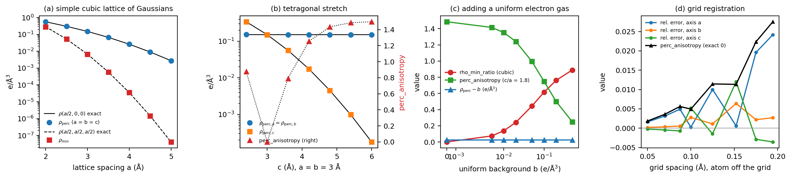
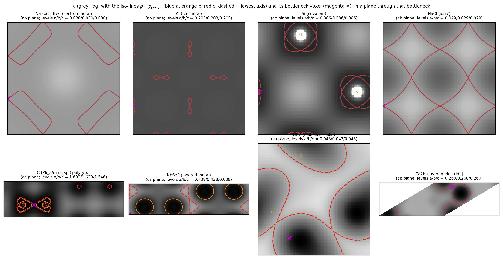
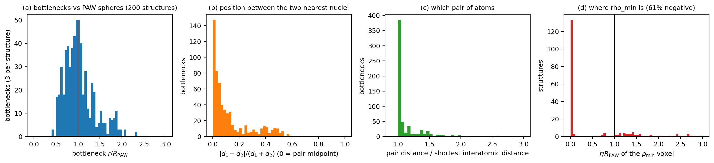
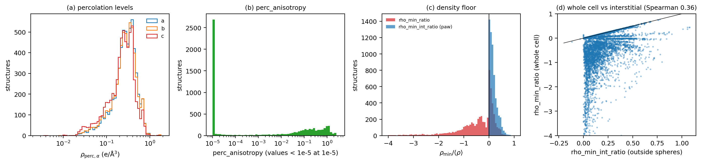
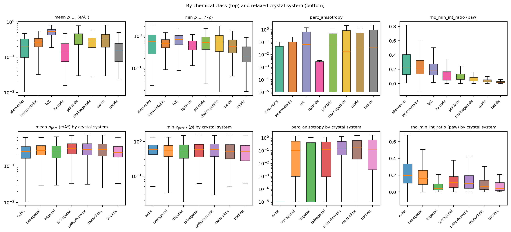
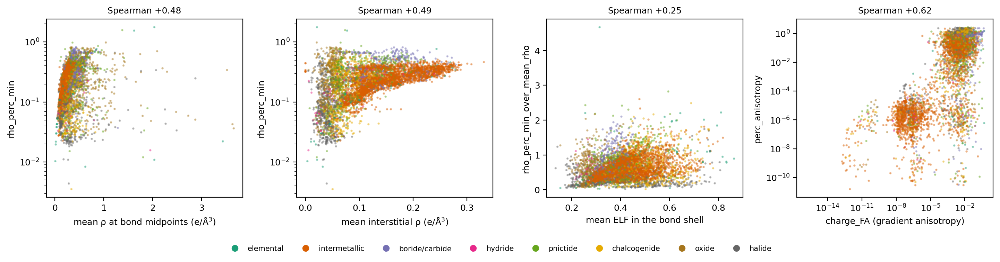
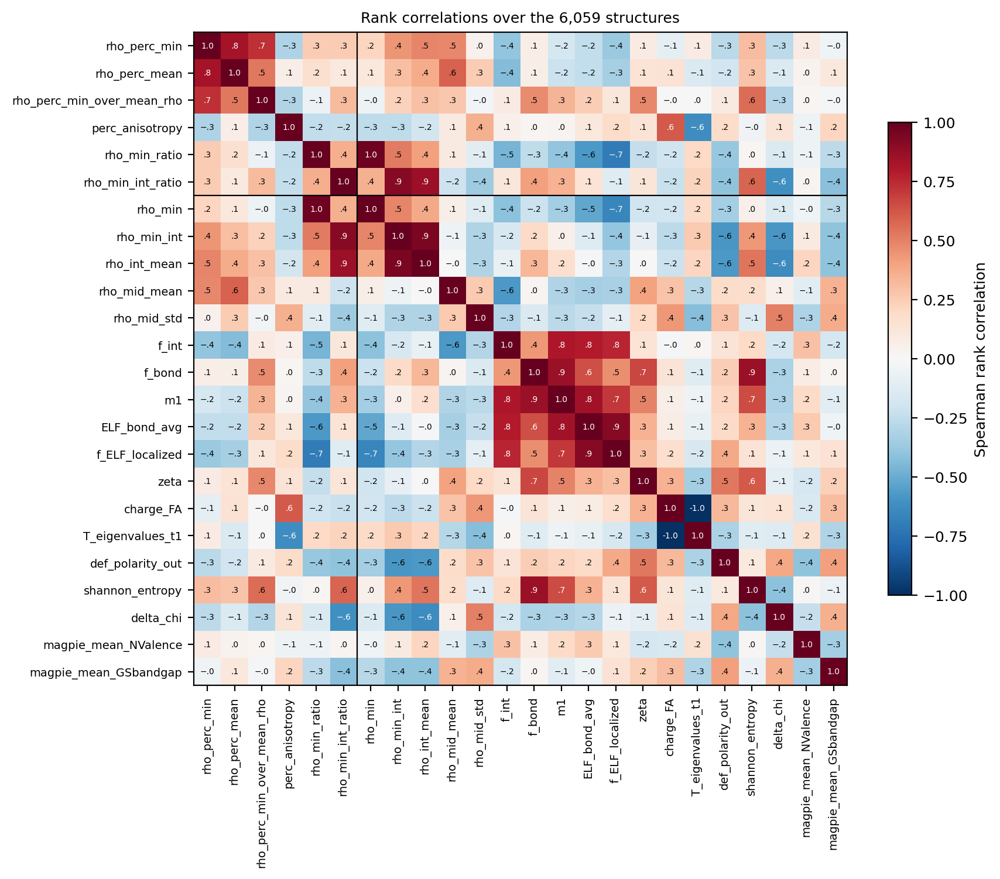
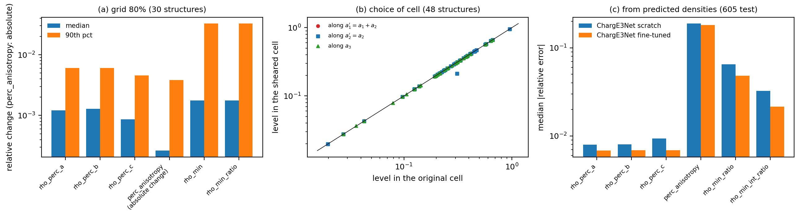

# Percolation and density-floor descriptors in pydemi: `rho_perc_a/b/c`, `perc_anisotropy`, `rho_min_ratio`

Definitions, implementation, physical meaning, numerical behaviour and a survey over
6,059 VASP charge densities.

**Author:** Shubham Maurya, CMS Lab, IIT Kanpur · **Date:** 2026-09-25 ·
**pydemi:** `main` (prompt.md build) · **Data:** 6,059-structure VASP dataset
(`/data/sai/new_charge/6000_data_aug13`), descriptor table
`results/prompt_spec/descriptors_6000_data_aug13.csv`

Every number and figure in this document comes from the scripts in `scripts/`
(section 12). The intermediate tables are in `data/`.

---

## Summary

These descriptors ask how the charge density **connects** the crystal:

* **`rho_perc_α`** (α = a, b, c) is the highest density level c at which the region
  {ρ ≥ c} still forms a connected path that wraps around the periodic cell along
  lattice vector a_α. Equivalently, it is the density at the bottleneck of the best
  connecting path along a_α (a max–min path, like the "mountain pass" of the density
  landscape).
* **`perc_anisotropy`** = (max_α − min_α)/mean_α of the three levels. It is 0 when the
  density connects the crystal equally well along all three lattice vectors, and grows
  towards 3 when one direction is much better (or much worse) connected than the others.
* **`rho_min_ratio`** = min_k ρ_k / ⟨ρ⟩_V is the deepest point of the density relative
  to its mean.

Main findings:

1. **The code is exact on the specification's test case** (Fig. 1).
   * For a simple cubic lattice of Gaussians, `rho_perc` equals the density at the bond
     midpoint to all six digits shown, and the density minimum equals the density at the
     cube centre.
   * Under a tetragonal stretch, `perc_anisotropy` follows the exact formula, rising
     towards 1.5 as one axis disconnects.
   * A 2 × 1 × 1 supercell leaves every level unchanged exactly (60 real structures).
2. **Grid registration matters for the anisotropy.** With the atom off the grid points,
   a cubic lattice gets a spurious `perc_anisotropy` of 0.028 at 0.19 Å spacing and
   0.002 at 0.05 Å, and the levels are biased by up to +2.4%. In the dataset (spacing
   about 0.066 Å), 43% of the 2,137 relaxed-cubic structures have exactly 0. Their 95th
   percentile is 2 × 10⁻⁵ and their maximum 0.008.
3. **The bottleneck lies on the shortest bonds, near the PAW sphere boundary.**
   * The bottleneck voxel can be located exactly. Over 200 random structures, 62% of the
     bottlenecks are within 10% of a pair midpoint, and 52% belong to the shortest
     interatomic distance of the structure.
   * Their median distance from the nearest nucleus is 0.99 R_PAW, and 54% lie inside an
     augmentation sphere, where the CHGCAR is pseudized.
4. **`rho_min_ratio` is a PAW artefact on CHGCARs.**
   * The pseudo-density is negative somewhere in 61% of the dataset.
   * In 67% of the sampled structures, the minimum is **at a nucleus** (r < 0.05 R_PAW).
     The whole-cell value then measures the pseudization dip, not the interstitial floor.
   * The `paw` extension's `rho_min_int_ratio`, the minimum outside the spheres, is the
     physical quantity. Its rank correlation with `rho_min_ratio` is only 0.36. It falls
     with the electronegativity range (Spearman −0.61) and with the Magpie band gap
     (−0.42), and orders the classes from elemental/intermetallic (0.21–0.23) to halides
     (0.02).
5. **Percolation is high for covalent networks and metals, and low for ionic, molecular
   and layered solids.** Examples of `rho_perc` (e/ų):
   * Si 0.386, Al 0.203, Na 0.030;
   * NaCl 0.029 and CO₂ 0.043;
   * NbSe₂ 0.44 in-plane but 0.038 across the layers (`perc_anisotropy` 1.31).

   Relative to ⟨ρ⟩, the lowest level ranks halides lowest (median 0.24) and
   borides/carbides highest (0.79). It is not a band-gap indicator (Spearman −0.02 with
   the Magpie gap).
6. **The levels depend on the cell choice.** Directions are the *lattice vectors*.
   * A rhombohedral primitive cell (Ca₂N) has three equivalent vectors, so it reports
     `perc_anisotropy` = 0 for a layered electride.
   * Changing the cell to a1′ = a1 + a2 changes the level along a2′ by up to 31% (18 of
     48 structures), because the winding classes change.
7. **ML predictability** (ChargE3Net, from scratch, 605 test structures):
   * the three levels: median error 0.8–0.9%, Spearman 0.999;
   * `rho_min_ratio` and `rho_min_int_ratio`: about 3–6%;
   * `perc_anisotropy`: median 19%, Spearman 0.90, because many values sit at the grid
     noise floor.

---

## Contents

1. Notation
2. Definitions and formulas
3. How pydemi computes them
4. Analytic behaviour
5. What they look like in real materials
6. Where the bottleneck and the minimum are
7. Physical significance
8. Survey over 6,059 materials
9. Numerical robustness, cell choice and ML predictability
10. Utility: what to use them for
11. Caveats and recommendations
12. Reproducing this document
13. References

---

## 1. Notation

| Symbol | Meaning |
|---|---|
| ρ_k | density at voxel k (e/ų, CHGCAR / V: the PAW pseudo-density) |
| ⟨ρ⟩_V | Σ_k ρ_k / N = Q/V, the mean density (valence electrons per ų) |
| a_α | lattice vectors (α = 1, 2, 3 ↔ a, b, c) |
| S(c) | the super-level set {k : ρ_k ≥ c} (voxels at or above level c) |
| face connectivity | voxels are neighbours when they share a face of the index grid (6 neighbours), with periodic wrapping |
| winding | a closed path in the periodic cell, lifted to the infinite crystal, ends displaced by a lattice vector n₁a₁ + n₂a₂ + n₃a₃; (n₁, n₂, n₃) is its winding |

---

## 2. Definitions and formulas

### 2.1 Percolation levels

A set S **spans** direction α if one of its face-connected clusters contains a closed
loop, in the periodic cell, whose winding has n_α ≠ 0. Such a cluster continues
infinitely in the crystal along a_α (and perhaps along other directions too). Then

$$
\rho_{\mathrm{perc},\alpha}=\max\{\,c:\ S(c)=\{\rho\ge c\}\ \text{spans}\ \alpha\,\}\quad(\text{e/Å}^3).
$$

As c decreases from max ρ, S(c) grows. It first spans α at c = ρ_perc,α, so this is the
**bottleneck** density of the best path along a_α:

$$
\rho_{\mathrm{perc},\alpha}=\max_{\text{paths }\gamma\text{ winding along }\alpha}\ \min_{k\in\gamma}\rho_k .
$$

For a smooth density, this is the value at an index-1 saddle point of ρ, the "pass"
between two density maxima along the path.

*Documented correction to the specification.* The specification says "lowest level c
whose super-level set spans". The lowest level is always min ρ, because S(min ρ) is the
whole cell. The meaningful quantity is the highest spanning level, which pydemi
implements and documents.

### 2.2 Percolation anisotropy

$$
\texttt{perc\_anisotropy}=\frac{\max_\alpha\rho_{\mathrm{perc},\alpha}-\min_\alpha\rho_{\mathrm{perc},\alpha}}
{\tfrac13\sum_\alpha\rho_{\mathrm{perc},\alpha}}\in[0,3].
$$

* 0: equal connectivity along all three lattice vectors.
* 1.5: two equal levels and one near zero (a layered solid, well connected in-plane).
* 3: one direction well connected and two near zero (a chain solid).

If all three levels are 0, the value is 0 with sentinel `zero_levels`. That case does not
occur in the dataset.

### 2.3 Density floor

$$
\texttt{rho\_min}=\min_k\rho_k,\qquad
\texttt{rho\_min\_ratio}=\frac{\rho_{\min}}{\langle\rho\rangle_V}.
$$

A zero mean density gives the sentinel `zero_density`. With the `paw` extension, pydemi
also reports:

* `rho_min_int`: the minimum over the voxels farther than max(c2, R_PAW) from their
  nearest nucleus, i.e. outside every augmentation sphere and outside the bond shell;
* `rho_min_int_ratio` = `rho_min_int` / ⟨ρ⟩_V.

### 2.4 Properties

* **Units and scaling.** The levels are in e/ų. `perc_anisotropy` and the ratios are
  dimensionless. Multiplying ρ by λ multiplies the levels by λ and leaves
  `perc_anisotropy` and `rho_min_ratio` unchanged.
* **Uniform background b.** Adding b shifts every level by exactly b (Fig. 1c). So
  `perc_anisotropy` falls, and `rho_min_ratio` tends to 1, as b grows. This is the
  free-electron-gas limit.
* **Supercells.** The levels are unchanged, because the connectivity of the infinite
  crystal is the same (§9.2).
* **Choice of cell.** "Along a_α" depends on which lattice vectors are chosen (§9.3).
* **No derivatives are involved.**

---

## 3. How pydemi computes them

Code: `src/pydemi/operators/topology.py` (`spans`, `percolation_levels`),
`src/pydemi/descriptors/structural.py` (registration; `rho_min`, `rho_min_ratio`,
`rho_min_int`, `rho_min_int_ratio`).

1. **Spanning test: `spans(mask)`.**
   * `scipy.ndimage.label` labels the face-connected clusters of the voxel mask inside
     the cell, without wrapping.
   * For each axis α, it pairs the cluster labels on the last layer (index N_α − 1) with
     those on the first layer (index 0). These face pairs are the periodic bonds across
     the cell boundary.
   * A union-find with offsets merges the clusters. Each cluster stores its displacement
     (in cells) relative to its root. Crossing the boundary along α adds the unit vector
     e_α.
   * When a crossing joins two clusters that already share a root, a loop has closed.
     Its winding is the offset difference plus e_α, and every nonzero component marks a
     spanned direction.

   This is exact for face connectivity on the torus, including clusters that wrap along
   combined directions.
2. **Levels: `percolation_levels(ρ)`.**
   * Bisection runs on the sorted unique voxel values, independently for the three
     axes: always the axis with the widest remaining bracket.
   * The result for each axis is the smallest unique value u such that {ρ > u} does not
     span, which is the same as the largest u such that {ρ ≥ u} spans.
   * It therefore equals the value of **one specific voxel**, the bottleneck, whose
     removal disconnects the last spanning path. That voxel can be located (§6).
   * Cost: about log₂(N) + 3 labelling passes, some 25 for a 10⁶-voxel grid. The levels
     are cached and shared by the four descriptors.
3. **Density floor.** `np.min`, and `np.mean` over the grid. `rho_min_int` masks voxels
   by distance to the nearest nucleus (the shared geometry pass) against max(c2, R_PAW).

All the descriptors are tagged `robust`.

---

## 4. Analytic behaviour

`scripts/analytic_models.py`. The model atoms are Gaussians
Z (α/π)^{3/2} e^{−αr²} with Z = 4 and α = 1 Å⁻², summed over periodic images. One atom
sits per orthorhombic cell, on a grid point, except in model D.

**Fig. 1.** (a) Simple cubic lattice against its spacing: `rho_perc` = ρ(bond midpoint),
ρ_min = ρ(cube centre), lines exact. (b) A tetragonal stretch. (c) A uniform background.
(d) Grid registration: the atom placed off the grid points.

### 4.1 Simple cubic lattice: the specification's test case

The best path along x runs through the atoms. Its bottleneck is the bond midpoint
(a/2, 0, 0), an index-1 saddle, so `rho_perc_a` = `rho_perc_b` = `rho_perc_c` =
ρ(a/2, 0, 0). The minimum is the cube centre.

| a (Å) | rho_perc (pydemi) | ρ(a/2,0,0) exact | rho_min | ρ(a/2,a/2,a/2) exact | rho_min_ratio | exact |
|---|---|---|---|---|---|---|
| 2.0 | 0.568153 | 0.568153 | 0.286404 | 0.286404 | 0.572808 | 0.572808 |
| 3.0 | 0.151502 | 0.151502 | 0.006729 | 0.006729 | 0.045419 | 0.045419 |
| 4.0 | 0.026314 | 0.026314 | 3.5e-5 | 3.5e-5 | 5.65e-4 | 5.65e-4 |
| 5.0 | 0.002773 | 0.002773 | 3e-7 | 3e-7 | 1e-6 | 1e-6 |

The agreement is exact whenever the saddle and the minimum lie on grid points.
`perc_anisotropy` is exactly 0.

### 4.2 Tetragonal stretch

Take a = b = 3 Å and c from 2.4 to 6 Å. The level along c is ρ(0, 0, c/2):

| c (Å) | rho_perc_a | rho_perc_c | perc_anisotropy | exact |
|---|---|---|---|---|
| 2.4 | 0.1524 | 0.3417 | 0.878 | 0.875 |
| 3.0 | 0.1515 | 0.1515 | 0 | 0 |
| 4.2 | 0.1515 | 0.0175 | 1.255 | 1.255 |
| 6.0 | 0.1515 | 0.00018 | 1.497 | 1.497 |

* **Stretching c disconnects that direction**, and the anisotropy rises towards its
  "layered" limit of 1.5.
* **Compressing c** (2.4 Å) makes c the best-connected direction.
* **Off-grid saddles.** When c/2 is not a grid point (c = 2.4, 3.6 and 5.4 Å), the grid
  misses the exact saddle by up to half a spacing and the level changes by up to 1%.

### 4.3 A uniform background

Add b e/ų everywhere: the levels shift by exactly b. `rho_min_ratio` rises from
5.7 × 10⁻⁴ to 0.89 at b = 0.5. The tetragonal model's `perc_anisotropy` falls from 1.49
to 0.25. A delocalized electron gas makes the density both connected and isotropic.

### 4.4 Grid registration

Take a = 3.5 Å, with the atom displaced by (0.37, 0.21, 0.13) of a spacing:

| spacing (Å) | 0.194 | 0.152 | 0.100 | 0.070 | 0.050 |
|---|---|---|---|---|---|
| rel. error of rho_perc_a | +2.4% | +0.06% | +0.03% | +0.3% | +0.16% |
| perc_anisotropy (exact 0) | 0.028 | 0.011 | 0.005 | 0.004 | 0.002 |

* **Why the error.** On a grid, the path must step through voxels. Near a saddle, the
  voxels either side of the true pass are denser than the pass itself along the path,
  but may be less dense across it. The discrete bottleneck therefore differs from the
  saddle value by an amount that depends on where the saddle falls between grid points.
* **The error is different for each axis**, which creates a spurious anisotropy. For
  the dataset's spacing (0.06–0.07 Å), it is of order 10⁻³.
* **Symmetric relaxed structures do better.** Atoms at high-symmetry positions are
  equally registered along equivalent axes, so the spurious value is usually far
  smaller or exactly zero (§8.3).

---

## 5. What they look like in real materials

`scripts/examples.py`.

**Fig. 2.** ρ in a plane through the bottleneck voxel (×) of the lowest-level axis, with
the iso-lines at the three levels (blue a, orange b, red c; dashed = lowest). The region
{ρ ≥ ρ_perc} lies inside the lines around the atoms. The bottleneck is where two such
regions just touch.

**Table E1** (`data/examples.csv`):

| material | rho_perc_a | rho_perc_b | rho_perc_c | perc_anisotropy | ⟨ρ⟩ | min ρ_perc / ⟨ρ⟩ | rho_min_ratio | rho_min_int_ratio |
|---|---|---|---|---|---|---|---|---|
| Na (bcc) | 0.0297 | 0.0297 | 0.0297 | 0 | 0.027 | 1.10 | 0.370 | 1.05 |
| Al (fcc) | 0.2027 | 0.2027 | 0.2027 | 0 | 0.182 | 1.11 | −0.055 | 0.623 |
| Si (diamond) | 0.3865 | 0.3865 | 0.3865 | 0 | 0.196 | 1.97 | −0.956 | 0.108 |
| NaCl | 0.0295 | 0.0295 | 0.0295 | 0 | 0.173 | 0.17 | −0.039 | 0.069 |
| C (P6₃/mmc, sp³ polytype) | 1.633 | 1.633 | 1.546 | 0.054 | 0.702 | 2.20 | 0.098 | 0.098 |
| NbSe₂ (layered) | 0.4382 | 0.4382 | 0.0376 | 1.315 | 0.323 | 0.12 | −0.876 | 0.028 |
| CO₂ (molecular) | 0.0427 | 0.0427 | 0.0427 | 0 | 0.385 | 0.11 | 0.011 | 0.011 |
| Ca₂N (rhombohedral primitive cell) | 0.2598 | 0.2598 | 0.2598 | 0 | 0.291 | 0.89 | 0.099 | 0.099 |

(The C_194 structure of the dataset has 8 four-coordinated atoms, with C–C 1.544 Å. It
is a hexagonal sp³ polytype, not graphite.)

What the examples show:

* **Metals (Na, Al).** The connecting level is at or above the mean density
  (min ρ_perc/⟨ρ⟩ = 1.1). The valence density is nearly uniform between the atoms
  (Na: `rho_min_int_ratio` 1.05).
* **Covalent networks (Si, the C polytype).** These have the highest levels in absolute
  terms and relative to the mean (2.0–2.2): the bond charge forms a continuous,
  high-density network. The bottleneck is on the bonds.
* **Ionic NaCl.** The level is low (0.17 ⟨ρ⟩): the best path must cross from ion to ion
  through the low density between them.
* **Molecular CO₂.** The path must jump between molecules through the intermolecular
  gap: 0.11 ⟨ρ⟩.
* **Layered NbSe₂.** In-plane the level is 0.44 e/ų (metallic layers), across the van
  der Waals gap only 0.038, giving `perc_anisotropy` = 1.31. The dashed c-level line in
  Fig. 2 shows the gap bottleneck.
* **Ca₂N.** The electride is layered, but its rhombohedral primitive cell has three
  equivalent lattice vectors, each with a component across the layers. The three levels
  are identical and `perc_anisotropy` is 0. The descriptor measures connectivity along
  the chosen lattice vectors, not along the crystal's physical axes (§9.3).

---

## 6. Where the bottleneck and the minimum are

`scripts/bottlenecks.py`: 200 random structures (seed 2026). For each axis, the
bottleneck is the voxel with ρ = ρ_perc,α. A median of 2 voxels share that value, by
symmetry.

**Fig. 3.** (a) Bottleneck distance from the nearest nucleus, in units of that atom's
R_PAW. (b) Position between the two nearest nuclei. (c) Which pair: its distance relative
to the structure's shortest interatomic distance. (d) Where ρ_min is.

| quantity (600 bottlenecks, 200 structures) | value |
|---|---|
| median r / R_PAW | 0.99 |
| inside an augmentation sphere (r ≤ R_PAW) | 54% |
| within 10% of the pair midpoint (\|d₁ − d₂\|/(d₁ + d₂) < 0.1) | 62% |
| on a shortest-distance pair (pair ≤ 1.01 d_min) | 52% |
| most frequent pairs | Si–Si, Pt–Pt, B–B, Cu–S, Rb–O, Al–Al, Zn–O |
| ρ_min negative | 61% |
| ρ_min voxel at a nucleus (r < 0.05 R_PAW) | 67% (median distance 0.03 Å) |

Consequences:

* **ρ_perc is a bond-path quantity.** The best path usually passes through the midpoint
  region of the shortest bonds. The bottleneck is typically the weakest bond of the best
  bond network.
* **It sits at the PAW boundary.** Half of the bottlenecks lie just inside a sphere,
  where the CHGCAR is pseudized. The pseudization mostly moves charge within r < 0.8 Å
  (the FeNi₃ table of the paper), and the bottleneck lies at about R_PAW, where pseudo
  and true density are close. The effect on ρ_perc is therefore likely modest. That is
  a reasoned expectation; without all-electron densities it was not measured here.
* **ρ_min is a pseudization artefact.** Two thirds of the minima are at a nucleus. The
  PAW pseudo-density of many elements dips, often below zero, at the nucleus, where the
  true density has its cusp. `rho_min_ratio` on a CHGCAR is therefore a property of the
  PAW datasets, not of the bonding. The interstitial `rho_min_int_ratio` avoids this.

---

## 7. Physical significance

| descriptor | question it answers | large value | small value |
|---|---|---|---|
| `rho_perc_α` | How dense is the "weakest link" of the best path of electron density along a_α? | continuous high-density networks: covalent frameworks (Si, C, borides/carbides), dense metals | ionic, molecular and van der Waals-separated solids; the gap direction of layered and chain solids |
| `perc_anisotropy` | Is the density network equally connected along all lattice vectors? | layered (→ 1.5) or chain-like (→ 3) connectivity: NbSe₂ 1.31; ErCl₃ and LuCl₃ (connected only along c) 2.5; NaNiN (only along a) 2.7 | isotropic networks: cubic structures, or cells whose vectors are all equivalent |
| `rho_min_ratio` | How deep is the lowest point of the density, relative to its mean? | on an all-electron or smooth density: no voids, nearly uniform electron gas (Na 0.37 whole cell, 1.05 interstitial) | voids, vacuum-like gaps (molecular solids CO₂ 0.011); on a CHGCAR, strongly negative from the pseudized nuclear dip |
| `rho_min_int_ratio` (paw) | The same, outside the atoms | metallic, delocalized interstitial density (elemental and intermetallic, median 0.21–0.23) | ionic compounds with empty interstitial regions (halides 0.02, oxides 0.04) |

In terms of conduction: `rho_perc` is a charge-density analogue of a percolation
threshold. A connected high-density path is necessary for electron hopping or
band-like transport along a direction, but not sufficient. Si has a high level but is an
insulator, because the relevant quantity is the density of states at the Fermi level,
which ρ alone does not contain. The level therefore measures **bonding connectivity**,
covalent or metallic, not metallicity (§8.4).

---

## 8. Survey over 6,059 materials

`scripts/dataset_table.py` merges the rerun table with the classes and crystal systems
of the anisotropy report, and adds the lattice lengths, grid spacings, electronegativity
range and heaviest block.

### 8.1 Distributions

**Fig. 4.** (a) The three levels. (b) `perc_anisotropy` (values below 10⁻⁵ drawn at
10⁻⁵). (c) Whole-cell against interstitial density floor. (d) Their relation.

| descriptor | 5% | median | 95% |
|---|---|---|---|
| rho_perc_a (e/ų) | 0.072 | 0.280 | 0.632 |
| rho_perc_c (e/ų) | 0.049 | 0.245 | 0.555 |
| min ρ_perc / ⟨ρ⟩ | 0.17 | 0.57 | 1.27 |
| perc_anisotropy | 0 | 0.0009 | 1.21 |
| rho_min_ratio | −2.62 | −0.22 | 0.31 |
| rho_min_int_ratio (paw) | 0.015 | 0.132 | 0.474 |

* **The c level is systematically lower** (median 0.245 against 0.280 for a). This is
  consistent with the usual convention of setting up layered structures with the layers
  perpendicular to c.
* **`perc_anisotropy`** is exactly 0 for 22% of the structures, above 0.5 for 17%, and
  above 1 for 494.
* **`rho_min_ratio` is negative for 61%**, reaching −9.6. `rho_min_int` is negative for
  only 3 structures.

### 8.2 By chemical class

**Fig. 5.** By chemical class (top) and relaxed crystal system (bottom).

| class | mean ρ_perc | min ρ_perc | min ρ_perc / ⟨ρ⟩ | perc_anisotropy | rho_min_ratio | rho_min_int_ratio |
|---|---|---|---|---|---|---|
| elemental | 0.198 | 0.174 | 0.69 | 0 | 0.19 | 0.23 |
| intermetallic | 0.261 | 0.247 | 0.59 | 0 | −0.14 | 0.21 |
| boride/carbide | 0.533 | 0.379 | 0.79 | 0.066 | 0.12 | 0.18 |
| hydride | 0.141 | 0.134 | 0.49 | 0 | 0.06 | 0.09 |
| pnictide | 0.350 | 0.250 | 0.64 | 0.060 | −0.78 | 0.09 |
| chalcogenide | 0.269 | 0.200 | 0.66 | 0.019 | −1.13 | 0.05 |
| oxide | 0.326 | 0.219 | 0.47 | 0.036 | 0.01 | 0.04 |
| halide | 0.150 | 0.081 | 0.24 | 0.041 | −0.53 | 0.02 |

(Medians. The levels are in e/ų.)

Reading:

* **Borides/carbides are the best connected.** They have the highest levels (mean 0.53
  e/ų, 0.79 ⟨ρ⟩): strong covalent B and C frameworks.
* **Halides are the least connected** (0.24 ⟨ρ⟩), followed by oxides (0.47) and hydrides
  (0.49). These are ionic lattices where the best path crosses low-density
  anion–cation gaps.
* **`perc_anisotropy` is 0 in the median for elemental solids, intermetallics and
  hydrides**, which are mostly high-symmetry cells. Borides/carbides, pnictides, oxides
  and halides have many low-symmetry or layered structures (median 0.04–0.07, with long
  tails above 1).
* **`rho_min_int_ratio` orders the classes cleanly by how "filled" the interstitial is.**
  It runs from elemental and intermetallic (0.21–0.23) through borides/carbides (0.18)
  and pnictides and hydrides (0.09) to chalcogenides (0.05), oxides (0.04) and halides
  (0.02).
* **The whole-cell `rho_min_ratio` gives a jumbled, sign-changing ordering**
  (chalcogenides −1.13, halides −0.53, borides/carbides +0.12). It follows which PAW
  datasets dip below zero at the nucleus. The heaviest block shows this: sp −0.74, f
  −0.29, d −0.03 whole-cell, against 0.06, 0.13 and 0.17 in the interstitial.

### 8.3 By crystal system: symmetry and the noise floor

| relaxed crystal system | median perc_anisotropy | exactly 0 | above 0.5 |
|---|---|---|---|
| cubic | 0 | 43% | 0% |
| trigonal | 0 | 16% | 25% |
| tetragonal | 0.12 | 15% | 24% |
| hexagonal | 0.10 | 9% | 27% |
| orthorhombic | 0.14 | 4% | 26% |
| monoclinic | 0.17 | 9% | 29% |
| triclinic | 0.12 | 4% | 31% |

* **Cubic structures should give exactly 0**, since their three lattice vectors are
  symmetry-equivalent. 43% do, and the rest have tiny values from grid registration and
  relaxation noise: 95th percentile 2 × 10⁻⁵, maximum 0.008.
* **Trigonal structures have median 0** because many of them are stored in rhombohedral
  primitive cells, whose three vectors are equivalent. This includes layered ones such
  as Ca₂N (§9.3).
* **Other systems have medians 0.10–0.17**, and a quarter to a third exceed 0.5.

### 8.4 Relations to other descriptors

**Fig. 6.** The lowest level against the mean density at the bond midpoints and in the
interstitial. The relative level against the bond-shell ELF. `perc_anisotropy` against
the gradient anisotropy `charge_FA`.

**Fig. 7.** Spearman rank correlations (`data/spearman_correlations.csv`).

| pair | Spearman |
|---|---|
| min ρ_perc – mean ρ_perc | 0.83 |
| min ρ_perc – mean ρ at bond midpoints | 0.48 |
| min ρ_perc – mean interstitial ρ | 0.49 |
| min ρ_perc / ⟨ρ⟩ – bond-shell ELF | 0.25 |
| min ρ_perc / ⟨ρ⟩ – Δχ | −0.29 |
| min ρ_perc / ⟨ρ⟩ – Magpie mean band gap | −0.02 |
| perc_anisotropy – charge_FA | 0.62 |
| perc_anisotropy – T_eigenvalues_t1 | −0.62 |
| rho_min_ratio – rho_min_int_ratio | 0.36 |
| rho_min_int_ratio – mean interstitial ρ | 0.85 |
| rho_min_int_ratio – Δχ | −0.61 |
| rho_min_int_ratio – Magpie mean band gap | −0.42 |

* **`perc_anisotropy` agrees with the gradient-based anisotropy** (`charge_FA` 0.62;
  smallest tensor eigenvalue −0.62). Both see layering and chains, from different
  information: connectivity against gradient directions.
* **The relative percolation level is nearly independent of ionicity and gap** (−0.29,
  −0.02). The interstitial density floor is not (−0.61, −0.42), and is the better
  ionicity and metallicity proxy.
* **The percolation levels carry information the bond-midpoint and interstitial means do
  not** (0.48–0.49). A best path is not an average.

---

## 9. Numerical robustness, cell choice and ML predictability

**Fig. 8.** (a) Grid convergence (80% Fourier-coarsened grid, 30 structures; absolute
change for `perc_anisotropy`). (b) The cell choice a1′ = a1 + a2 (48 structures).
(c) Median error from ChargE3Net-predicted densities.

### 9.1 Grid

From the paper's convergence analysis, 30 random structures:

| descriptor | median change | 90th pct |
|---|---|---|
| rho_perc_a / b / c | 0.12% / 0.13% / 0.09% | 0.6% / 0.6% / 0.45% |
| perc_anisotropy (absolute change) | 2.6 × 10⁻⁴ | 3.8 × 10⁻³ (max 0.010) |
| rho_min, rho_min_ratio | 0.18% | 3.3% |

The levels converge well. `perc_anisotropy` changes by up to 0.01 in absolute terms,
consistent with the grid-registration floor of §4.4. Differences in `perc_anisotropy`
below about 0.01 are therefore not meaningful.

### 9.2 Supercells

A 2 × 1 × 1 supercell (60 structures, density tiled) gives **identical** levels: maximum
difference exactly 0. The labelling, the periodic merge and the winding test are
consistent with the connectivity of the infinite crystal.

### 9.3 The choice of cell

Take the same lattice and grid, re-indexed to the cell (a1 + a2, a2, a3). This is exact
when N1 = N2 (48 of the 60 structures):

| new axis | structures changed | median rel. change | max |
|---|---|---|---|
| a1′ = a1 + a2 | 34 | 0.02% | 1.2% |
| a2′ = a2 | 18 | 0 | 31% |
| a3′ = a3 | 8 | 0 | 0.85% |

Two effects are at work:

1. **The winding classes change.** A loop's winding (n₁, n₂, n₃) becomes
   (n₁, n₂ − n₁, n₃) in the new basis.
   * A path along a1, winding (1, 0, 0), becomes (1, −1, 0) and now also counts for a2′.
   * A path along a1 + a2, winding (1, 1, 0), becomes (1, 0, 0) and no longer counts for
     a2′.

   The level along a2′ can therefore move either way. It fell in 9 structures, by up to
   31%, and rose in 9, by at most 0.2%.
2. **Face connectivity changes.** In the new index grid, one of the six face neighbours
   is a diagonal neighbour of the old grid. Even the unchanged direction a3 moves by up
   to 0.85%.

So the three levels describe connectivity along *the lattice vectors of the chosen
cell*. For a fixed standard setting, such as the cells in this dataset, they are
comparable across structures. They are not invariant descriptors of the crystal:

* Rhombohedral primitive cells (Ca₂N) hide layering.
* Conventional and primitive cells of the same crystal can give different values.

### 9.4 ML predictability

Descriptors were computed from ChargE3Net's predicted densities (from-scratch model, 605
test structures) against those from DFT (`data/ml_scores_scratch.csv`):

| descriptor | median rel. error | 90th pct | Spearman | R² |
|---|---|---|---|---|
| rho_perc_a | 0.79% | 3.3% | 0.9991 | 0.998 |
| rho_perc_b | 0.80% | 3.3% | 0.9992 | 0.998 |
| rho_perc_c | 0.94% | 4.0% | 0.9986 | 0.998 |
| perc_anisotropy | 19% | 100% | 0.901 | 0.996 |
| rho_min_ratio | 6.5% | 37% | 0.995 | 0.985 |
| rho_min_int_ratio | 3.3% | 17% | 0.993 | 0.991 |

* **The levels are among the best-predicted structural descriptors.**
* **`perc_anisotropy` has large relative errors but R² 0.996.** Its large values (layered
  and chain structures) are predicted well. The many values near 0 are noise-level in
  both the DFT and the ML density, so their relative errors are meaningless.
* **Fine-tuned model** (`data/ml_scores_finetune.csv`; mean NMAPE 0.72% against 0.96%).
  All nine improve: the levels to 0.68–0.69% median error and Spearman 0.9995–0.9997,
  `rho_min_ratio` 6.5% → 4.8%, `rho_min_int_ratio` 3.3% → 2.1%. `perc_anisotropy` stays
  at Spearman 0.90 (R² 0.998) for the reason above.

---

## 10. Utility: what to use them for

1. **Connectivity features for property models.** `rho_perc_α`, and min ρ_perc / ⟨ρ⟩,
   rank structures by how continuous their bonding network is. The order runs from
   covalent frameworks and metals down to ionic, molecular and van der Waals solids.
   They have little overlap with gap or ionicity proxies (§8.4), so they add
   information.
2. **Detecting low-dimensional structures.** `perc_anisotropy` near 1.5 flags layered
   solids and near 3 flags chain solids, with the offending direction given by the
   lowest level. This screens for exfoliable or quasi-1D candidates, provided the cell is
   in a conventional setting (§9.3).
3. **Interstitial filling and ionicity.** `rho_min_int_ratio` (paw) is a robust proxy for
   how delocalized the valence density is, and correlates with Δχ at −0.61. The
   whole-cell `rho_min_ratio` is useful only on all-electron or smooth densities.
4. **Checking densities.** The levels converge quickly with the grid, are exact for
   supercells, and are predicted to about 1% from ML densities. They make good sanity
   checks for predicted densities along specific directions.
5. **Locating weak links.** The bottleneck voxel is known exactly (§6). It points to the
   bond or gap that limits connectivity along each direction, which is useful for
   interpretation.

---

## 11. Caveats and recommendations

| issue | effect | recommendation |
|---|---|---|
| lattice-vector directions | levels depend on the cell choice; rhombohedral primitive cells hide layering | standardize cells (conventional settings) before comparing; compute on the conventional cell for trigonal and hexagonal structures |
| grid registration | perc_anisotropy noise up to about 0.01; level bias up to a few 0.1% at 0.07 Å spacing | treat perc_anisotropy < 0.01 as isotropic |
| PAW nuclear dip | rho_min_ratio on a CHGCAR is negative for 61% of structures, dominated by the nuclear pseudo-density | use `extensions=("paw",)` and `rho_min_int_ratio`; or use all-electron densities |
| bottleneck at the sphere boundary | 54% of bottlenecks are just inside a PAW sphere | expected to be a small effect (§6), but compare levels only within one set of PAW datasets |
| connectivity is not conduction | covalent insulators have high levels | do not read rho_perc as metallicity; combine with electronic-structure features |
| face (6-)connectivity | slightly anisotropic in non-orthogonal cells | differences below 1% between axes of non-orthogonal cells are not meaningful |

---

## 12. Reproducing this document

Run from `docs/percolation_descriptors/scripts/`, in the pydemi environment, niced, with
`OMP_NUM_THREADS=1` on the shared machine:

| order | script | inputs | outputs (`../data/`) |
|---|---|---|---|
| 1 | `analytic_models.py` | none | `analytic_A/B/C/D.csv` |
| 2 | `dataset_table.py` | rerun table; anisotropy-report classes; CHGCAR headers | `percolation_dataset.csv` |
| 3 | `examples.py` | dataset CHGCARs | `slices.npz`, `examples.csv` |
| 4 | `bottlenecks.py [N=200]` | dataset CHGCARs | `bottlenecks.csv`, `cell_tests.csv` |
| 5 | `make_figures.py` | all of the above; `ml_scores_*.csv`; `paper/analysis/out/convergence.csv` | `../figures/fig01–fig09` (PNG + PDF), `spearman_correlations.csv` |

Each takes minutes. The random sample uses seed 2026; the cell tests use its first 60
structures. `ml_scores_scratch.csv` is copied from the ML evaluation.

The document is Markdown with LaTeX math. For a PDF: `pandoc percolation_descriptors.md
-o percolation_descriptors.pdf --pdf-engine=xelatex` (pandoc is not installed on this
machine).

---

## 13. References

* D. Stauffer and A. Aharony, *Introduction to Percolation Theory*, 2nd ed., Taylor &
  Francis (1994). (Spanning clusters, percolation thresholds.)
* J. Hoshen and R. Kopelman, "Percolation and cluster distribution. I. Cluster multiple
  labeling technique and critical concentration algorithm", *Phys. Rev. B* **14**, 3438
  (1976). (Cluster labelling with union-find.)
* R. F. W. Bader, *Atoms in Molecules: A Quantum Theory*, Oxford University Press (1990).
  (Critical points; index-1 saddles as bond critical points.)
* P. E. Blöchl, "Projector augmented-wave method", *Phys. Rev. B* **50**, 17953 (1994).
  (The pseudo-density inside the augmentation spheres.)
* pydemi `prompt.md`, §8.2 (structural domain and the percolation implementation);
  pydemi paper, "Numerical considerations" (PAW, grid convergence).
